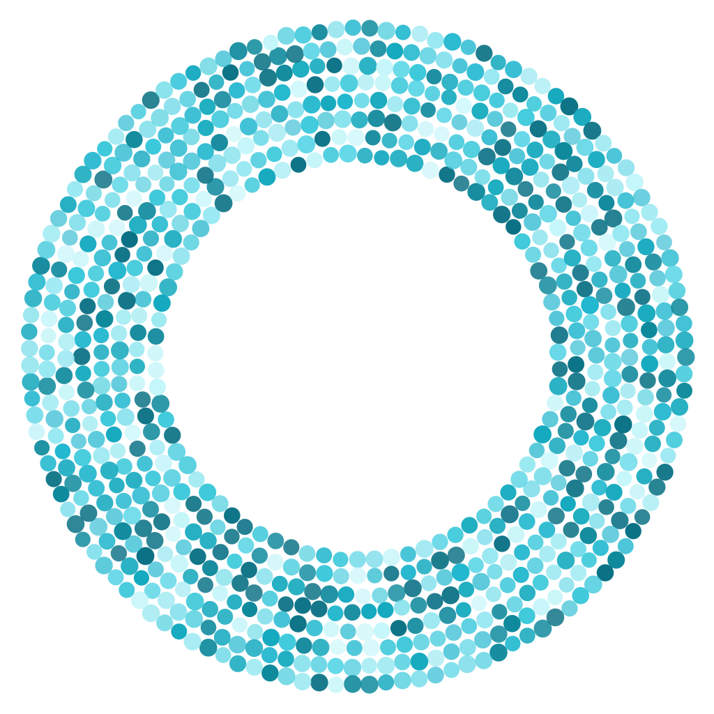

<p align="center"></p>

# Nimbus

<!-- HERO PHOTO PLACEHOLDER: assembled device on a desk - ring lit, e-ink
     showing the status screen. Add the photo to assets/ and embed it here. -->

<p align="center">
  <a href="https://polyformproject.org/licenses/noncommercial/1.0.0/"></a>
  <a href="https://github.com/ristllin/nimbus-fw-releases/releases/latest"></a>
  <a href="https://docs.cumulo-nimbus.ai/"></a>
</p>

A DIY desk device that keeps you informed without stealing your screen.
Two modes on one firmware: an ambient **status light for AI coding sessions**
(encrypted Bluetooth, per-session ring segments), and a **self-hosted AI
assistant** with voice, Telegram, and long-term memory on its own SD card.
A 45-LED ring plus a 2.9" e-ink panel + knob - or a 2.8" color touchscreen -
on an ESP32-S3. Bring your own API key (Mistral, OpenAI, or Anthropic);
about **$60–75 in commodity parts** to build.

**Documentation: https://docs.cumulo-nimbus.ai/**

## What you need

- The electronics - dev board, display, LED ring, mic/amp/speaker, microSD,
  battery section: full list with sourcing links and prices in the
  **[bill of materials](docs/hardware/bom.md)** (~$60–75)
- A data-capable USB-C cable
- A computer with a Chromium browser (web flasher) or Python 3 + PlatformIO
- A 2.4 GHz Wi-Fi network
- One AI provider API key (Orchestrator mode; skip for the status light)
- Optional: a FAT32 microSD card for long-term memory, and a Telegram account

## Quick start

The step-by-step path - parts → flash → setup wizard → first conversation -
lives on the docs site:

1. **[What you need](https://docs.cumulo-nimbus.ai/quick-start/what-you-need)**
2. **[Flash the firmware](https://docs.cumulo-nimbus.ai/quick-start/flash)**
   - browser flasher, or `python3 tools/setup_device.py` over the DevKit's
   **UART** port (a factory-fresh board flashes only through that port)
3. **[Set up the device](https://docs.cumulo-nimbus.ai/quick-start/setup-wizard)**
   - join the `Nimbus-setup` network, walk the wizard
4. **[Your first conversation](https://docs.cumulo-nimbus.ai/quick-start/first-conversation)**
   - or the **[Notifier quick start](https://docs.cumulo-nimbus.ai/quick-start/notifier-quick-start)**
   for the status light

## Safety

This build contains a **2S lithium-ion pack** (two 18650 cells in series).
Use brand-name cells from a reputable vendor, always keep the 2S BMS between
the cells and everything else, never charge outside the BMS, and power off
immediately if anything gets warm that shouldn't. The firmware caps LED
brightness at 60% of maximum: sustained higher levels have been tested and
can overheat and damage internal electronics, so do not raise the limit. See
the [BOM safety note](docs/hardware/bom.md#safety-note--2s-li-ion).

**You build and operate this project entirely at your own risk.** It is a DIY
prototype, not a certified product, and comes with no warranty of any kind;
the author accepts no liability for damage or injury arising from building or
using it. Read [DISCLAIMER.md](DISCLAIMER.md) before you start, especially if
your build includes the battery.

## Building the firmware

Board support lives in the public
[solide-drivers](https://github.com/ristllin/solide-drivers) repository,
consumed as a PlatformIO library. `platformio.ini` expects it as a **sibling
checkout** (`symlink://../solide-drivers`):

```bash
git clone https://github.com/ristllin/Nimbus.git
git clone https://github.com/ristllin/solide-drivers.git   # sibling directory
cd Nimbus
pio test -e native            # host unit tests, no hardware
pio run -e esp32s3            # compile production firmware
python3 tools/setup_device.py # guarded install over the UART port
```

If you prefer not to keep a sibling checkout, point the `lib_deps` entry in
`platformio.ini` at the public git URL instead.

Nimbus speaks the [nimbus-notify](https://github.com/ristllin/nimbus-notify)
wire protocol (`pip install nimbus-notify` for the host-side broker), and
ships signed firmware updates from
[nimbus-fw-releases](https://github.com/ristllin/nimbus-fw-releases).

## Layout

- `lib/core/` - portable logic (no Arduino): protocol codec, profiles, power
  policy, the orchestrator memory engines and turn contract. Host-tested.
- `src/` - firmware: hardware glue (`hw/`), modes (`modes/`), the agent
  subsystem (`agent/`), the web surface (`net/`), entry point.
- `lib/harness/` - the agent policy/orchestration layer, host-testable.
- `test/` - Unity C++ **host** suites per module (run under `pio test -e native`,
  no hardware); golden framebuffers pin every screen.
- `tests/hil/` - the Python **hardware-in-the-loop** suite (drives a real board).
  (The `test` *build environment* is a third, unrelated thing - the firmware plus
  a serial console the HIL suite drives.)
- `docs/` - the canonical documentation tree
  ([map](docs/README.md)); `website/` publishes it to GitHub Pages.
- `hardware/` - the physical build: PCB manufacturing files (`fab/`) and a home for
  assembly notes, BOM, and CAD. The published build guides live in `docs/hardware/`.
- `tools/` - installer, recovery, calibration, generators, test harnesses
  ([index](tools/README.md)).
- `evals/` - orchestrator behavior benchmark (scenario corpus, scoring, reports).

Contributor guide: [CONTRIBUTING.md](CONTRIBUTING.md) and the
[development guide](docs/development.md) (build environments, test ladder,
golden-test flow, hard-won constraints).

## Community

Questions, builds, and ideas:
[GitHub Discussions](https://github.com/ristllin/Nimbus/discussions).
Bugs: [issues](https://github.com/ristllin/Nimbus/issues).

## License

Nimbus is **source-available for noncommercial use**:

- **Code, firmware, scripts** - [PolyForm Noncommercial License 1.0.0](LICENSE)
- **Documentation, hardware design files, images** -
  [CC BY-NC-SA 4.0](LICENSE-docs)
- Attributions and third-party notices: [NOTICE](NOTICE)

Build one, modify it, share your fork - just not commercially.
