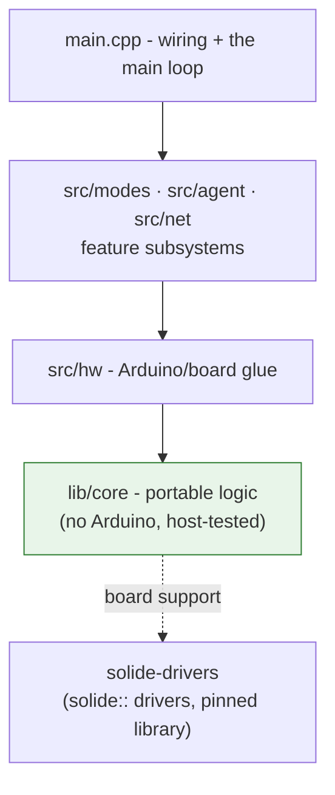
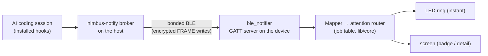
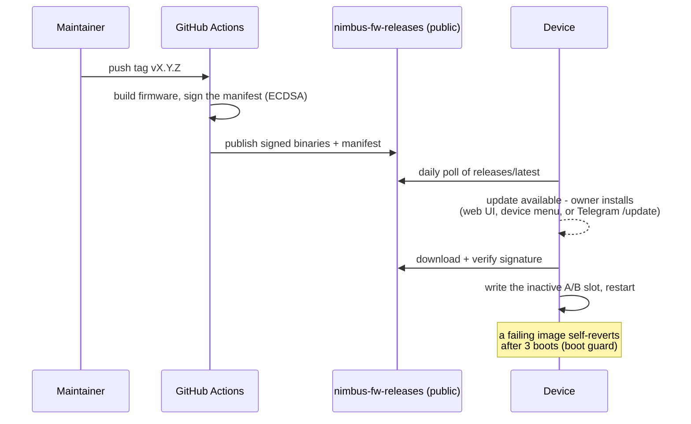

# Nimbus Architecture

Nimbus is firmware for a battery-capable desk device built on the **Solide S3**
board (ESP32-S3-DevKitC-1 N16R8): a 45-LED ring, an I²S microphone and speaker,
and one of two display/input configurations - a 2.9" e-paper panel with a rotary
knob, or a 2.8" color touchscreen. One binary serves both hardware
configurations and both of the device's two operating modes.

This page is the map: how the code is layered, what each operating mode turns
on, which sibling repositories the project depends on, and how a release
travels from a git tag to a device on someone's desk. It links out rather than
re-explaining - each subsystem has its own document.

## Code layering

The repository is organized as four layers. The rule is strict: **a lower layer
never includes an upper one.**

- **`lib/core`** - portable C++ with no Arduino dependency: the attention
  router and ring planner, the notifier frame codec, the battery model, the
  orchestrator's memory engines and turn contract, fault injection, Wi-Fi
  policy, and more. Everything here runs and is tested on the host
  (`pio test -e native`), which is what keeps the device-independent logic at
  100% coverage without a board on the desk.
- **`src/hw`** - the glue that binds portable logic to real hardware: display
  output, self-test probes, board bring-up.
- **`src/modes` · `src/agent` · `src/net`** - the feature subsystems: the two
  operating modes, the orchestrator agent (providers, memory, Telegram, voice),
  and the network surfaces (web UI, BLE notifier link, OTA).
- **`main.cpp`** - wiring and the main loop only. It owns task startup, the
  boot-time mode decision, and draining request flags from the UI subsystems.

Board support itself lives outside the repo in
[`solide-drivers`](#sibling-repositories), consumed as a pinned library - Nimbus
calls its `solide::` seams (LEDs, display, audio, memory, self-test) and never
forks its internals.

## Two operating modes

At boot the firmware reads one NVS setting (`nimbus_mode`) and becomes one of
two devices. The split is deliberate and total - each mode powers only one
radio, because the ESP32-S3's internal SRAM cannot comfortably host the BLE
stack and the Wi-Fi/TLS stack at once.

| | Notifier | Orchestrator |
|---|---|---|
| Purpose | Status light for your AI coding sessions | A provider-hosted LLM agent (Telegram + voice) |
| Radio | **Bluetooth only** - Wi-Fi stays off | **Wi-Fi only** - Bluetooth stays off |
| Ring is driven by | nsn frames from the host broker | The agent's own sessions and turns |
| Web UI / providers / Telegram | off | on |
| Software update (OTA) | not available in this mode (update over USB, or switch modes) | available |

Switching modes (Settings > Mode on the device, Settings → Mode & identity on
the web page, or the `MODE` console command) persists the setting and restarts
the device. The status language - which colors and motions mean what on the
ring - is [identical in both modes](./modes-and-signals.md).

### Notifier - the broker pipeline

In Notifier mode the ring and screen are driven **only over BLE**. AI coding
harnesses (Claude Code, Codex, and others) report session state through
installed hooks to a broker running on the host; the broker encodes it as nsn
frames and writes them to the device's GATT server. The link is bonded and
encrypted (LE Secure Connections, Just Works) - an unbonded central can connect
but cannot paint the ring.

The wire protocol is byte-locked to the reference encoder in the
[`nsnotify`](#sibling-repositories) repository via generated test vectors, so
the broker and the device codec cannot drift apart. Details:
[notifier status language](./notifier-status-language.md) and
[modes & signals](./modes-and-signals.md).

### Orchestrator - the connected agent

In Orchestrator mode the device joins Wi-Fi and becomes a small self-contained
agent host:

- **LLM turns** against OpenAI, Anthropic, or Mistral, with structured outputs
  and a bounded multi-round tool loop ([provider wire](./provider-wire.md),
  [turn anatomy](./turn-anatomy.md)).
- **The World memory system** - vector recall, episodic history, scratchpad
  goals - tiered across PSRAM, SD card, and flash
  ([Orchestrator World](./orchestrator-world.md),
  [storage tiering](./orchestrator-storage.md)).
- **Telegram** as the conversation channel, including voice notes, photos, and
  per-person roles and quotas ([people and privacy](./people-and-privacy.md)).
- **Voice** - hold-to-talk on the device, speech-to-text and text-to-speech
  through the configured provider.
- **The web UI** - a token-gated control surface served from the device itself
  (provider keys, routing, memory dashboard, routines, settings).
- **Routines** - scheduled recurring turns (morning digests, reminders).

## Two display configurations, one binary

A device is assembled in one of two display/input configurations, and the same
firmware serves both. A single NVS setting, `scrModel` (`eink` by default, read
via `store::screenModel()`), is read once at boot to select both the display
driver and the input driver:

| Configuration | Display | Input |
|---|---|---|
| **E-paper + knob** *(default)* | 2.9" SSD1680, 296×128, 1-bit | EC11 rotary knob |
| **Touch TFT** | 2.8" ILI9341, 240×320 color | XPT2046 resistive touch |

The two cannot coexist on one board - the TFT consumes the knob's GPIOs - so
the setting is hardware identity, not a preference: changing it requires a
restart, and it is exempt from "Revert to Defaults". Above the driver seam the
firmware is configuration-blind; screens are composed once and rendered by
whichever panel is bound. Pinouts and wiring:
[hardware reference](./hardware.md).

## Sibling repositories

Nimbus deliberately keeps three concerns in separate repositories and consumes
each through a narrow seam:

| Repository | What it is | How Nimbus consumes it |
|---|---|---|
| [`solide-drivers`](https://github.com/ristllin/solide-drivers) (public) | Board support - the `solide::` drivers for the Solide S3 (LEDs, displays, audio, SD, NVS), plus the board-level build/BOM docs | Pinned library dependency in `platformio.ini` (a sibling checkout or the public git URL); its self-test console example is the hardware acceptance gate |
| [`nsnotify`](https://github.com/ristllin/nimbus-notify) (public) | The nsn wire protocol and the host-side broker, published on PyPI as **`nimbus-notify`** | The reference encoder generates test vectors that byte-lock the device codec; users `pip install nimbus-notify` to run the broker |
| `nimbus-fw-releases` (public) | Signed firmware releases | Devices poll it for updates - see below |

Releases are published to the dedicated `nimbus-fw-releases` repository
because devices download updates unauthenticated - the delivery channel stays
a clean, assets-only repository.

## How a release ships

Firmware updates are signed, published to the public releases repository, and
installed over the air with one click - with an automatic safety net if a bad
image ships. The full design is in [OTA updates](./ota.md); the operator's
runbook is [OTA operations](./ota-operations.md).

Key properties:

- **Signed end to end.** CI signs the release manifest with a private key held
  as a repository secret; the matching public key is compiled into the
  firmware, so a device only installs what CI produced.
- **A/B slots + boot guard.** The update writes the inactive partition; if the
  new image fails to prove itself within 3 boots, the device reverts to the
  previous one on its own.
- **Owner-approved.** Devices check daily but install only on an explicit
  action - from the web UI, the device's Settings menu, or the Telegram
  `/update` command.
- **Orchestrator mode only.** In Notifier mode the Bluetooth stack occupies the
  memory the update needs, so a Notifier device updates over USB or by
  switching modes first.

## Where to go next

- [Modes & signals](./modes-and-signals.md) - every user-facing knob and what it changes
- [Hardware reference](./hardware.md) - pinouts, wiring, first-flash guidance
- [Orchestrator World](./orchestrator-world.md) - the agent's memory and control surface
- [Security](./security.md) - the auth model and open items
