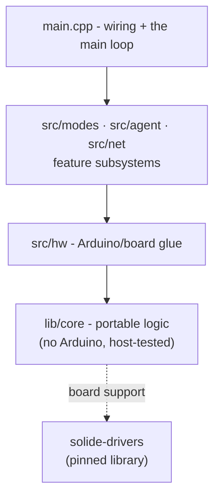

# Development guide

How to build, test, and change the firmware - the distilled version of the
repository's working knowledge. Ground rules for pull requests are in
[CONTRIBUTING.md](https://github.com/ristllin/Nimbus/blob/main/CONTRIBUTING.md).

## Repository layout and the layering rule

Four layers; **a lower layer never includes an upper one**:



- `lib/core/` - portable C++, no Arduino, 100% host-testable. New logic goes
  here first whenever possible.
- `src/hw/` - glue binding portable logic to real hardware.
- `src/modes/`, `src/agent/`, `src/net/` - the feature subsystems.
- `main.cpp` - wiring and the main loop only.

Board support is the separate
[solide-drivers](https://github.com/ristllin/solide-drivers) repository,
consumed as a pinned PlatformIO library. Nimbus calls its `solide::` seams and
never forks its internals.

**Device builds** (`esp32s3`, `test`, …) fetch it automatically from the pinned
public tag in `platformio.ini` - a fresh clone builds with nothing else.
**Host tests** (`pio test -e native`) additionally need its headers on the
include path, which expects a sibling checkout:

```bash
git clone https://github.com/ristllin/solide-drivers.git ../solide-drivers
git -C ../solide-drivers checkout v0.5.1   # the tag the firmware pins
```

Driver developers can point the device builds at that same sibling by swapping
the commented `symlink://../solide-drivers` line in `platformio.ini`.

## Build environments

| Environment | What it is |
|---|---|
| `native` | Host unit tests (Unity + golden images): `pio test -e native` - keep it at 100% |
| `esp32s3` | Production firmware - silent serial, no test/debug code |
| `test` | Production plus the serial test console - what the HIL harness drives |
| `notifierdbg` | Production plus a device→host status echo for Notifier E2E |
| `bttest` | `test` advertising as "Nimbus-BT" so a bench board is unambiguous |
| `provision` / `provision-uart` | Standalone serial network diagnostic / installer seed tool |
| `beep`, `mictest`, `tftmin`, `tfttouch`, `tftbringup` (+`-uart`) | Single-purpose hardware diagnostics |

`tools/build_all.sh` compiles the whole matrix - a compile-only gate before a
release. The full annotated list is in
[Tools & commands](tools-and-commands.md).

## The verification ladder

"Compiles + links + boots" is **not** verification - that fallacy once shipped
a build whose knob, Wi-Fi, and agent had never been exercised. The ladder:

1. **Portable logic** → `pio test -e native`. Fast, no hardware, must stay at
   100%. Over a thousand cases as of v4.1. These are the C++ Unity suites in
   **`test/`** (one directory per module). Note the two similarly-named trees:
   **`test/`** is host C++ (this step); **`tests/hil/`** is the Python HIL suite
   (step 2); and the **`test` build environment** is a third thing again - the
   firmware plus a serial console the HIL suite drives.
2. **Device behavior** → flash `[env:test]` and run the hardware-in-the-loop
   (HIL) suite:

   ```bash
   python3 -m pytest tests/hil -m "hil and not manual" --allow-hardware   # device suite
   python3 -m pytest tests/hil -m "net and not manual" --allow-hardware   # LAN suite
   ```

   Markers (`hil` / `net` / `agent` / `audio` / `manual`) are all deselected
   by default, and hardware is additionally gated behind `--allow-hardware`,
   so collection stays clean with no device attached. Tests that break device
   state must restore it in a `finally`; manual tests must fail loud when
   unconfirmed.
3. **Anything user-visible** → assert it through the test console
   (`RENDER?`, `STATUS`, echoes) or hand it to a human as an explicit manual
   step.

Every observed field failure and the test that would have caught it is tracked
in the maintainers' failure catalog. Check the known open items before "fixing"
one.

## Golden tests (screens and protocol)

UI screens are pinned as **golden framebuffers**: e-ink screens in
`test/golden/*.bin` (296×128 1-bit), TFT screens in `test/golden_tft/*.bin`
(240×320 RGB565). The flow after an intentional screen change:

1. Run the native suite; the golden test fails and writes the new buffer.
2. Render it for human review: `python3 tools/golden.py render <name>` (e-ink)
   or `python3 tools/tftpreview.py contact` (TFT - the whole UI on one sheet).
3. If it looks right, bless the new buffer and commit it with the change.

The nsn wire protocol is pinned the same way - `test/test_proto/nsn_vectors.h`
is generated from the reference encoder in
[nimbus-notify](https://github.com/ristllin/nimbus-notify) by
`tools/gen_nsn_vectors.py`, byte-locking the device codec to the broker.

## Pre-commit hooks

```bash
pip install pre-commit && pre-commit install
pre-commit run --all-files    # what CI runs
```

The hooks include secret scanning (gitleaks), repo-specific pattern checks,
a complexity gate (lizard - new code only; existing offenders are baselined),
formatting/whitespace hygiene, and ruff for Python. Generated outputs
(`website/docs/**` guides/reference, `docs/sfx-map.md`, the embedded docs
pack) are exempt from hygiene hooks - regenerate them, never hand-edit.

## Serial discipline (how not to wedge a board)

The ESP32-S3's native USB port is fragile in specific, documented ways:

- **Never strobe DTR/RTS.** Open ports quietly (both lines de-asserted before
  open) - see `tests/hil/device.py`. A DTR/RTS strobe can wedge the USB device
  silent.
- **Opening the port restarts the board** - even a quiet open. Hold one serial
  session across commands instead of reconnecting per command; prefer HTTP
  (`/api/state`) for polling.
- **Restart in software only**: the `REBOOT` console command, or the task
  watchdog (~8 s).
- A silent board is almost never bricked - see
  [recovery](quick-start/flash.md#recovery).

## Docs follow every commit

Renamed or moved anything user-visible? Grep for the old wording and fix every
hit in the same commit (`README.md`, `docs/`, `website/docs/`, web UI copy).
Edited a published doc? Re-run `node website/scripts/migrate-docs.mjs` and
commit the regenerated `website/docs/**`. Edited a doc the on-device model
reads? Re-run `python3 tools/gen_docs_pack.py` and commit the regenerated
header. The [docs map](README.md) says which file is canonical for what.

## Hard-won constraints (do not relearn these on hardware)

- ⛔ **No on-device sub-agent concurrency** - no worker task, no second
  concurrent TLS connection, no parallelism in the turn/sub-agent path. The
  single-task, single-TLS, fully-serialized design is deliberate and
  hardware-proven; every attempt at concurrency destabilized the device.
- **Internal SRAM is the scarce pool, not total RAM.** Route churn to PSRAM;
  never "fix" OOM by raising heap floors. See [Memory](memory.md).
- **The two USB-C ports are not interchangeable** - a factory-fresh board
  flashes only through `UART`. See [Flash the firmware](quick-start/flash.md).
- **Structured outputs everywhere** - never ask a model for JSON in prose.
  See [Provider wire](provider-wire.md).

---

*Forking the project and running your own update channel →
[Self-hosted OTA](self-hosted-ota.md)*
