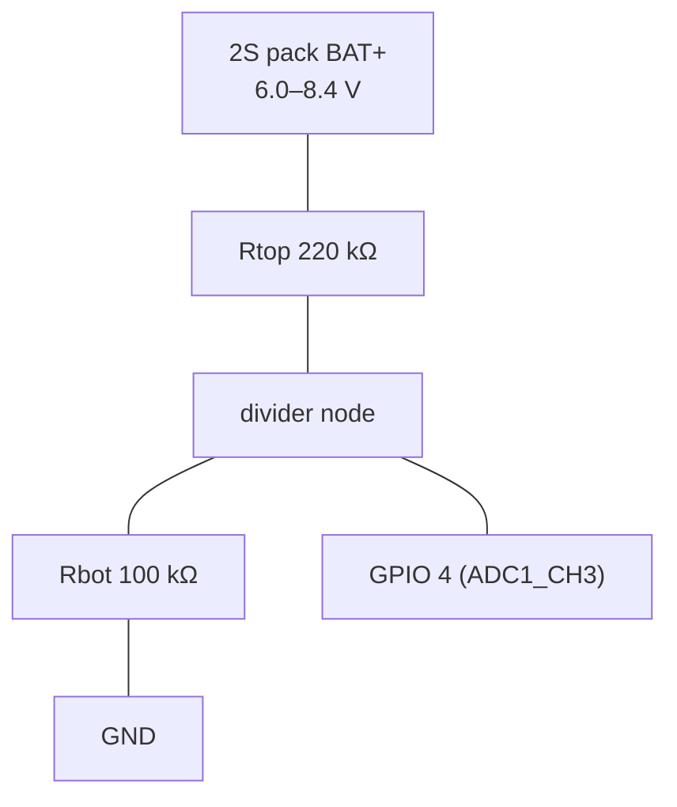

<!-- audience: dev -->
# Nimbus Hardware Reference

Project-level pinout + wiring for the **Solide S3** board (ESP32-S3-DevKitC-1 N16R8).
The board pin map's source of truth is
`board_solide_s3.h` in the public
[solide-drivers](https://github.com/ristllin/solide-drivers) board-support
repository; the deeper board build/BOM guide is its
[docs/build.md](https://github.com/ristllin/solide-drivers/blob/main/docs/build.md) +
[docs/hardware.md](https://github.com/ristllin/solide-drivers/blob/main/docs/hardware.md).
This page is the Nimbus-side consolidated view.

## Board configurations

A Nimbus device runs in **one of two display configurations**, one per board. The
hand-built **Solide S3** board drives a 2.8" color touchscreen alongside its LED
ring (`screenModel=tft`). The other is an off-the-shelf all-in-one module, the
**Freenove ESP32-S3 Display (CYD)**, that arrives as a single part and runs its
own firmware image.

| Configuration | Display | Input | `screenModel` | Board | Details |
|---|---|---|---|---|---|
| **[Touch TFT](hardware/touch-tft.md)** | 2.8" ILI9341, 240×320 RGB565 | XPT2046 resistive touch | `tft` | `solide_s3` | [→ pinout, wiring, touch cal](hardware/touch-tft.md) |
| **[All-in-one (Freenove CYD)](hardware/all-in-one-cyd.md)** *(lowest effort)* | 2.8" ILI9341, 240×320 capacitive touch | Touch | `tft` | `freenove_s3` | [→ pinout & happy-path build](hardware/all-in-one-cyd.md) |

The Solide S3 pinout:


The all-in-one has its own complete pinout on its page:
[All-in-one (Freenove CYD)](hardware/all-in-one-cyd.md).

For a hand-built Solide S3 board, `python3 tools/setup_device.py` stores
`scrModel=tft` over UART before production firmware boots, so the board binds its
display and touch drivers on the first boot. It is **hardware identity, not a
preference**: read once at boot to pick the drivers, so a change needs a restart,
and it is exempt from "Revert to Defaults". Surfaced as `scrModel` in `/api/state`
and `scr=` in `STATUS`.

The all-in-one is different: its pinout is a **compile-time identity** chosen by
`SOLIDE_BOARD=freenove_s3` at flash time, and `screenModel` is fixed to `tft`.
There is no display setting to pick, and nothing to wire.

Everything below this section covers the **Solide S3** board. The all-in-one
carries the same peripherals on a different, fixed pinout, covered in full on its
own page.

## First flash of a fresh board - use the UART port

⚠ **The DevKitC-1 has TWO USB-C ports and they are not interchangeable for
flashing.** Getting this wrong on a factory-fresh board looks like a dead board.

| Port (silkscreen) | Goes to | Auto-reset into download mode? |
|---|---|---|
| **UART** | CP2102N bridge → GPIO 43/44, **and DTR/RTS wired to EN + GPIO 0** | **YES - electrical, always works** |
| **USB** | the ESP32-S3's own USB peripheral (GPIO 19/20) | Only while the ROM owns it |

**For the first flash of a fresh board, plug into `UART`.** esptool toggles DTR/RTS,
the auto-reset circuit physically pulls GPIO 0 low and pulses EN, and the chip
enters download mode. **No buttons, and it does not care what firmware is running**,
because the path is electrical rather than software-cooperative. For a
production install, use the guarded installer:

```bash
python3 tools/setup_device.py
```

It lists the UART adapters, requires an explicit choice, reads the selected
board's immutable factory MAC and NVS state, and asks for the fitted display plus
initial operating mode. It then asks you to type the MAC back before any upload.
On a new board a UART-only diagnostic writes and verifies `scrModel` and
`nimbus_mode`; production firmware is installed last. Existing Nimbus settings
produce a prominent warning, and NVS is never erased. Do not run a bare `pio run
... -t upload` with more than one board connected, because PlatformIO may select
a different serial device than the one you intended.

The full flashing guide - the installer in detail, reflashing a running board,
recovery, and which build environment to use - is
[Flash the firmware](quick-start/flash.md).

`[env:provision]` is a standalone serial network diagnostic, not the product
firmware. It does not serve the Nimbus setup network or web settings. If it was
flashed accidentally, run `python3 tools/setup_device.py` to replace it with the
production firmware.

The board appears as a **CP210x** (`10c4:ea60`, `/dev/cu.usbserial-*` or
`/dev/cu.SLAB_USBtoUART`) rather than an Espressif device.

### Why the USB port can leave a fresh board unflashable

The native `USB` port talks to the S3's own USB peripheral. Whoever owns that
peripheral decides whether a reset is possible:

- **ROM owns it** → USB-serial-JTAG (`303a:1001`), and esptool can reset it.
- **An app owns it** (any TinyUSB/Arduino USB-CDC firmware, including the demo
  these kits ship with) → a plain CDC-ACM device such as **`303a:4001`**
  ("Espressif CDC Device"). DTR/RTS are then *virtual*: they do nothing unless
  that app implements a reset handler. The shipped demo does not.

In that state there is **no software path to download mode at all** - verified
against a factory-fresh unit: `--before default-reset`, `--before usb-reset`,
`--before no-reset`, the 1200-baud touch (every DTR/RTS polarity), a libusb bus
reset, and racing esptool against repeated resets all reach `Connecting…` and
never sync.

⚠ A libusb bus reset (`tools/usb_reset.py`) resets the **USB link, not the CPU**.
It is the right tool for a *wedged* CDC on a Nimbus board; it cannot restart the
chip or reach download mode.

⚠ **Do not go hunting with DTR/RTS.** AGENTS.md forbids strobing it on this board
and that is not idle advice - a strobe matrix wedged a board's CDC silent here.

### Once Nimbus is on it

Nimbus also owns the native USB, but its `[env:test]` build has the `REBOOT`
console command and a task watchdog, so it stays reachable and either port works
for reflashing. The UART port remains the guaranteed path if a build ever wedges.

## Shared peripherals

These are present on the **Solide S3** board. The display + touch pins are on the
[Touch TFT](hardware/touch-tft.md) page. The all-in-one carries the same peripherals on
its own fixed pinout - see [All-in-one (Freenove CYD)](hardware/all-in-one-cyd.md).

| Peripheral | Bus | Pins | Rail | Notes |
|---|---|---|---|---|
| **microSD** | SPI2 (FSPI) | CS 10 · MOSI 11 · SCK 12 · MISO 13 | 3.3 V | **MUST be FAT32-formatted** - exFAT (the factory default on >32 GB cards) mounts as `cardType!=0, ok=false`; REFORMAT as FAT32/"MS-DOS (FAT)" before first use (owner-verified fix 2026-07-13). orch `/mem` store. Needs a shared GND (a cold GND joint = `cardType=0`). |
| **LED ring** WS2812B ×45 | RMT | DIN 21 | **5 V** pwr / 3.3 V logic | ~372 mA worst case @ brightness 30 |
| **Speaker** MAX98357A I²S amp | I²S1 (std) | BCLK 7 · LRCLK 8 · DIN 17 | amp **5 V** | Class-D, built-in thermal/over-current protection (V0.1) |
| **Mic** I²S MEMS (INMP441/ICS-43434) | I²S0 (std) | BCLK 15 · WS 18 · SD 16 | **3.3 V only ⚠** | L/R→GND (left slot); VDD/data follow VCC - 5 V damages the S3 |
| **Battery sense** *(optional)* | **ADC1** | **GPIO 4** | - | resistor divider off the pack - see [Battery voltage sampling](#battery-voltage-sampling-how-to-add-it) |

:::caution A warm or hot SD card is an electrical fault
Disconnect power immediately and remove the card. Do not reinsert it while the
device is powered. Formatting and firmware cannot make a card hot: verify the
socket/module orientation and pin numbering, confirm its VDD is **3.3 V (never
5 V)**, check continuity from every ground to system GND, and check that 3.3 V
is not shorted to ground before applying power again. Nimbus runs safely without
the card, using its reduced internal-flash tier.

The SD card uses dedicated **SPI2** pins (`10/11/12/13`). TFT + touch use a
different **SPI3** bus (`42/41/1` plus their selects). They do not share SPI data
lines, but they do share the 3.3 V rail and ground; an SD power fault can therefore
brown out or damage the display even though its bus is separate.
:::

**Reserved (never assign):** 0·45·46 strapping · 19·20 native USB · 43·44 UART0 ·
26–32 flash · **33–37 OCTAL PSRAM** · 48 on-board RGB. **Free spares:** 3 · **4 (battery
sense)** · 5 · 6 · 9. **(18 = I²S mic WS/LRCLK.)**

> **Nimbus V0.1** moves audio to two separate, well-protected breakouts: a **MAX98357A**
> I²S amp + an **INMP441/ICS-43434** I²S MEMS mic (replacing the old combined PDM-mic +
> NS4168 board). Mic RX (I²S0) and speaker TX (I²S1) are independent controllers, so
> record + play run concurrently.

## Power

`USB-C → 2S BMS → 2×18650 (series) → DC-DC → 5 V bus`. The **3.3 V** rail (MCU, display,
SD, audio, mic) is always on; the **5 V** bus (LED ring, amp volume) is switchable - so
the ESP32 + display + SD + input + mic all run on USB alone.

## Battery voltage sampling (how to add it)

The board has **no built-in gauge**. Two options; the firmware supports both behind
build flags (default = `NullMonitor`, i.e. desk-powered, battery UI hidden):

### Option A - resistor divider + ADC  *(implemented, `NIMBUS_HAS_BATTERY_ADC`)*

Cheapest path, no extra chip. **Tap `BAT+` *before* the DC-DC** - the regulated 5 V rail
is flat and tells you nothing about charge. Wire a divider into a **free ADC1 pin**
(GPIO 1–10; Wi-Fi owns ADC2 = GPIO 11–20, which reads garbage while Wi-Fi is up):



- Ratio: (220k+100k)/100k = **÷3.2**, so 8.4 V → 2.63 V, inside the ADC's ~0–3.1 V range.
- Firmware: `AdcBatteryMonitor` (`src/hw/power_battery_adc.cpp`) averages
  `analogReadMilliVolts(GPIO4)`, multiplies by 3.2 → pack mV, divides by the cell count
  (2) → per-cell mV → `liIonPercent()` SoC curve (host-tested).
- An optional divider that is not fitted leaves the ADC pin floating. Firmware
  accepts telemetry only across a broad **2.5–4.5 V/cell** plausibility window;
  outside it the board behaves as desk-powered with no battery gauge. This keeps
  a USB-only fresh board awake instead of mistaking a floating reading for a dead
  pack and entering low-battery sleep during setup.
- Config in [`include/nimbus_config.h`](../include/nimbus_config.h):
  `NIMBUS_BATT_SENSE_PIN 4` · `NIMBUS_BATT_DIVIDER_X100 320` · `NIMBUS_BATT_CELLS 2` ·
  `NIMBUS_BATT_VBUS_PIN -1`. Enable with `-DNIMBUS_HAS_BATTERY_ADC`.
- **Single-cell LiPo instead?** Use a ÷2 divider (e.g. 100k/100k), set
  `NIMBUS_BATT_DIVIDER_X100 200` and `NIMBUS_BATT_CELLS 1`, on any free ADC1 pin.

**LIVE-VERIFIED (2026-07-12)** on the 2S LiitoKala pack: enabled `NIMBUS_HAS_BATTERY_ADC`,
read **7923 mV** = 3962 mV/cell (2S confirmed). ⚠ **The S3 ADC under-reads near full.**
The ÷3.2 node at 8.4 V is **2.625 V - above the ADC's LINEAR region at 11 dB** (accurate
to ~2.45 V, compresses above), so a *truly full* pack reads ~7.9 V → ~72 %, not 100 %.
Consequences baked into the firmware: charge state comes from the
voltage **trend**, NOT absolute voltage (there is **no VBUS pin** - `NIMBUS_BATT_VBUS_PIN
-1` - so `onExternalPower` can only be inferred); a learned/asserted full-charge anchor
(`BATTCAL`) stretches the compressed top band so full reads 100 %. A lower divider (e.g.
÷4, keeping the full-charge node ≤ ~2.1 V) would make the top of the range linear and
remove the need for the calibration - a candidate for the next board rev.

> **⚠ Cautions:** use ADC1 (1–10) not ADC2; keep the divider high-value (≥100 kΩ legs)
> so it barely drains the pack, and never let
> the divider node exceed ~3.3 V. GPIO 3 is a strapping-adjacent pin - GPIO 4/5/6/9 are
> cleaner choices (the board doc designates **4**).

### Option B - I²C fuel gauge  *(stubbed, `NIMBUS_HAS_FUEL_GAUGE`)*

A MAX17048-class gauge (I²C addr 0x36) models SoC in hardware (more accurate, survives
sag). Impl exists at `src/hw/power_fuelgauge.cpp`; wire SDA/SCL to a free I²C-capable
pair + a VBUS-sense pin, set the pins in `nimbus_config.h`, build with
`-DNIMBUS_HAS_FUEL_GAUGE`.

Either monitor feeds the same portable `power::Manager` → the battery header glyph, the
T1 (force the Dark battery mode + Telegram ping) / T2 (flush + deep sleep) thresholds,
and the VBUS→Full battery-mode auto-switch.

## Security note
Web/LAN surfaces are token-gated - see [`security.md`](security.md).


## Battery hardware is web-configurable (v2.10.x, owner 2026-07-17)

Boards differ physically - some have the design **220k/100k** divider (÷3.20), others the
**270k/120k** actually fitted (÷3.25), and packs range from LiitoKala **3500 mAh** to
reclaimed vape/18650 **~500 mAh** cells (always **2S**). These are no longer compile-time:
**Settings → Battery** on the web exposes the two sense resistors + pack capacity, stored in
NVS (`battRtop`/`battRbot`/`battCapMah`) and applied live (ADC re-armed + model capacity
updated on the main task; cells stays compile-time 2S). Defaults equal the old compile
constants, so an un-set board is unchanged.

⚠ This fixed a real on-device bug: the firmware baked in **÷3.20** while the fitted
resistors are **270k/120k = ÷3.25**, so voltage read **~1.6% low** across the range (BATTCAL
masked only the top). Set the true resistors and the raw reading is correct end-to-end; the
`/api/state` `dividerX100` now reports the CONFIGURED ratio, so the Battery Lab's host-side
correction tracks it (no double-correction). ⚠ A divider change re-scales every mV, so the
BATTCAL full-anchor goes stale - **re-run Calibrate on a full pack** after changing resistors
(the web UI prompts for this).

## Measured battery reality (curve run #4, Board 2, 2026-07-16)

The first complete full→cutoff drain on real hardware. **5.75 h**, 3940 samples, 25
settle reads, zero thermal trips (die held ~50 °C). Owner-measured ground truths from
a dedicated analyzer: **capacity 3500 mAh**, **full = 8.40 V**. Raw data +
snapshots live with the Battery Lab, its own project at
[ristllin/nimbus-battery-lab](https://github.com/ristllin/nimbus-battery-lab)
(`data/rescue/run4_FINAL_brownout.{json,csv}`).

### What it measured
- **Total system power at LED bright=77/255: 4.21 W** (608 mA average at the pack over
  5.75 h to deliver 3500 mAh). This is the hard number every estimate below is anchored on.
- **Load-model correction k = 0.60**: the datasheet model (`200 + 45·60·b/255`)
  predicted 1015 mA where the truth was 608. Two errors multiply: it returns **5 V-rail**
  mA but is consumed as **pack** mA (a 2S pack behind the buck ⇒ ~1.33×), and the
  per-LED full-white constant (60 mA) is high - the run bounds real white at ~45-50 mA,
  since 45 LEDs × 60 mA @5 V would exceed the *entire* measured system draw.
- **Device base draw ≈ 0.6-1.0 W** (derived, not measured: total 4.21 W minus the
  bounded LED share). ⚠ The one measurement that would collapse this range to a number
  is a drain at **bright=0** - one pack cycle, highest-value next experiment.

### ⚠ Battery life: Dark posture is a VISUAL setting, not a power setting
`Posture::Dark` only stops lighting LEDs. It does not touch Wi-Fi, Bluetooth, or the CPU -
it appears in 4 places, none of them power-domain code. The three battery modes
(Dark / Balanced / Full) are a table of LED/screen/telemetry settings (`profile.cpp`),
not radio or clock decisions.
There is **no power management**: no `esp_light_sleep`, no `esp_pm_configure`, no
`setCpuFrequencyMhz`, `CONFIG_PM_ENABLE` unset, CPU pinned at 240 MHz. The only
`esp_deep_sleep_start()` is the critical-battery give-up path. Modem sleep is on only
because Arduino defaults `WIFI_PS_MIN_MODEM` - never by intent, never tuned.

| Posture | Pack draw | Life on 3500 mAh |
|---|---|---|
| Drain @77/255 (run #4) | 608 mA | **5.75 h** (measured, to cutoff) |
| Ring at 1% (run #7) | 209 mA | **16.7 h** (measured) |
| Dark ≈ Calm ≈ Full-idle | **150 mA (1.11 W)** | **~23 h** (two-point solve) |
| For a **week** | 20.8 mA | ✗ not reachable |
| For a **month** | 4.9 mA | ✗ not reachable |

### The load model is now MEASURED, not derived (run #7, 2026-07-17)

**I(b) = 150 + 5.95·b mA at the pack**, from two measured points - b=77 (run #4, 608 mA
over 5.75 h to real cutoff) and b=10 (run #7, 209 mA over 15.39 h, 73 settle reads).

⚠ **The derived 86-143 mA band MISSED.** The true idle draw is **150 mA (1.11 W)** -
above the top of the estimate, so idle life is **~23 h, not 24-40 h**. The optimistic end
of that table was never real. Quote ~1 day, never "a day and a half".

⚠ **1% ring brightness is NOT ~0.** It draws 60 mA on top of the 150 mA base - **29 % of
total draw**, costing **6.7 h** of runtime (23.4 → 16.7 h). 45 LEDs make "1 %" collective.

**Independent cross-check that passed:** the measured slope implies **~42 mA/LED at full
white** vs the datasheet's 60 - the same over-estimate the k=0.60 capacity correction
found by a completely different route (a measured 3500 mAh vs a two-point current solve).
Two unrelated methods, one conclusion: the datasheet per-LED constant is ~30 % high.

⚠ **Run #7 stopped at a 6000 mV FLOOR, not cutoff** - 281 mAh (8 %) was still in the pack,
so `3500 / runtime` would OVERSTATE the current by 9 % (227 vs 209 mA). The delivered
charge was recovered by reading its final settle voltage off run #4's measured curve. A
floor-stopped run is also barred from the SoC curve (no 0 % anchor). Known bias: run #4's
curve was built at 0.17C and run #7 ran at 0.05C, so its settle reads recover higher and
the curve over-reads its SoC - meaning the true I(10) is a little ABOVE 209 mA, and the
true base a little above 150. The **bright=0 idle-baseline run** (owner-approved) measures
A directly, with no extrapolation and no dependence on run #4's curve.

Dark/Calm/Full-idle are within noise of each other - since Full-idle went fully dark
(owner 2026-07-15), the LEDs were never the idle load; the always-on radios + 240 MHz
CPU are. **A week is not reachable by tuning, and not even by deleting the LEDs**: 45
WS2812Bs draw 0.6-1.0 mA each *with every pixel black* (~19-30 mA at the pack, no load
switch on the LED rail) - the dark strip alone exceeds the whole 20.8 mA week budget.
An S3 at 240 MHz with Wi-Fi associated is ~10× the month budget by itself. A week needs
a MOSFET on the LED rail + light-sleep with duty-cycled wake; a month needs deep sleep
- architecturally incompatible with "Notifier shows live BLE-pushed status".
