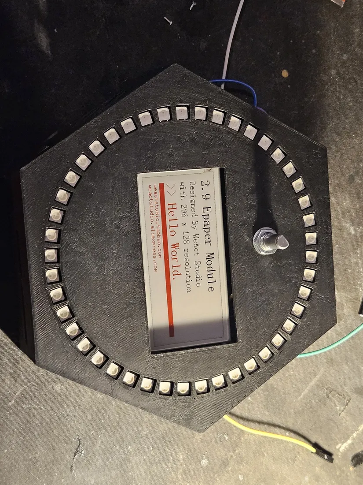
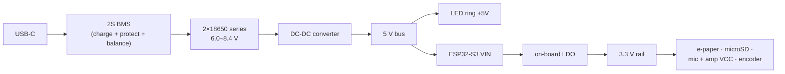
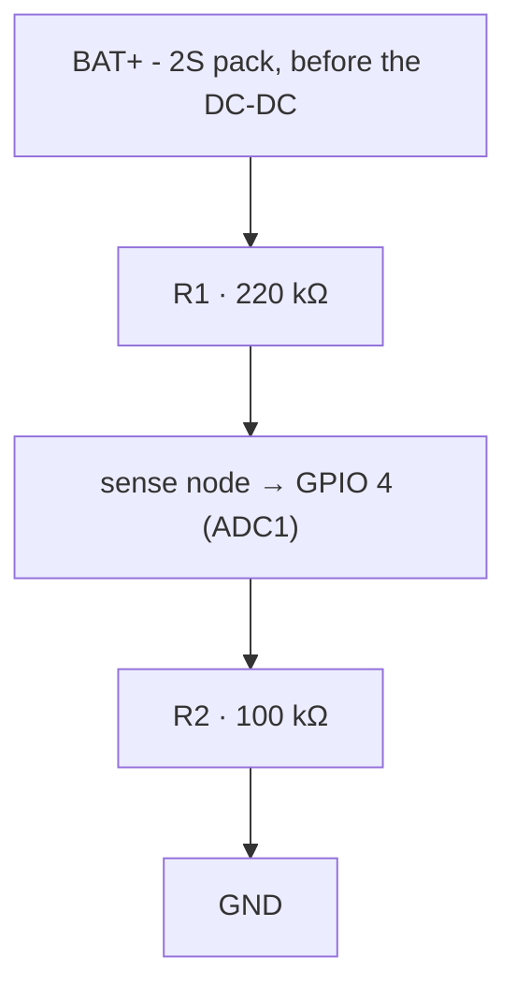
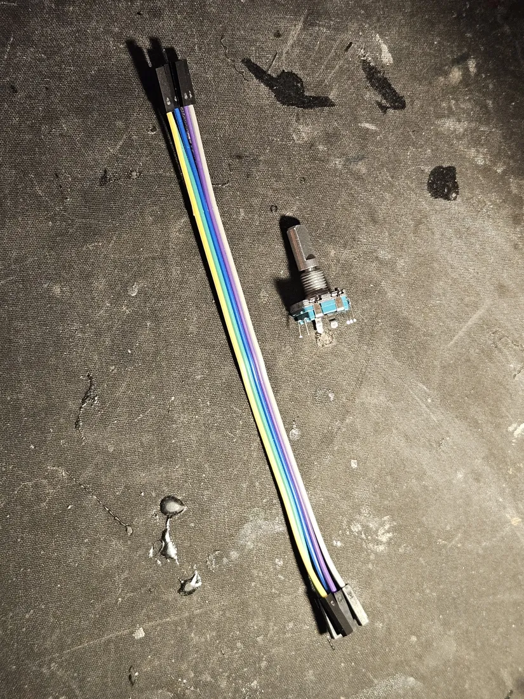
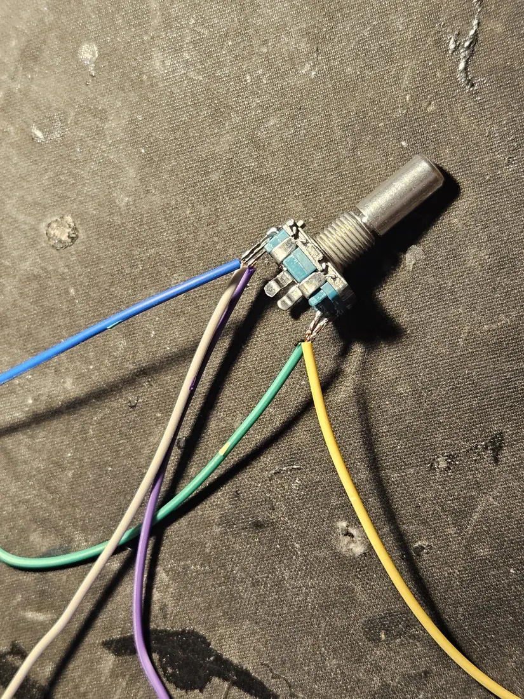
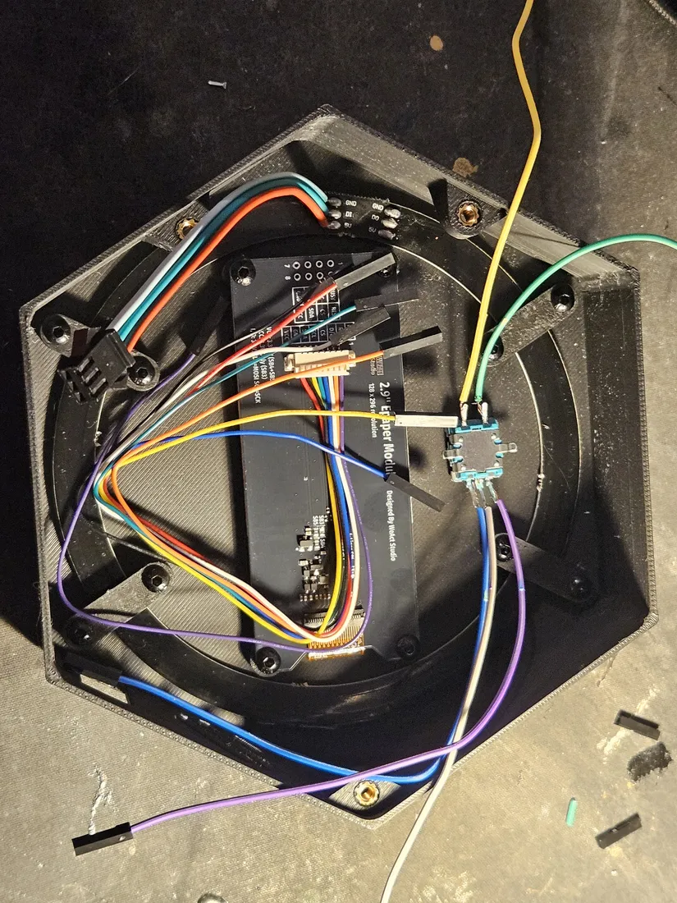
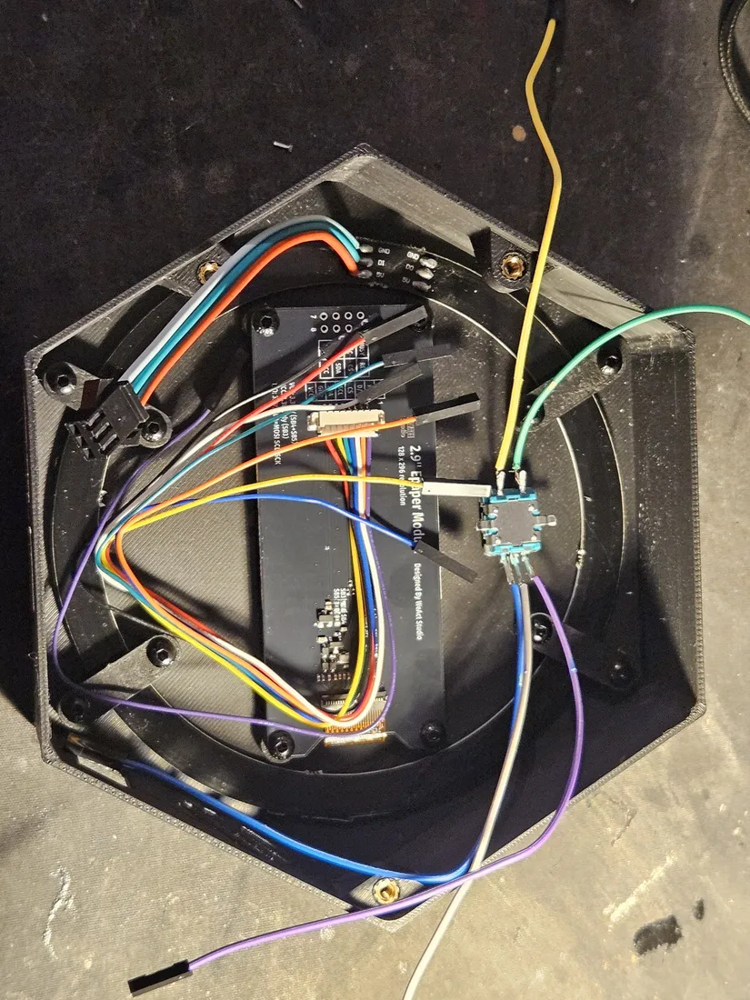

# Build Guide - E-Paper + Knob

How to construct the default Nimbus configuration from parts: a 2.9" SSD1680
e-paper panel with an EC11 rotary knob on the Solide S3 board
(ESP32-S3-DevKitC-1 N16R8). This is the shipped build - a fresh or erased
device boots as `screenModel = eink`.



This page is the assembly walk-through. The companion pages:

- [E-paper + knob reference](eink-knob.md) - the pinout drawing and
  display/input pin table for this configuration.
- [Hardware reference](../hardware.md) - everything common to both
  configurations: first flash, shared peripherals, power, battery sensing.
- [Touch TFT build guide](build-tft.md) - the other configuration.

## Bill of materials

All commodity parts; any listing matching the **Module / chip** column works.
Prices are approximate street prices in USD, excluding shipping. The
consolidated parts list for all configurations, with the shared-parts
breakdown and safety notes, is the **[bill of materials](bom.md)**.

| Qty | Part | Module / chip | Notes | Purchase | ~Price |
|---|---|---|---|---|---|
| 1 | Dev board | **ESP32-S3-DevKitC-1 N16R8** | 16 MB QIO flash, 8 MB octal PSRAM. The N16R8 variant specifically - octal PSRAM occupies GPIO 33–37. | [AliExpress](https://www.aliexpress.com/w/wholesale-esp32-s3-devkitc-1-n16r8.html) · [Mouser](https://www.mouser.com/c/?q=ESP32-S3-DevKitC-1-N16R8) | $12 |
| 1 | Display | **WeAct 2.9" 3-color e-paper (SSD1680)**, 296×128 | B/W + red panel; the firmware drives it in fast B/W (~2.2 s refresh). | [WeAct Studio official store](https://weactstudio.aliexpress.com) | $9 |
| 1 | Knob | **EC11 rotary encoder** with push switch | 3-pin side + 2-pin side, five unmarked pins - see the trap below. | [AliExpress](https://www.aliexpress.com/w/wholesale-ec11-rotary-encoder.html) | $1 |
| 1 | LED ring | **WS2812B ring, 45 pixels** | Addressable RGB; 5 V power, 3.3 V logic. | [AliExpress](https://www.aliexpress.com/w/wholesale-ws2812b-led-ring.html) | $6 |
| 1 | Amp | **MAX98357A I²S amplifier** breakout | Class-D, built-in thermal and over-current protection. | [Adafruit 3006](https://www.adafruit.com/product/3006) · [AliExpress](https://www.aliexpress.com/w/wholesale-max98357a.html) | $2–6 |
| 1 | Speaker | **4 Ω · 3 W · ~40 mm** full-range | The standard MAX98357A pairing; any small 4 Ω 3 W driver (28–45 mm) works. | [AliExpress](https://www.aliexpress.com/w/wholesale-40mm-4ohm-3w-speaker.html) | $2 |
| 1 | Mic | **INMP441** or **ICS-43434** I²S MEMS mic breakout | Separate breakout from the amp. **3.3 V only** - 5 V damages the S3. | [AliExpress](https://www.aliexpress.com/w/wholesale-inmp441-i2s.html) | $2 |
| 1 | Storage | **microSD module (SPI)** + microSD card | Card must be formatted **FAT32** - see the trap below. | [AliExpress](https://www.aliexpress.com/w/wholesale-micro-sd-card-module-spi.html) + any 16–32 GB card | $6 |
| 2 | Cells | **18650 Li-ion** | Wired in **series** (2S). Brand-name cells from a reputable vendor only. Reference pack: owner-measured 3500 mAh, 8.40 V full. | [18650batterystore.com](https://www.18650batterystore.com/) | $12 |
| 1 | Charger/protection | **2S BMS with USB-C charging** | Protection + balance + charging in one module. | [AliExpress](https://www.aliexpress.com/w/wholesale-2s-bms-usb-c-charging-board.html) | $3 |
| 1 | Regulator | **DC-DC converter → 5 V** | From the 2S pack (~6.0–8.4 V) to a clean 5 V bus, ≥2 A. | [AliExpress](https://www.aliexpress.com/w/wholesale-dc-dc-buck-converter-5v-3a.html) | $2 |
| 1 each | Battery sense | 220 kΩ + 100 kΩ resistors | Optional but recommended - the pack-voltage divider on GPIO 4. | any electronics supplier | $1 |
| - | Misc | wire, protoboard/PCB, JST connectors; optional 330 Ω resistor (LED DIN) and 1000 µF capacitor (ring 5 V/GND) | The resistor and capacitor improve LED reliability on long runs. | [AliExpress](https://www.aliexpress.com/w/wholesale-jst-connector-kit-protoboard.html) | $5 |

**Total: ≈ $61–65** (AliExpress-class sourcing; US distributors add ~$15–25).

## Power architecture



- **On battery:** the DC-DC 5 V bus feeds the ESP32's VIN; the DevKit's
  on-board regulator makes the 3.3 V rail. USB-C on the BMS charges the pack.
- **On USB alone (development):** the DevKit runs from USB - the MCU, e-paper,
  SD, encoder, and mic all work. The **LED ring will not light and the speaker
  will not drive audibly without the 5 V bus**, which is the pack path.
- **Every ground is common** - tie all GNDs together: cells, BMS, DC-DC,
  ESP32, and every module.
- ⚠ **The mic VCC is 3.3 V only.** Its VDD and data lines follow VCC, and 5 V
  damages the S3's input. Never put the mic on the 5 V bus.

## Wiring

The whole build at block level - each peripheral with its bus and rail, and
the battery chain along the bottom (the pin-by-pin tables follow):


Pin numbers are the canonical ones from
`board_solide_s3.h` in the
[solide-drivers](https://github.com/ristllin/solide-drivers) board-support
repository; the tables below are copied from its
[build guide](https://github.com/ristllin/solide-drivers/blob/main/docs/build.md)
and the [e-paper + knob reference](eink-knob.md). `3V3`/`5V`/`GND` are the
rails above.

### E-paper (WeAct 2.9", SSD1680)

The WeAct silk screen labels the SPI lines I²C-style - **SDA is MOSI and SCL
is SCK**; the panel is SPI, not I²C.

| Module pin | → | ESP32 |
|---|---|---|
| VCC | → | **3V3** |
| GND | → | **GND** |
| SDA (MOSI) | → | GPIO **39** |
| SCL (SCK) | → | GPIO **38** |
| CS | → | GPIO **40** |
| D/C | → | GPIO **41** |
| RES (RST) | → | GPIO **42** |
| BUSY | → | GPIO **47** |

### EC11 rotary encoder

3-pin side = rotation (A · common · B); 2-pin side = the push switch.

| Encoder pin | → | ESP32 / rail |
|---|---|---|
| A (3-pin, outer) | → | GPIO **1** |
| C / common (3-pin, **middle**) | → | **GND** |
| B (3-pin, outer) | → | GPIO **2** |
| SW (2-pin) | → | GPIO **48** |
| SW (2-pin, other) | → | **GND** |

Internal pull-ups are enabled in the driver - no external resistors needed.

### microSD module (SPI)

| Module pin | → | ESP32 |
|---|---|---|
| VCC (3V3) | → | **3V3** |
| GND | → | **GND** |
| CS | → | GPIO **10** |
| MOSI (DI) | → | GPIO **11** |
| SCK (CLK) | → | GPIO **12** |
| MISO (DO) | → | GPIO **13** |

### WS2812B LED ring

| Module pin | → | ESP32 / rail |
|---|---|---|
| +5V | → | **5 V bus** |
| GND | → | **GND** (common) |
| DIN | → | GPIO **21** (a 330 Ω series resistor on DIN is good practice) |

### Audio - MAX98357A amp + I²S mic

Two separate breakouts. The amp runs at reduced volume on 3.3 V (fine as a
status speaker); use the 5 V bus for more volume - but never share that VCC
with the mic.

| Module | Pin | Role | → | ESP32 / rail |
|---|---|---|---|---|
| amp | VCC | power | → | **3V3** (5 V bus for louder) |
| amp | GND | ground | → | **GND** |
| amp | BCLK | bit clock | → | GPIO **7** |
| amp | LRCLK | word clock | → | GPIO **8** |
| amp | DIN | data in | → | GPIO **17** |
| mic | VDD | power | → | **3V3** ⚠ (never 5 V) |
| mic | GND | ground | → | **GND** |
| mic | BCLK / SCK | bit clock | → | GPIO **15** |
| mic | WS / LRCLK | word select | → | GPIO **18** |
| mic | SD | data out | → | GPIO **16** |
| mic | L/R | channel select | → | **GND** (left slot) |

### Battery sense (optional, recommended)

A resistor divider from the **pack** - not the regulated 5 V rail, which stays
flat and tells you nothing about charge - into GPIO 4 (ADC1):



The ÷3.2 ratio scales 8.4 V to ~2.6 V, inside the ADC's range; quiescent draw
is about 26 µA. Enable with `-DNIMBUS_HAS_BATTERY_ADC`. Full detail, the ADC
top-band caveat, and the single-cell variant:
[Battery voltage sampling](../hardware.md#battery-voltage-sampling-how-to-add-it).

## Assembly walk-through

A photo-by-photo build of an actual Nimbus, from printed parts to the finished
device. The [wiring tables](#wiring) above are the pin-level authority; this
section is the physical order of operations. The electronics, power, and case
stages are the same on both display builds - only the final display stage
differs. Bench-flash and self-test each subsystem (the [Assembly order](#assembly-order)
below) before you close the case.

### Print the case and set the heat inserts

Print all enclosure parts before you touch the electronics. STL, material, and support notes live in [Enclosure and CAD](#enclosure-and-cad) - print in PLA or PETG, main body needs no supports on most printers.


**Confirm the print set is complete.** Lay every part out and account for it before starting. This build uses:

- the **top plate** (upper right) - flat hexagon carrying the board standoffs, two long rail mounts, and the clustered mounting bosses;
- the **bottom tub** (lower) - deep hexagon with the circular LED-ring channel and the rectangular center pocket;
- the small **clip brackets** and the **S-logo bracket** (left);
- the **hex plug** (center left).

Check that the boss holes printed clean and open. If a hole bridged over or is stringy, clear it before pressing an insert - an insert will not seat square in a fouled hole.

**Set the inserts in the tub half.** Press a brass heat-set insert into each boss around the LED-ring channel and into the corner posts.


Use a soldering iron fitted with an insert tip (or a plain conical tip). Follow the iron's own guidance for temperature and the insert maker's recommended setting - do not guess a number. Rest the insert on the hole, let it heat, then press straight down so the knurled body sinks into the plastic. Check each one: the insert should sit flush or a hair below the boss face, square to the surface, with a small bead of melted plastic pushed up around it. Wipe stray plastic off the threads while it is still warm.

**Set the inserts in the plate half.** Repeat for every boss on the top plate, including the two long rail mounts and the standoff clusters.


The plate carries more inserts and they sit at different heights on the raised standoffs. Keep each one vertical as it sinks - a leaning insert throws off board alignment later. Confirm the two inserts at the ends of each rail mount are flush; those take the load when the assembly is screwed together. Let the whole part cool fully before you thread anything into a fresh insert.

**Fastener note: the microSD holder screws.** The microSD holder module stands taller than the flat-seated parts, so it uses a longer pair of screws than the rest of the assembly.


Set the two longer screws (shown on the bench beneath the board) aside with the SD holder so they do not get mixed into the shorter case hardware. Match screw length to what each part actually needs - a screw too long will bottom out or push past a boss. If you are unsure of a length, match it against the part before driving it.

Seat inserts and dry-fit the case, but leave the board and Li-ion pack out until wiring is done. Keep the earlier safety framing in view once electronics go in: brand-name cells only, the 2S BMS stays between the cells and everything else, never charge the pack outside the BMS, verify a clean 5V at the DC-DC output with a meter before the board or pack is connected, tie every ground common, and treat any warm or hot module or SD card as an electrical fault - power off first. The firmware caps LED brightness at 60% and it must not be raised.

### Assemble the carrier board

There are two ways to wire a Nimbus. This section covers the **optional custom carrier PCB** (Nimbus V0.1) - a single blue board that sockets the DevKit and every module and routes the power section for you. If you would rather hand-wire, skip this section entirely and build on protoboard straight from the [Wiring](#wiring) tables - the carrier PCB carries no signals the tables do not, it just makes them solder-free. The manufacturing outputs (Gerbers, ODB++, CAM) to order your own board live in [`hardware/fab/`](https://github.com/ristllin/Nimbus/tree/main/hardware/fab); see [how to order the board](https://github.com/ristllin/Nimbus/tree/main/hardware/fab#ordering-the-pcb).

The whole point of the board is that **nothing is soldered down permanently**. The DevKit and the small modules drop into female headers, so any one of them can be pulled and replaced. Solder the headers, not the modules.

#### The DevKit


The brain is the **ESP32-S3-DevKitC-1 N16R8** - the wide black board with the shielded ESP32-S3-N16R8 module and two USB-C ports at the bottom edge. The two ports are not interchangeable: one is the UART bridge and one is the native USB. Flash a fresh board over the **UART** port - see [First flash of a fresh board](../hardware.md#first-flash-of-a-fresh-board--use-the-uart-port) - before you commit it to the carrier. The pin numbers silkscreened down both long edges (3V3, RST, 4, 5, 6 ... on one side; GND, TX, RX, 1, 2, 42 ... on the other) are the same numbers the [Wiring](#wiring) tables use. Note the loose black header strip in the corner of the photo: that is the part you solder to the carrier, not to the DevKit.

#### The modules


Everything that sockets into the carrier, laid out. From the parts in the [bill of materials](bom.md): the purple **MAX98357A** I²S amp (with its green 2-position speaker screw terminal), the round **INMP441** I²S mic breakout, the blue **DC-DC LM2596** buck converter (the large module with the `470` inductor, the `100`/`220` electrolytics, and the blue trimmer pot), and the black USB-C **charger/BMS** board. Also shown are the male header strips for the module breakouts. Keep the mic separate in your mind from the amp - they are two different breakouts, and the mic is **3.3 V only**.

#### The bare board, top


The bare carrier, top side. Read the silkscreen before you solder anything - every footprint is named:

- **ESP32-S3-Devkit-C-1 N16R8** - the two long through-hole rows down the left that the DevKit straddles.
- **SD Card**, **INMP441**, **MAX98357** - the three module rows across the middle, each with its pin names (`cs`/`mosi`/`clk`/`miso`, `sck`/`ws`/`sd`/`L/R`, `LRC`/`BCLK`/`DIN`/`GAIN`/`SD`/`Vin`).
- **Charger** and **DC-DC LM2596** - the power section on the right, with the `B+`/`BM`/`B-`, `VIN`, and `In+`/`In-`/`Out+`/`Out-` pads.
- **Battery** (`GND` / `Vin 2s li-ion` / `BM`) and **LED ring** (`Vin 5V` / `data` / `GND`) at the bottom left, plus the **100kΩ / 220kΩ** footprint for the battery-sense divider.

Every pad name maps one-to-one to a row in the [Wiring](#wiring) tables. When in doubt, the silk is the authority.

#### The bare board, back


The back, bare. This is where all your solder joints will land, so give it a look first: the plated through-holes and the routed traces should be clean and unbridged out of the box. Nothing mounts on this side - components all sit on the top.

#### The routing, for reference


Not a build step - the board layout, for anyone who wants to trace a net or fork the design. It shows how the four nets (raw `BAT` from the pack, the regulated `5V` bus, `3V3`, and a common `GND`) reach every module. It is the visual companion to [Power architecture](#power-architecture): the pack feeds the DC-DC, the DC-DC feeds the 5 V bus, the DevKit's on-board regulator makes 3.3 V, and **every ground is tied common**.

#### Solder the female headers


**Set the headers.** Cut female header strips to the length of each row and solder them in from the top so the sockets face up: the two long rows for the DevKit, and one short row each for the SD Card, INMP441, and MAX98357 footprints. Tack one end pin, check the strip sits flat and square against the board, then solder the rest. Straight headers here are what let you unplug a module later.

**Set the fixed parts.** While the iron is hot, place the two battery-sense resistors in the `100kΩ` / `220kΩ` footprint (the divider into GPIO 4 - see [Battery sense](#wiring)), and the green screw terminals at the **Battery** and **LED ring** positions. These few parts do solder down; the modules do not. Check the finished joints are shiny and full, with none bridged to a neighbor.

#### Seat the charger and DC-DC


Mount the two large power modules at their labeled edge footprints: the **DC-DC LM2596** at the `In+`/`In-`/`Out+`/`Out-` pads and the **charger/BMS** at the `Charger` pads (`B+`/`BM`/`B-`, `VIN`). Their outputs are the 5 V bus and the pack rail, so get the polarity right against the silk.

Li-ion safety is not optional here. **Buy brand-name cells from a reputable vendor** - counterfeits are common. The **2S BMS stays between the cells and everything else** - the pack wires land on the charger/BMS, never straight onto the DC-DC or a module. **Never charge the pack outside the BMS.** Set the DC-DC output before you connect the DevKit: with the pack on the charger, turn the blue trimmer until a meter reads a clean **5 V** at `Out+`/`Out-`, as called out in [Power architecture](#power-architecture).

#### Seat the DevKit and modules


**Seat the board.** Push the DevKit into its two header rows so both USB-C ports overhang the board edge and stay reachable, and so its silk pin numbers line up with the carrier's. Then drop in the three small modules - SD card, INMP441 mic, MAX98357 amp - matching each module's pin labels to the socket labels beneath it. The amp's green screw terminal is the speaker output.

**Connect the pack.** The three-conductor lead at the top left is the 2S pack: it lands on the **Battery** input (`GND`, `Vin 2s li-ion`, `BM`) - pack negative, the balance mid-tap, and pack positive - which routes to the BMS, not to anything downstream. Confirm every ground is common before power-on.

The firmware caps LED-ring brightness at 60% for thermal safety; do not raise that limit. And once running, treat any warm module or a warm SD card as an electrical fault - **power off first**, then debug (see the [hot-card safety check](../hardware.md#shared-peripherals)).

#### Check the back


Flip it and inspect. Every header row should show a clean line of full, shiny joints with no cold joints and no bridges between adjacent pins - the DevKit rows and the module rows are the ones to scrutinize, since a single bridge there can short a rail into a signal. With the joints good and the pack on the BMS, the board is ready for the [Wiring](#wiring) verification and first flash.

### LED ring, speaker, and power switch

Three ring-and-shell parts finish the build: the WS2812B light ring behind the face, the status speaker in its pocket, and the rocker that switches pack power. Wire them per the pinout tables already in this page - do not re-derive the pins here.

**1. Identify the ring and its pigtail.**


The ring is a flexible 45-pixel WS2812B on a black PCB. A three-conductor pigtail is soldered to the three pads at one point on the ring and runs out to a 3-pin JST connector: one conductor for +5V, one for GND, one for DIN. Confirm which pad is which against the silkscreen before you trust the wire colors - the colors are just whatever the pigtail shipped with and carry no standard meaning. Land those three wires exactly as the [WS2812B LED ring](#ws2812b-led-ring) table specifies: +5V to the 5 V bus, GND common, DIN to the data pin (a 330 Ω series resistor on DIN is good practice). Power the +5V leg only from the 5 V bus, never from 3V3.

**2. Cut the ring open for the case pass-through.**


The ring must open at one spot so the pigtail can drop straight through the case wall instead of being pinched around the rim. Cut the single power ribbon that bridges the ring's two ends closed, at the seam next to where the pigtail attaches. Cut that ribbon only - never cut the LED strip itself, and do not nick or sever the three pigtail conductors; they must stay intact and carry the signal. The pixels are a single addressable chain, so any break in the strip kills every pixel downstream of it - the power ribbon is the one and only thing you cut. Route the pigtail through the case opening and reseat the ring so the open ends sit flush.

**Brightness cap.** The firmware caps the ring at 60% brightness and this cap must not be raised. It is a thermal and current limit for a 45-pixel ring on this pack, not a preference. Leave it where it is.

**3. Prep the speaker.**


The speaker is the small 4 Ω full-range driver in a square frame. It comes with a twisted red/black lead pair, tinned at the free ends. This is a bare driver with no polarity that matters for a mono status tone, but keep the pair twisted to hold noise down. Land the two leads on the amp's speaker output per the [Audio wiring](#audio---max98357a-amp--i²s-mic) section - the driver connects to the MAX98357A output, not to any ESP32 pin or rail directly.

**4. Mount the speaker in the case.**


Seat the driver into its printed pocket so the frame sits flat against the shelf and the cone faces the grille. Fix it with the frame's mounting tab against the printed post; drive the self-tapping screw shown into the post - use the screw that fits the printed boss, do not overtighten into the plastic. Route the twisted lead pair out through the channel toward the amp. Check that the frame is fully seated and the cone is not fouling any wall before you close up. A speaker enclosure that buzzes is almost always a loose frame or a lead trapped under the cone, not a bad driver.

**5. Press in the power rocker.**


The rocker drops into the rectangular cutout in the case top, beside the vent slots and above the embossed **PWR** marking. Wire it before you press it home: the switch breaks the pack power line, so its two spade terminals go inline on the main power feed, one lead in and one out. Push the switch straight into the cutout until both retaining clips snap and the bezel sits flush with the case face. It should hold with no adhesive. The **I / O** markings on the paddle are the live/off states; confirm the paddle throws freely once seated and that the leads clear the vent slots.

This switch sits ahead of everything downstream but the pack always stays behind its 2S BMS - never bypass the BMS to reach the cells, and never charge the pack outside it. Keep every ground common across the ring, speaker, and switch. If any module or the SD card runs warm or hot, that is an electrical fault: throw the rocker to off first, then investigate.

### Build the 2S battery pack

> **Read this before you touch a cell - 2S Li-ion.** Two 18650s in series hold real energy, and this is the one stage of the build that can burn you or start a fire. Buy brand-name cells from a reputable vendor (the reference pack uses matched LiitoKala Lii-35A); counterfeit 18650s are common and dangerous. The **2S BMS stays between the cells and everything else** - it is the only protection, balance, and charge path, so never charge the pack outside the BMS and never feed the DC-DC from anything but the BMS output. Tie every ground common. If a cell, a module, or the SD card ever gets warm that should not, treat it as an electrical fault: power off first, debug second. Work on one joint at a time, keep the two pack leads from ever touching, and never leave a bare cell terminal exposed. Full framing lives in the [2S Li-ion safety note](bom.md#safety-note---2s-li-ion) and [Power architecture](#power-architecture).

Build the pack as its own sub-assembly and verify a clean 5 V at the DC-DC output **before** it feeds anything downstream. This is step 4 of the [Assembly order](#assembly-order); do not connect the 5 V bus to VIN or the LED ring until the meter reads right.

**1. Insulate the cell tops.**


Lay the two cells side by side, same polarity conventions as your series plan, and cap the terminal ends with an insulating barrier before any metal goes near them. Here a sheet of fish-paper (Kapton works too) is taped down over the top of the pack so only the intended weld points are exposed. Check that the wraps on both cells are intact with no nicks down to bare steel, and that the insulator sits flat with no bare terminal ring peeking out from under the tape. The pack leads exit the opposite end.

**2. Spot-weld the series link.**


Bridge the two cells with a nickel strip and spot-weld it down - this is the series (2S) link that turns two cells into one 6.0–8.4 V pack. Both copper electrodes must land on the strip over the cell can, never bridging directly cell-to-cell. **Do not solder this joint** and do not guess the weld setting: dial the welder in on a scrap strip and cell first, per the welder's own guidance, until you get welds that bite without blowing through. Check each joint by tugging the strip lightly - it should not peel - and confirm you see clean weld dimples, not a scorched or lifted strip.

**3. Solder the BMS pack lead.**


Solder the pack lead to its nickel tab as shown, keeping the iron on the tab and off the cell body. Use a hot, tinned iron and get in and out fast - follow your iron's guidance rather than any fixed temperature, because prolonged heat into an 18650 is what damages it. A good joint is a shiny, concave fillet with the wire fully anchored, not a dull gray blob. Let it cool before flexing.

**4. Confirm the mid-point tap sits between the cells.**


The strip now joins the two cell terminals and the tap wire lands at that series junction. This mid-point is the balance/sense tap that goes to the BMS, which is what places the **BMS electrically between the cells** so it can watch each one independently. Route this tap and the two pack leads to the BMS, never straight to the DC-DC. Verify the junction is solid and the tap wire is not shorting to the adjacent cell can. If your BMS labels its tap pads differently, follow its silk screen and datasheet for which lead is the mid-point.

**5. Terminate the pack lead.**


Crimp a female spade terminal onto the pack output lead so it lands on the board without a bare soldered wire flapping loose. Use the correct crimp for the wire (do not eyeball the terminal size) and crimp both the conductor barrel and the insulation grip. Check that the terminal grips copper, not just insulation, that no whiskers stick out, and give it a firm pull - it must not slide off. A heat-shrink collar over the crimp keeps it from shorting to a neighbour.

**6. Connect the pack to the board.**


Land the pack leads on the board so the BMS output feeds the **DC-DC input only** at this point. Get polarity right before anything is energized - a reversed pack is how boards die. Confirm every ground is common between cells, BMS, DC-DC, and the board per [Power architecture](#power-architecture). Leave the 5 V bus disconnected from the ESP32 VIN and the LED ring until the next step passes; a mis-set converter must not be allowed to reach the MCU or the ring.

**7. Calibrate the DC-DC to a clean 5 V, then stop.**


With the pack feeding the DC-DC input and **nothing on the output yet**, set the meter to DC volts and read across the converter's OUT + and OUT -. Turn the module's trim pot until it reads a clean 5.00 V, exactly as the meter shows here. This gate is non-negotiable: a converter shipped at 8 V or wandering under load will destroy the ESP32 and the ring the instant they are connected. Only once you have a steady 5.00 V do you wire the 5 V bus to VIN and the LED ring +5 V (step 5 of the [Assembly order](#assembly-order)).

After the pack is assembled and running, charge it fully through the BMS USB-C port and run `BATTCAL` on the console so the gauge reads 100 % at full - the ADC under-reads a full pack. See [Battery pack](#battery-pack) and [Battery voltage sampling](../hardware.md#battery-voltage-sampling-how-to-add-it). Remember the firmware caps LED brightness at 60 %: sustained higher levels can overheat and damage the internal electronics, and must not be raised.

### Stack the electronics and close the case

Do the full electrical bring-up **before** anything goes into the case. Once the boards are stacked and screwed down, the pin headers and the self-test console are hard to reach - so flash and pass the self-test on the bench first, following [Assembly order](#assembly-order) steps 1-5: first flash over the UART port ([First flash of a fresh board](../hardware.md#first-flash-of-a-fresh-board--use-the-uart-port)), then `TEST all` on the self-test console with `led`/`epd`/`sd`/`memory`/`input` all PASS. A board that boots clean loose on the bench is the only board worth closing up.


**Confirm the stack matches [Wiring](#wiring).** Top-down, every module from the pinout tables is present and seated: the ESP32-S3-N16R8 DevKit up top (both USB-C ports, RST and BOOT buttons clear), the DC-DC buck with its `220 35V` and `100 50V` electrolytics, `470` inductor, and blue output trimpot, the purple MAX98357A amp beside the INMP441 mic and the buzzer, the microSD module with a card fully home, and the BMS USB-C board. Check the microSD card is seated flush, not proud - a card that stands off the socket is the `cardType=0` trap. Green screw terminals carry the pack and 5 V leads; verify each is clamped on stripped copper, not on insulation. Keep the **2S BMS between the cells and everything else**, and **never charge the pack outside the BMS** - charge only through its USB-C port. Use brand-name cells from a reputable vendor (counterfeits are common); see the 2S Li-ion safety note in the [BOM](bom.md).


**Check the vertical stack from the side.** The tall parts - the DevKit module can, the two DC-DC electrolytics, the amp and mic breakouts - all clear each other with no board bowing and no header touching a neighbor's pads. The blue PCB seats down onto the printed standoff frame with an even gap all around; no component is crushed against the frame. Reconfirm **every ground is common** here ([Power architecture](#power-architecture)): cells, BMS, DC-DC, ESP32, and every module share one GND. A missing common ground reads as flaky peripherals, not a dead board.


**Seat the PCB into the printed bottom case.** Lower the assembly so the board mounting holes line up over the case's screw posts and brass heat-set inserts. It should drop in without forcing - if it fights, find the tall part or lead that is catching before pressing harder. Drive the case screws into the brass inserts snug, not hard; the insert strips before the plastic complains, so stop at first resistance rather than chasing a number.

**Route every lead so nothing is pinched.** Before the screws go tight, sweep all wiring - the twisted red/black lead pair and any module still to be secured - clear of the board edges, screw posts, and the case wall so nothing is trapped or crushed when the case closes. Pinched insulation is a short waiting to happen. Give the pack and 5 V-bus leads a gentle tug to confirm the screw terminals hold.

**Set the buck to 5 V before the pack feeds the stack.** The DC-DC output is adjustable at the blue trimpot, so never trust it blind. With the pack connected to the buck input but the 5 V lead still off the board, meter the buck output and confirm it reads **5 V** before you land it on the bus. A buck left high pushes past 5 V into every board on the 5 V bus and destroys them.

**One last power-on before the lid.** With the stack in the case but still openable, power up and confirm the device boots and the self-test still passes in its installed position - a fault that only appears after seating is almost always a pinched lead or a ground gone open. Keep a hand near the modules for the first minute: **a warm or hot module or SD card is an electrical fault** - kill power immediately and find the short before going further ([hot-card safety check](../hardware.md#shared-peripherals)). Only then install the production firmware ([Assembly order](#assembly-order) step 7) and close the case.

The firmware caps LED-ring brightness at 60%; leave it there. Raising it pushes ring current and heat past what the 5 V bus and this enclosure are sized for.

### Fit the e-paper panel and the knob

The panel and the knob are the two parts the user actually touches, so they go in last, after every peripheral has passed the self-test on the bench. Wire the encoder off the enclosure first, then seat the board and route to it.

**1. Prep the encoder and its leads.**



The EC11 comes as a bare encoder: silver shaft, blue body, five pins and nothing marking them. Cut five jumper leads (the photo uses one salvaged ribbon, split at one end) long enough to reach from the knob's mounting position through to the board header with slack to spare. Female Dupont ends push straight onto the board's pin strip; tin and solder the other ends to the encoder pins. Keep the colors consistent so you can trace them later - the routing, not the color, is what matters.

**2. Solder to the five unmarked pins - mind which pin is which.**



This is the build's easiest wiring mistake. The **3-pin side is the signal side**: the two **outer** pins are A and B (rotation), and the **middle** pin is common to **GND**. The **2-pin side is the push switch**. In the photo the three signal leads land on the row nearest the shaft collar and the switch leads come off the opposite side. Solder accordingly:

- Outer pin → A → GPIO **1**
- **Middle** pin → common → **GND**
- Outer pin → B → GPIO **2**
- One switch pin → GPIO **48**, the other switch pin → **GND** (the two are interchangeable)

Full table and rail assignments are in [EC11 rotary encoder](#ec11-rotary-encoder). The exact failure mode is called out in [Known traps](#known-traps): swapping A and B only reverses rotation direction, but wiring a signal lead to the **middle** position instead of GND breaks detent counting outright. Internal pull-ups are enabled in the driver, so no external resistors go on any of the three inputs.

**3. Seat the e-paper board and route the leads to its header.**



Drop the WeAct 2.9" board into its recess so the FPC ribbon and the pin header sit clear of the standoffs, then push the display leads onto the header. Remember the WeAct silk screen labels the SPI lines I²C-style - **SDA is MOSI and SCL is SCK** - so match by function against the [E-paper table](#e-paper-weact-29-ssd1680) rather than trusting the printed letters. Pass the encoder shaft through the hole in the side wall and tighten its panel nut against the wall so the knob does not spin loose in the hand.



Check from a second angle before closing up: every lead fully seated on the header, no strand shorting to its neighbor, and the encoder body flat against the wall with its three signal leads and two switch leads dressed clear of the board. Confirm every ground in the build is common - the encoder common, the display GND, and the rail grounds all tie together.

**4. Verify the finished front.**


With the case closed the front should read like this one: the 45-pixel WS2812B ring around the rim, the 2.9" panel centered, and the knob shaft standing proud on the right. Power up and drive the panel - the WeAct factory frame ("Hello World", 296 x 128) or your own boot frame should latch and hold, since the panel keeps its image in RAM with no backlight draw. Rotate the knob to move the cursor and long-press for hold-to-talk. If a module or the SD card runs warm or hot, that is an electrical fault: power off first, then find the short - do not keep it running. And leave the firmware LED cap at 60%; it is there to keep ring current and heat in bounds and must not be raised.

## Assembly order

The photo-by-photo build is the [Assembly walk-through](#assembly-walk-through)
above; the same shots gathered on one page are the [build photos](build-photos.md).

1. **Bench-check the bare DevKit first.** Flash it over the **UART** USB-C
   port - on a factory-fresh board the native USB port has no path into
   download mode, so getting this wrong looks like a dead board. See
   [First flash of a fresh board](../hardware.md#first-flash-of-a-fresh-board--use-the-uart-port).
2. **Wire the 3.3 V peripherals on USB power** - e-paper, encoder, microSD,
   mic, amp. No pack or 5 V bus needed yet.
3. **Verify each peripheral before going further.** Flash the solide-drivers
   self-test console and drive it over serial:
   ```bash
   SOLIDE_EXAMPLE=08_selftest_console pio run -e esp32s3 -t upload
   # then over serial:  TEST all
   ```
   `led`/`epd`/`sd`/`memory`/`input` should PASS (`sd` SKIPs with no card;
   `audio` needs the 5 V amp and a working mic). No 5 V bus is needed for most
   of the tests.
4. **Build the power section separately**: cells into the 2S BMS, BMS output
   into the DC-DC. Verify a clean 5 V at the DC-DC output with a meter before
   connecting anything.
5. **Connect the 5 V bus**: LED ring +5V and the ESP32 VIN. Confirm every
   ground is common.
6. **Add the battery-sense divider** (previous section) if you want a battery
   gauge.
7. **Install the production firmware** with the guarded installer, which also
   records the display configuration and operating mode:
   ```bash
   python3 tools/setup_device.py
   ```

## Known traps

- **The encoder's five pins are unmarked.** The 3-pin side is the signal
  side: the two **outer** pins are A (→ GPIO 1) and B (→ GPIO 2), and the
  **middle** pin is common → GND. The 2-pin side is the switch: one pin →
  GPIO 48, the other → GND (interchangeable). Swapping A/B just reverses
  rotation; wiring a signal pin to the middle position breaks detent counting.
- **The SD card must be FAT32, not exFAT.** Cards over 32 GB ship
  exFAT-formatted by default and mount as `cardType!=0, ok=false`. Reformat as
  FAT32 ("MS-DOS (FAT)" on macOS) before first use.
- **A cold SD ground joint reads as `cardType=0`** - the card looks absent, not
  faulty. If a previously working card intermittently disappears, check
  continuity from the SD module's GND to system GND before suspecting the card.
- **A warm or hot SD card is an electrical fault.** Disconnect power
  immediately - see the
  [hot-card safety check](../hardware.md#shared-peripherals).
- **The e-paper silk screen lies about the bus.** `SDA`/`SCL` on the module
  are SPI MOSI/SCK. Do not wire it to I²C pins.
- **Never route anything to GPIO 33–37** (octal PSRAM on the N16R8), nor to
  0/45/46 (strapping), 19/20 (USB), 43/44 (UART), 26–32 (flash).

## Battery pack

Two 18650 cells in series (2S, 6.0–8.4 V range) behind the BMS. Ground truths
from the reference pack, measured on a dedicated analyzer: **3500 mAh
capacity, 8.40 V full**. Measured runtimes on that pack: 5.75 h at ring
brightness 77/255 (608 mA average), about 23 h idle (~150 mA - the radios and
CPU, not the LEDs, set the idle floor). Quote about a day of battery life,
not more; details in
[Measured battery reality](../hardware.md#measured-battery-reality-curve-run-4-board-2-2026-07-16).

Note that the ADC under-reads a full pack - after assembly, charge fully and
run `BATTCAL` (console) so 100 % reads as 100 %. See
[Battery voltage sampling](../hardware.md#battery-voltage-sampling-how-to-add-it).

## Enclosure and CAD

A 3D-printable enclosure for this build is published:
**[`hardware/fab/case_eink.stl`](https://github.com/ristllin/Nimbus/blob/main/hardware/fab/case_eink.stl)**
(GitHub renders it in a 3D viewer). Print in PLA or PETG; the main body needs no
supports on most printers. The
[`hardware/fab/`](https://github.com/ristllin/Nimbus/tree/main/hardware/fab) folder
also holds the PCB manufacturing outputs (Gerbers, ODB++) and
[how to order the board](https://github.com/ristllin/Nimbus/tree/main/hardware/fab#ordering-the-pcb).
