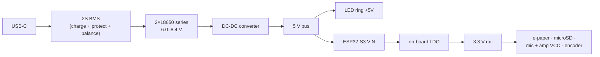
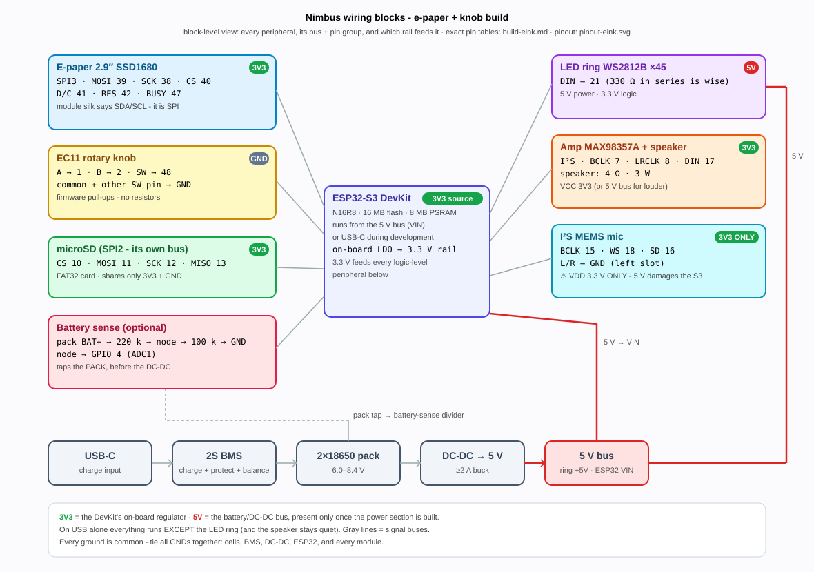
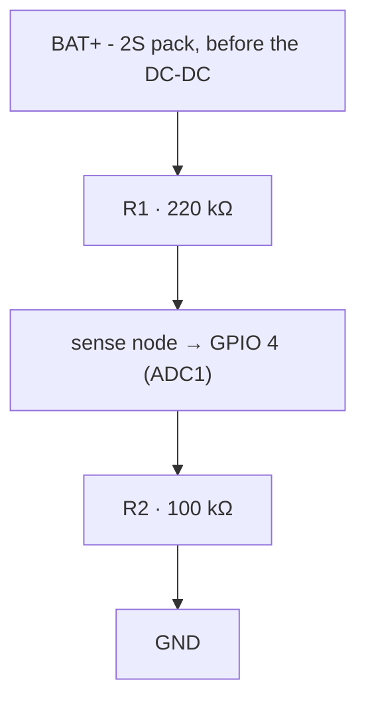

# Build Guide - E-Paper + Knob

How to construct the default Nimbus configuration from parts: a 2.9" SSD1680
e-paper panel with an EC11 rotary knob on the Solide S3 board
(ESP32-S3-DevKitC-1 N16R8). This is the shipped build - a fresh or erased
device boots as `screenModel = eink`.

This page is the assembly walk-through. The companion pages:

- [E-paper + knob reference](eink-knob.md) - the pinout drawing and
  display/input pin table for this configuration.
- [Hardware reference](../hardware.md) - everything common to both
  configurations: first flash, shared peripherals, power, battery sensing.
- [Touch TFT build guide](build-tft.md) - the other configuration.

## Bill of materials

All commodity parts; any listing matching the **Module / chip** column works.
Prices are approximate street prices in USD, excluding shipping. The
consolidated parts list for both configurations, with the shared-parts
breakdown and safety notes, is the **[bill of materials](bom.md)**.

| Qty | Part | Module / chip | Notes | Purchase | ~Price |
|---|---|---|---|---|---|
| 1 | Dev board | **ESP32-S3-DevKitC-1 N16R8** | 16 MB QIO flash, 8 MB octal PSRAM. The N16R8 variant specifically - octal PSRAM occupies GPIO 33–37. | [AliExpress](https://www.aliexpress.com/w/wholesale-esp32-s3-devkitc-1-n16r8.html) · [Mouser](https://www.mouser.com/c/?q=ESP32-S3-DevKitC-1-N16R8) | $12 |
| 1 | Display | **WeAct 2.9" 3-color e-paper (SSD1680)**, 296×128 | B/W + red panel; the firmware drives it in fast B/W (~2.2 s refresh). | [WeAct Studio official store](https://weactstudio.aliexpress.com) | $9 |
| 1 | Knob | **EC11 rotary encoder** with push switch | 3-pin side + 2-pin side, five unmarked pins - see the trap below. | [AliExpress](https://www.aliexpress.com/w/wholesale-ec11-rotary-encoder.html) | $1 |
| 1 | LED ring | **WS2812B ring, 45 pixels** | Addressable RGB; 5 V power, 3.3 V logic. | [AliExpress](https://www.aliexpress.com/w/wholesale-ws2812b-led-ring.html) | $6 |
| 1 | Amp | **MAX98357A I²S amplifier** breakout | Class-D, built-in thermal and over-current protection. | [Adafruit 3006](https://www.adafruit.com/product/3006) · [AliExpress](https://www.aliexpress.com/w/wholesale-max98357a.html) | $2–6 |
| 1 | Speaker | **4 Ω · 3 W · ~40 mm** full-range | The standard MAX98357A pairing; any small 4 Ω 3 W driver (28–45 mm) works. | [AliExpress](https://www.aliexpress.com/w/wholesale-40mm-4ohm-3w-speaker.html) | $2 |
| 1 | Mic | **INMP441** or **ICS-43434** I²S MEMS mic breakout | Separate breakout from the amp. **3.3 V only** - 5 V damages the S3. | [AliExpress](https://www.aliexpress.com/w/wholesale-inmp441-i2s.html) | $2 |
| 1 | Storage | **microSD module (SPI)** + microSD card | Card must be formatted **FAT32** - see the trap below. | [AliExpress](https://www.aliexpress.com/w/wholesale-micro-sd-card-module-spi.html) + any 16–32 GB card | $6 |
| 2 | Cells | **18650 Li-ion** | Wired in **series** (2S). Brand-name cells from a reputable vendor only. Reference pack: owner-measured 3500 mAh, 8.40 V full. | [18650batterystore.com](https://www.18650batterystore.com/) | $12 |
| 1 | Charger/protection | **2S BMS with USB-C charging** | Protection + balance + charging in one module. | [AliExpress](https://www.aliexpress.com/w/wholesale-2s-bms-usb-c-charging-board.html) | $3 |
| 1 | Regulator | **DC-DC converter → 5 V** | From the 2S pack (~6.0–8.4 V) to a clean 5 V bus, ≥2 A. | [AliExpress](https://www.aliexpress.com/w/wholesale-dc-dc-buck-converter-5v-3a.html) | $2 |
| 1 each | Battery sense | 220 kΩ + 100 kΩ resistors | Optional but recommended - the pack-voltage divider on GPIO 4. | any electronics supplier | $1 |
| - | Misc | wire, protoboard/PCB, JST connectors; optional 330 Ω resistor (LED DIN) and 1000 µF capacitor (ring 5 V/GND) | The resistor and capacitor improve LED reliability on long runs. | [AliExpress](https://www.aliexpress.com/w/wholesale-jst-connector-kit-protoboard.html) | $5 |

**Total: ≈ $61–65** (AliExpress-class sourcing; US distributors add ~$15–25).

## Power architecture



- **On battery:** the DC-DC 5 V bus feeds the ESP32's VIN; the DevKit's
  on-board regulator makes the 3.3 V rail. USB-C on the BMS charges the pack.
- **On USB alone (development):** the DevKit runs from USB - the MCU, e-paper,
  SD, encoder, and mic all work. The **LED ring will not light and the speaker
  will not drive audibly without the 5 V bus**, which is the pack path.
- **Every ground is common** - tie all GNDs together: cells, BMS, DC-DC,
  ESP32, and every module.
- ⚠ **The mic VCC is 3.3 V only.** Its VDD and data lines follow VCC, and 5 V
  damages the S3's input. Never put the mic on the 5 V bus.

## Wiring

The whole build at block level - each peripheral with its bus and rail, and
the battery chain along the bottom (the pin-by-pin tables follow):



Pin numbers are the canonical ones from
`board_solide_s3.h` in the
[solide-drivers](https://github.com/ristllin/solide-drivers) board-support
repository; the tables below are copied from its
[build guide](https://github.com/ristllin/solide-drivers/blob/main/docs/build.md)
and the [e-paper + knob reference](eink-knob.md). `3V3`/`5V`/`GND` are the
rails above.

### E-paper (WeAct 2.9", SSD1680)

The WeAct silk screen labels the SPI lines I²C-style - **SDA is MOSI and SCL
is SCK**; the panel is SPI, not I²C.

| Module pin | → | ESP32 |
|---|---|---|
| VCC | → | **3V3** |
| GND | → | **GND** |
| SDA (MOSI) | → | GPIO **39** |
| SCL (SCK) | → | GPIO **38** |
| CS | → | GPIO **40** |
| D/C | → | GPIO **41** |
| RES (RST) | → | GPIO **42** |
| BUSY | → | GPIO **47** |

### EC11 rotary encoder

3-pin side = rotation (A · common · B); 2-pin side = the push switch.

| Encoder pin | → | ESP32 / rail |
|---|---|---|
| A (3-pin, outer) | → | GPIO **1** |
| C / common (3-pin, **middle**) | → | **GND** |
| B (3-pin, outer) | → | GPIO **2** |
| SW (2-pin) | → | GPIO **48** |
| SW (2-pin, other) | → | **GND** |

Internal pull-ups are enabled in the driver - no external resistors needed.

### microSD module (SPI)

| Module pin | → | ESP32 |
|---|---|---|
| VCC (3V3) | → | **3V3** |
| GND | → | **GND** |
| CS | → | GPIO **10** |
| MOSI (DI) | → | GPIO **11** |
| SCK (CLK) | → | GPIO **12** |
| MISO (DO) | → | GPIO **13** |

### WS2812B LED ring

| Module pin | → | ESP32 / rail |
|---|---|---|
| +5V | → | **5 V bus** |
| GND | → | **GND** (common) |
| DIN | → | GPIO **21** (a 330 Ω series resistor on DIN is good practice) |

### Audio - MAX98357A amp + I²S mic

Two separate breakouts. The amp runs at reduced volume on 3.3 V (fine as a
status speaker); use the 5 V bus for more volume - but never share that VCC
with the mic.

| Module | Pin | Role | → | ESP32 / rail |
|---|---|---|---|---|
| amp | VCC | power | → | **3V3** (5 V bus for louder) |
| amp | GND | ground | → | **GND** |
| amp | BCLK | bit clock | → | GPIO **7** |
| amp | LRCLK | word clock | → | GPIO **8** |
| amp | DIN | data in | → | GPIO **17** |
| mic | VDD | power | → | **3V3** ⚠ (never 5 V) |
| mic | GND | ground | → | **GND** |
| mic | BCLK / SCK | bit clock | → | GPIO **15** |
| mic | WS / LRCLK | word select | → | GPIO **18** |
| mic | SD | data out | → | GPIO **16** |
| mic | L/R | channel select | → | **GND** (left slot) |

### Battery sense (optional, recommended)

A resistor divider from the **pack** - not the regulated 5 V rail, which stays
flat and tells you nothing about charge - into GPIO 4 (ADC1):



The ÷3.2 ratio scales 8.4 V to ~2.6 V, inside the ADC's range; quiescent draw
is about 26 µA. Enable with `-DNIMBUS_HAS_BATTERY_ADC`. Full detail, the ADC
top-band caveat, and the single-cell variant:
[Battery voltage sampling](../hardware.md#battery-voltage-sampling-how-to-add-it).

## Assembly order

1. **Bench-check the bare DevKit first.** Flash it over the **UART** USB-C
   port - on a factory-fresh board the native USB port has no path into
   download mode, so getting this wrong looks like a dead board. See
   [First flash of a fresh board](../hardware.md#first-flash-of-a-fresh-board--use-the-uart-port).
2. **Wire the 3.3 V peripherals on USB power** - e-paper, encoder, microSD,
   mic, amp. No pack or 5 V bus needed yet.
3. **Verify each peripheral before going further.** Flash the solide-drivers
   self-test console and drive it over serial:
   ```bash
   SOLIDE_EXAMPLE=08_selftest_console pio run -e esp32s3 -t upload
   # then over serial:  TEST all
   ```
   `led`/`epd`/`sd`/`memory`/`input` should PASS (`sd` SKIPs with no card;
   `audio` needs the 5 V amp and a working mic). No 5 V bus is needed for most
   of the tests.
4. **Build the power section separately**: cells into the 2S BMS, BMS output
   into the DC-DC. Verify a clean 5 V at the DC-DC output with a meter before
   connecting anything.
5. **Connect the 5 V bus**: LED ring +5V and the ESP32 VIN. Confirm every
   ground is common.
6. **Add the battery-sense divider** (previous section) if you want a battery
   gauge.
7. **Install the production firmware** with the guarded installer, which also
   records the display configuration and operating mode:
   ```bash
   python3 tools/setup_device.py
   ```

## Known traps

- **The encoder's five pins are unmarked.** The 3-pin side is the signal
  side: the two **outer** pins are A (→ GPIO 1) and B (→ GPIO 2), and the
  **middle** pin is common → GND. The 2-pin side is the switch: one pin →
  GPIO 48, the other → GND (interchangeable). Swapping A/B just reverses
  rotation; wiring a signal pin to the middle position breaks detent counting.
- **The SD card must be FAT32, not exFAT.** Cards over 32 GB ship
  exFAT-formatted by default and mount as `cardType!=0, ok=false`. Reformat as
  FAT32 ("MS-DOS (FAT)" on macOS) before first use.
- **A cold SD ground joint reads as `cardType=0`** - the card looks absent, not
  faulty. If a previously working card intermittently disappears, check
  continuity from the SD module's GND to system GND before suspecting the card.
- **A warm or hot SD card is an electrical fault.** Disconnect power
  immediately - see the
  [hot-card safety check](../hardware.md#shared-peripherals).
- **The e-paper silk screen lies about the bus.** `SDA`/`SCL` on the module
  are SPI MOSI/SCK. Do not wire it to I²C pins.
- **Never route anything to GPIO 33–37** (octal PSRAM on the N16R8), nor to
  0/45/46 (strapping), 19/20 (USB), 43/44 (UART), 26–32 (flash).

## Battery pack

Two 18650 cells in series (2S, 6.0–8.4 V range) behind the BMS. Ground truths
from the reference pack, measured on a dedicated analyzer: **3500 mAh
capacity, 8.40 V full**. Measured runtimes on that pack: 5.75 h at ring
brightness 77/255 (608 mA average), about 23 h idle (~150 mA - the radios and
CPU, not the LEDs, set the idle floor). Quote about a day of battery life,
not more; details in
[Measured battery reality](../hardware.md#measured-battery-reality-curve-run-4-board-2-2026-07-16).

Note that the ADC under-reads a full pack - after assembly, charge fully and
run `BATTCAL` (console) so 100 % reads as 100 %. See
[Battery voltage sampling](../hardware.md#battery-voltage-sampling-how-to-add-it).

## Enclosure and CAD

**No enclosure files are published yet.** There is no published case, front
panel, or 3D-printable CAD for this configuration. The
[`hardware/fab/`](https://github.com/ristllin/Nimbus/tree/main/hardware/fab) folder holds PCB manufacturing outputs (Gerbers, ODB++, CAM)
for archival reference only - it is not an enclosure. _(add enclosure files
when available)_
