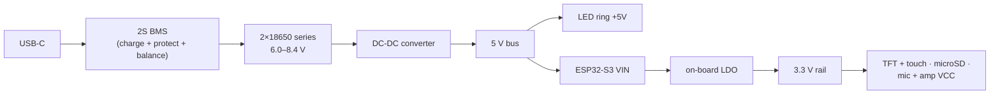
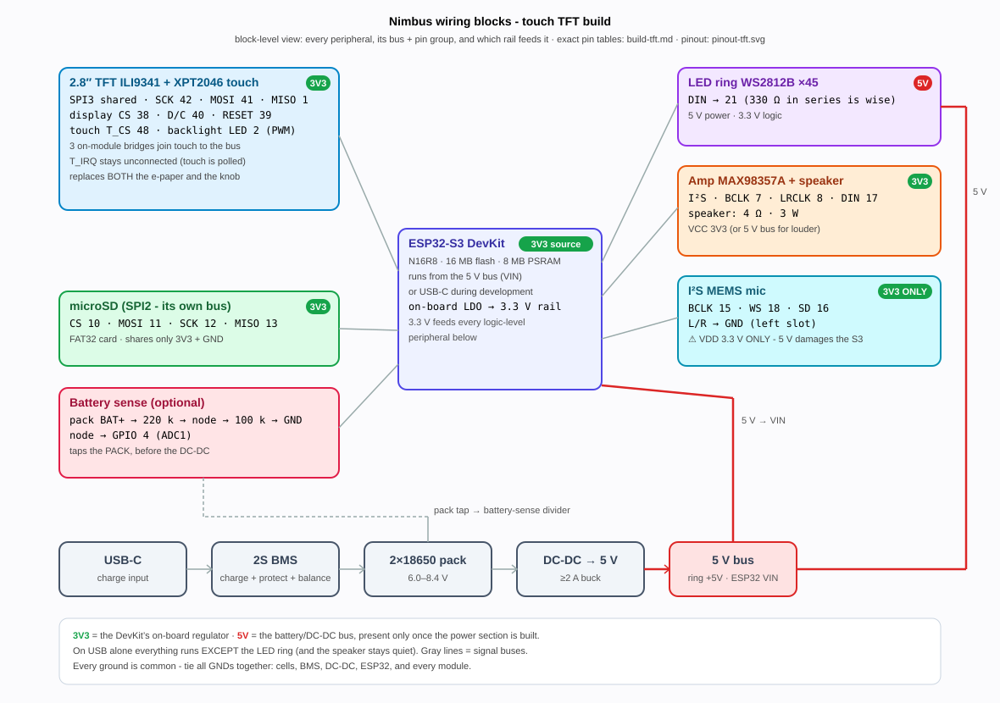

# Build Guide - Touch TFT

How to construct the touch-screen Nimbus configuration from parts: a 2.8"
ILI9341 240×320 color TFT with an XPT2046 resistive touch controller on the
Solide S3 board (ESP32-S3-DevKitC-1 N16R8). The TFT **replaces both** the
e-paper panel and the knob - it shares the e-paper's SPI pads and consumes the
encoder's GPIOs, so a board is only ever one configuration or the other.

This page is the assembly walk-through. The companion pages:

- [Touch TFT reference](touch-tft.md) - the pinout drawing, touch
  calibration, screenshots, and the white-screen investigation.
- [Hardware reference](../hardware.md) - everything common to both
  configurations: first flash, shared peripherals, power, battery sensing.
- [E-paper + knob build guide](build-eink.md) - the default configuration.

## Bill of materials

All commodity parts; any listing matching the **Module / chip** column works.
Prices are approximate street prices in USD, excluding shipping. The
consolidated parts list for both configurations, with the shared-parts
breakdown and safety notes, is the **[bill of materials](bom.md)**.

| Qty | Part | Module / chip | Notes | Purchase | ~Price |
|---|---|---|---|---|---|
| 1 | Dev board | **ESP32-S3-DevKitC-1 N16R8** | 16 MB QIO flash, 8 MB octal PSRAM. The N16R8 variant specifically - octal PSRAM occupies GPIO 33–37. | [AliExpress](https://www.aliexpress.com/w/wholesale-esp32-s3-devkitc-1-n16r8.html) · [Mouser](https://www.mouser.com/c/?q=ESP32-S3-DevKitC-1-N16R8) | $12 |
| 1 | Display | **2.8" ILI9341 SPI TFT, 240×320**, with **XPT2046** resistive touch | The common SPI module with display pads (SCK/SDI/SDO/DC/RESET/CS/LED) plus a touch header (T_CLK/T_DIN/T_DO/T_CS/T_IRQ). Three on-module solder bridges are required - see below. | [AliExpress](https://www.aliexpress.com/w/wholesale-2.8-ili9341-spi-touch-xpt2046.html) | $8 |
| 1 | LED ring | **WS2812B ring, 45 pixels** | Addressable RGB; 5 V power, 3.3 V logic. | [AliExpress](https://www.aliexpress.com/w/wholesale-ws2812b-led-ring.html) | $6 |
| 1 | Amp | **MAX98357A I²S amplifier** breakout | Class-D, built-in thermal and over-current protection. | [Adafruit 3006](https://www.adafruit.com/product/3006) · [AliExpress](https://www.aliexpress.com/w/wholesale-max98357a.html) | $2–6 |
| 1 | Speaker | **4 Ω · 3 W · ~40 mm** full-range | The standard MAX98357A pairing; any small 4 Ω 3 W driver (28–45 mm) works. | [AliExpress](https://www.aliexpress.com/w/wholesale-40mm-4ohm-3w-speaker.html) | $2 |
| 1 | Mic | **INMP441** or **ICS-43434** I²S MEMS mic breakout | Separate breakout from the amp. **3.3 V only** - 5 V damages the S3. | [AliExpress](https://www.aliexpress.com/w/wholesale-inmp441-i2s.html) | $2 |
| 1 | Storage | **microSD module (SPI)** + microSD card | Card must be formatted **FAT32** - see the trap below. | [AliExpress](https://www.aliexpress.com/w/wholesale-micro-sd-card-module-spi.html) + any 16–32 GB card | $6 |
| 2 | Cells | **18650 Li-ion** | Wired in **series** (2S). Brand-name cells from a reputable vendor only. Reference pack: owner-measured 3500 mAh, 8.40 V full. | [18650batterystore.com](https://www.18650batterystore.com/) | $12 |
| 1 | Charger/protection | **2S BMS with USB-C charging** | Protection + balance + charging in one module. | [AliExpress](https://www.aliexpress.com/w/wholesale-2s-bms-usb-c-charging-board.html) | $3 |
| 1 | Regulator | **DC-DC converter → 5 V** | From the 2S pack (~6.0–8.4 V) to a clean 5 V bus, ≥2 A. | [AliExpress](https://www.aliexpress.com/w/wholesale-dc-dc-buck-converter-5v-3a.html) | $2 |
| 1 each | Battery sense | 220 kΩ + 100 kΩ resistors | Optional but recommended - the pack-voltage divider on GPIO 4. | any electronics supplier | $1 |
| - | Misc | wire, protoboard/PCB, JST connectors; optional 330 Ω resistor (LED DIN) and 1000 µF capacitor (ring 5 V/GND) | The resistor and capacitor improve LED reliability on long runs. | [AliExpress](https://www.aliexpress.com/w/wholesale-jst-connector-kit-protoboard.html) | $5 |

**Total: ≈ $59–63** (AliExpress-class sourcing; US distributors add ~$15–25).

There is no encoder in this build - the panel's touch layer is the input, and
there are no free reachable GPIOs to keep a knob (see the trap below).

## Power architecture



- **On battery:** the DC-DC 5 V bus feeds the ESP32's VIN; the DevKit's
  on-board regulator makes the 3.3 V rail. USB-C on the BMS charges the pack.
- **On USB alone (development):** the DevKit runs from USB - the MCU, TFT,
  touch, SD, and mic all work. The **LED ring will not light and the speaker
  will not drive audibly without the 5 V bus**, which is the pack path.
- **Every ground is common** - tie all GNDs together: cells, BMS, DC-DC,
  ESP32, and every module.
- ⚠ **The mic VCC is 3.3 V only.** Its VDD and data lines follow VCC, and 5 V
  damages the S3's input. Never put the mic on the 5 V bus.
- ⚠ Unlike the reflective e-paper, **the TFT backlight is a continuous draw**
  whenever it is lit. It sits on a PWM pin so the firmware's idle path blanks
  it rather than drawing a screensaver.

## The three on-module solder bridges (do this first)

The XPT2046 touch header is **not** wired to three additional ESP32 GPIOs.
Before wiring the module to the board, solder three short jumpers **on the TFT
module itself** so touch and display share one SPI bus:

| Touch pad | Jumper to display pad | Shared ESP32 net |
|---|---|---|
| `T_CLK` | `SCK` | GPIO 42 - SPI clock |
| `T_DIN` | `SDI` | GPIO 41 - SPI MOSI |
| `T_DO` | `SDO` | GPIO 1 - SPI MISO |

These are physical pad-to-pad connections on the module, not three more wires
to the DevKit. Connect `T_CS` separately to **GPIO 48**. Leave `T_IRQ`
**unconnected**; Nimbus polls the touch controller.

⚠ **Continuity-check all three pairs with power disconnected.** The ESP32 bus
wire may land on either pad of a pair, but both pads must be electrically
common. Missing bridges can leave the display completely blank (bus wires on
the touch-side pads) or leave the display working while touch is dead (bus
wires on the display-side pads). Also verify `T_CS → GPIO 48` and confirm
`T_IRQ` has not accidentally been connected to GPIO 48.

## Wiring

The whole build at block level - each peripheral with its bus and rail, and
the battery chain along the bottom (the pin-by-pin tables follow):



Copied from the [Touch TFT reference](touch-tft.md#wiring) - the display and
touch table first, then the shared peripherals from the
[solide-drivers build guide](https://github.com/ristllin/solide-drivers/blob/main/docs/build.md).

### TFT + touch (SPI3)

| ESP32 GPIO | Net | Module pins | Was (e-paper build) |
|---|---|---|---|
| 42 | SPI clock | SCK **+ T_CLK** | e-paper RES |
| 41 | SPI MOSI | SDI **+ T_DIN** | e-paper D/C |
| 1 | SPI MISO | SDO **+ T_DO** | encoder A |
| 40 | display D/C | DC | e-paper CS |
| 39 | display reset | RESET | e-paper MOSI |
| 38 | display CS | CS | e-paper SCK |
| 48 | touch CS | T_CS | encoder SW |
| 2 | backlight (PWM) | LED | encoder B |
| - | *not connected* | T_IRQ | - |
| 3V3 / GND | power | VCC / GND | - |

The three on-module bridges make display and touch one SPI bus with two chip
selects, which is what fits the whole panel into seven GPIOs.

### microSD module (SPI2 - a separate bus)

| Module pin | → | ESP32 |
|---|---|---|
| VCC (3V3) | → | **3V3** |
| GND | → | **GND** |
| CS | → | GPIO **10** |
| MOSI (DI) | → | GPIO **11** |
| SCK (CLK) | → | GPIO **12** |
| MISO (DO) | → | GPIO **13** |

The SD is **not** on the TFT's SPI bus - they share only 3.3 V and ground.

### WS2812B LED ring

| Module pin | → | ESP32 / rail |
|---|---|---|
| +5V | → | **5 V bus** |
| GND | → | **GND** (common) |
| DIN | → | GPIO **21** (a 330 Ω series resistor on DIN is good practice) |

### Audio - MAX98357A amp + I²S mic

Two separate breakouts. The amp runs at reduced volume on 3.3 V (fine as a
status speaker); use the 5 V bus for more volume - but never share that VCC
with the mic.

| Module | Pin | Role | → | ESP32 / rail |
|---|---|---|---|---|
| amp | VCC | power | → | **3V3** (5 V bus for louder) |
| amp | GND | ground | → | **GND** |
| amp | BCLK | bit clock | → | GPIO **7** |
| amp | LRCLK | word clock | → | GPIO **8** |
| amp | DIN | data in | → | GPIO **17** |
| mic | VDD | power | → | **3V3** ⚠ (never 5 V) |
| mic | GND | ground | → | **GND** |
| mic | BCLK / SCK | bit clock | → | GPIO **15** |
| mic | WS / LRCLK | word select | → | GPIO **18** |
| mic | SD | data out | → | GPIO **16** |
| mic | L/R | channel select | → | **GND** (left slot) |

### Battery sense (optional, recommended)

Identical to the e-paper build - a 220 kΩ / 100 kΩ divider from the pack
(before the DC-DC) into GPIO 4 (ADC1).
See the [e-paper guide's battery-sense section](build-eink.md#battery-sense-optional-recommended)
and [Battery voltage sampling](../hardware.md#battery-voltage-sampling-how-to-add-it).

## Assembly order

1. **Solder the three touch-to-display bridges on the module** and
   continuity-check them (section above). Doing this before any board wiring
   makes the check unambiguous.
2. **Bench-check the bare DevKit.** Flash it over the **UART** USB-C port - on
   a factory-fresh board the native USB port has no path into download mode,
   so getting this wrong looks like a dead board. See
   [First flash of a fresh board](../hardware.md#first-flash-of-a-fresh-board--use-the-uart-port).
3. **Wire the TFT module** per the table above, then run the standalone
   bring-up sketch - it exercises the panel, colors, backlight, and raw touch
   without the full firmware:
   ```bash
   pio run -e tftbringup -t upload
   ```
4. **Wire the remaining 3.3 V peripherals on USB power** - microSD, mic, amp.
5. **Build the power section separately**: cells into the 2S BMS, BMS output
   into the DC-DC. Verify a clean 5 V at the DC-DC output with a meter before
   connecting anything.
6. **Connect the 5 V bus**: LED ring +5V and the ESP32 VIN. Confirm every
   ground is common.
7. **Add the battery-sense divider** if you want a battery gauge.
8. **Install the production firmware** with the guarded installer:
   ```bash
   python3 tools/setup_device.py
   ```
   When it asks for the fitted display, answer **TFT**. This step matters more
   here than on the e-paper build: the raw firmware default is e-ink, and a
   TFT board has no knob to fix a wrong setting on-device.
9. **Calibrate the touch panel.** Every resistive panel reads differently, so
   the raw-count-to-pixel mapping is measured per unit - until it is set,
   taps land somewhere else and touch looks broken. Run the wizard:
   ```bash
   python3 tools/tcal_wizard.py --port /dev/cu.usbserial-XXXX
   ```
   Full detail: [Touch calibration](touch-tft.md#touch-calibration).

## Known traps

- **The three bridges are the number-one build fault.** A missing bridge
  produces a blank display or dead touch with no error anywhere - see the
  continuity check above.
- **The encoder cannot be kept.** Only the J3 header is reachable on the
  carrier, GPIO 35/36/37 (octal PSRAM) sit in the middle of it, and the
  longest usable contiguous run is seven pins (`1, 2, 42, 41, 40, 39, 38`) -
  all consumed by the panel. The documented free spares are on J1, which the
  carrier does not break out. GPIO 47 (the old e-paper BUSY) is the only
  genuinely free reachable pin on this variant.
- **The backlight is a continuous draw.** Plan for it in battery estimates;
  the firmware blanks it when idle rather than drawing a screensaver, because
  on a TFT showing nothing is cheaper than showing anything.
- **The touch controller is slow.** The XPT2046 tops out near 2 MHz against
  the panel's 40 MHz, so each device gets its own SPI transaction settings.
  Getting this wrong does not fail loudly - it returns plausible-looking
  garbage coordinates.
- **Uncalibrated touch is indistinguishable from broken touch.** Calibrate
  before concluding anything is miswired
  ([Touch calibration](touch-tft.md#touch-calibration)).
- **The SD card must be FAT32, not exFAT.** Cards over 32 GB ship
  exFAT-formatted by default and mount as `cardType!=0, ok=false`. Reformat as
  FAT32 ("MS-DOS (FAT)" on macOS) before first use.
- **A cold SD ground joint reads as `cardType=0`** - the card looks absent,
  not faulty. Check continuity from the SD module's GND to system GND before
  suspecting the card.
- **A warm or hot SD card is an electrical fault.** Disconnect power
  immediately - see the
  [hot-card safety check](../hardware.md#shared-peripherals). An SD power
  fault can brown out or damage the display even though the buses are
  separate.
- **Never route anything to GPIO 33–37** (octal PSRAM on the N16R8), nor to
  0/45/46 (strapping), 19/20 (USB), 43/44 (UART), 26–32 (flash).
- **If the panel ever goes blank white**, read the
  [white-screen investigation](touch-tft.md#the-white-screen-what-was-ruled-out-and-what-was-not)
  before re-measuring anything - the field cause was traced to the device's
  own SoftAP radio disturbing a jumper-wired panel, the firmware now avoids
  it, and a watchdog bounds any residual symptom to about 5 seconds.

## Battery pack

Two 18650 cells in series (2S, 6.0–8.4 V range) behind the BMS. Ground truths
from the reference pack, measured on a dedicated analyzer: **3500 mAh
capacity, 8.40 V full**. Measured runtimes on that pack (e-paper board):
5.75 h at ring brightness 77/255 (608 mA average), about 23 h idle (~150 mA).
The TFT backlight adds continuous draw on top of those figures whenever the
screen is lit. Details in
[Measured battery reality](../hardware.md#measured-battery-reality-curve-run-4-board-2-2026-07-16).

Note that the ADC under-reads a full pack - after assembly, charge fully and
run `BATTCAL` (console) so 100 % reads as 100 %. See
[Battery voltage sampling](../hardware.md#battery-voltage-sampling-how-to-add-it).

## Enclosure and CAD

**No enclosure files are published yet.** There is no published case, front
panel, or 3D-printable CAD for this configuration. The
[`hardware/fab/`](https://github.com/ristllin/Nimbus/tree/main/hardware/fab) folder holds PCB manufacturing outputs (Gerbers, ODB++, CAM)
for archival reference only - it is not an enclosure. _(add enclosure files
when available)_
