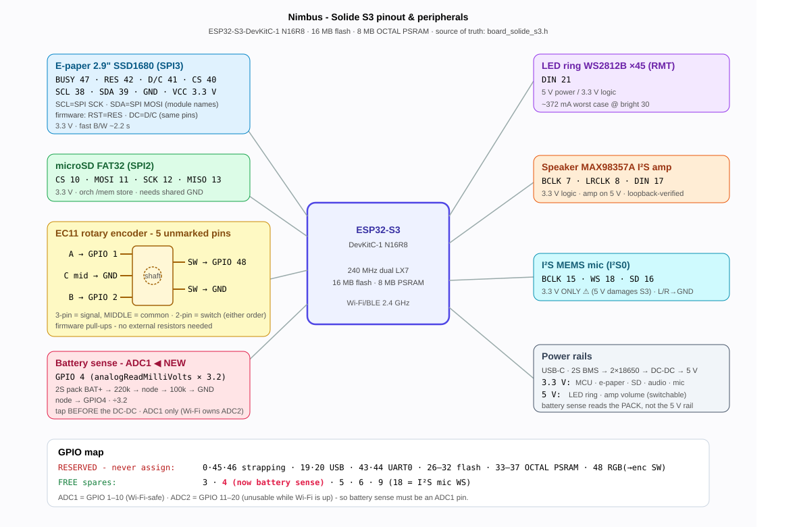

# Configuration A - E-paper + knob (`screenModel = eink`)

The default, shipped configuration: a 2.9" **SSD1680 e-paper** panel paired with an
**EC11 rotary encoder** (the knob). This is what a fresh or erased device comes
up as.

For everything common to both boards - first flash, power, battery sensing, the
shared peripherals (SD, LED ring, speaker, mic) - see the
[hardware reference](../hardware.md). This page covers only what is specific to the
e-paper build.

## Pinout

*(Open [`diagrams/pinout-eink.svg`](diagrams/pinout-eink.svg) for the full-size drawing.)*

## Display + input pins

| Peripheral | Bus | Pins | Rail | Notes |
|---|---|---|---|---|
| **E-paper** 2.9" SSD1680 | SPI3 (HSPI) | BUSY 47 · RES 42 · D/C 41 · CS 40 · SCL 38 · SDA 39 · GND · VCC 3.3 V | 3.3 V | Pins are labelled **as printed on the module** - its SPI clock/data are silk-screened `SCL`/`SDA` (they are **not** I²C). Firmware names: SCK=SCL, MOSI=SDA, RST=RES, DC=D/C. Fast B/W ~2.2 s; MISO unused. |
| **Encoder** EC11 | GPIO | A 1 · B 2 · SW 48 (+2× GND) | 3.3 V | **5 unmarked pins.** The 3-pin side is the signal side - outer pins = A (→ GPIO 1) and B (→ GPIO 2), **MIDDLE = common → GND**; the 2-pin side is the switch - one pin → GPIO 48, the other → GND (interchangeable). All three inputs use firmware pull-ups, no external resistors. Rotate = cursor, long-press = hold-to-talk. |

The e-paper build leaves the ADC-sense pin (GPIO 4) and the documented free spares
(3 · 5 · 6 · 9) available - see [Battery voltage sampling](../hardware.md#battery-voltage-sampling-how-to-add-it).

## Notes

- The panel keeps the current frame in RAM; a full refresh takes **~2.2 s** (fast B/W).
  The status ring is the instant channel, the e-paper is the secondary one.
- Reflective e-paper draws **no idle backlight power** - unlike the
  [touch TFT](touch-tft.md), whose backlight is a continuous draw.
