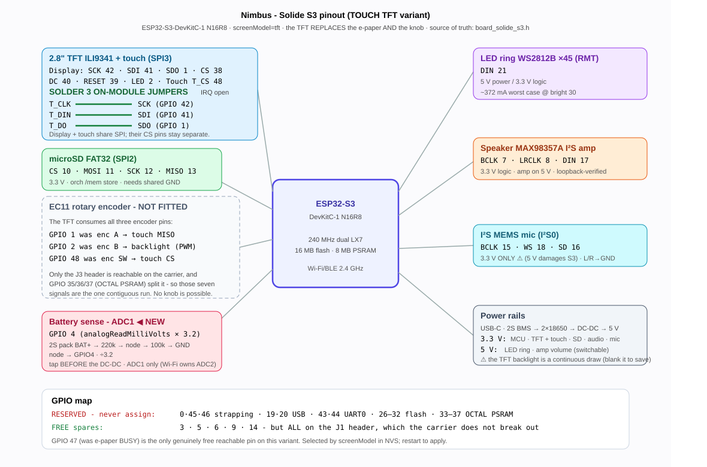
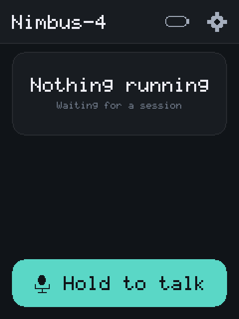
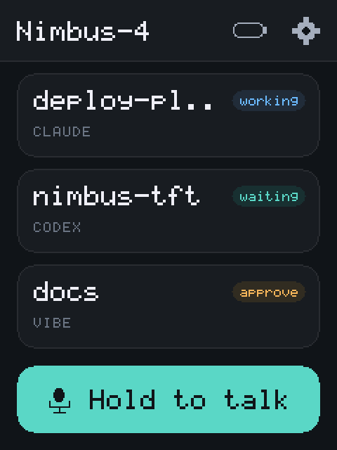
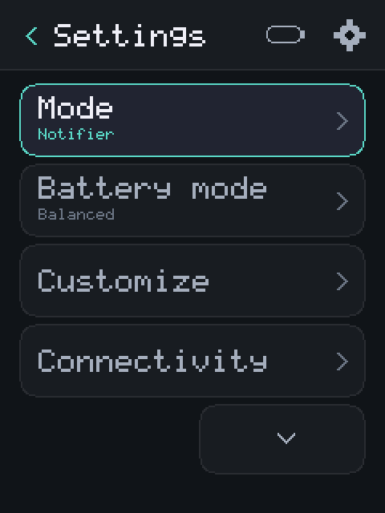
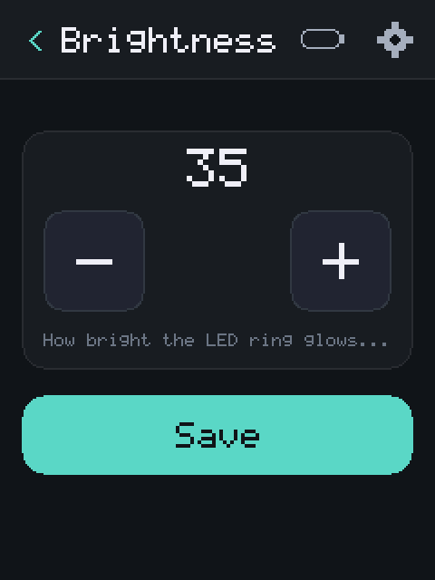

# Configuration A - Touch TFT (`screenModel = tft`)

The hand-built Solide S3 build: a 2.8" **ILI9341** 240×320 color TFT with an
**XPT2046** resistive touch controller. The display and touch controller share the
board's SPI3 pads, and the touch layer is the only input.

For everything common to both boards - first flash, power, battery sensing, the
shared peripherals (SD, LED ring, speaker, mic) - see the
[hardware reference](../hardware.md). This page covers only the touch-TFT build.

## Pinout



*(Open [`diagrams/pinout-tft.svg`](diagrams/pinout-tft.svg) for the full-size drawing.)*

## Assembly-critical: the three touch-to-display jumpers

The XPT2046 touch header is **not wired to three additional ESP32 GPIOs**. Solder
three short jumpers on the TFT module so touch and display share the same SPI bus:

| Touch pad | Jumper to display pad | Shared ESP32 net |
|---|---|---|
| `T_CLK` | `SCK` | GPIO 42 - SPI clock |
| `T_DIN` | `SDI` | GPIO 41 - SPI MOSI |
| `T_DO` | `SDO` | GPIO 1 - SPI MISO |

These are physical pad-to-pad connections on the module, not three more wires to
the DevKit. Connect `T_CS` separately to **GPIO 48**. Leave `T_IRQ` **unconnected**;
Nimbus polls the touch controller.

⚠ **Construction/debug check:** with all power disconnected, use continuity mode
to verify all three pairs above. The ESP32 bus wire may land on either pad in a
pair, but both pads must be electrically common. If the bus wires land on the
touch-side pads, missing bridges can leave the **display completely blank**. If
they land on the display-side pads, the display may draw while touch is dead and
shared-MISO diagnostics fail. Also verify `T_CS→GPIO 48` and confirm that `T_IRQ`
has not accidentally been connected to GPIO 48.

## Wiring

| ESP32 GPIO | Net | Module pins |
|---|---|---|
| 42 | SPI clock | SCK **+ T_CLK** |
| 41 | SPI MOSI | SDI **+ T_DIN** |
| 1 | SPI MISO | SDO **+ T_DO** |
| 40 | display D/C | DC |
| 39 | display reset | RESET |
| 38 | display CS | CS |
| 48 | touch CS | T_CS |
| 2 | backlight (PWM) | LED |
| - | *not connected* | T_IRQ |
| 3V3 / GND | power | VCC / GND |

The three on-module bridges above make display and touch one SPI bus with two chip
selects, which is what fits the whole panel into seven GPIOs.

⚠ **Reachable GPIOs are nearly all consumed.** Only the **J3** header is reachable on
the carrier, and GPIO 35/36/37 (OCTAL PSRAM) sit in the middle of it - so the longest
usable contiguous run is seven pins (`1, 2, 42, 41, 40, 39, 38`), all consumed by the
panel. The documented free spares (3/5/6/9) are all on **J1**, which the carrier does
not break out. On this variant **GPIO 47** is the only genuinely free reachable pin.

⚠ **The touch controller is slow.** XPT2046 tops out near 2 MHz against the panel's
40 MHz, so each device gets its own SPI transaction settings. Getting this wrong does
not fail loudly - it returns plausible-looking garbage coordinates.

⚠ **The backlight is a continuous draw.** It is on a PWM pin so the idle path
*blanks* it rather than drawing a screensaver - on a TFT, drawing a screensaver costs
more power than showing nothing.

⚠ **The microSD is not on this SPI bus.** It uses dedicated SPI2 GPIOs
`CS 10 · MOSI 11 · SCK 12 · MISO 13`; TFT + touch use SPI3 above. The two
peripherals share only 3.3 V and ground. A hot SD card is nevertheless relevant
to a dead TFT because a miswired/shorted SD socket can collapse or damage that
common rail. Power down immediately and follow the
[hot-card safety check](../hardware.md#shared-peripherals); do not diagnose a hot
card by changing display settings.

Bring-up sketch (panel, colors, backlight, raw touch, decoupled from the firmware):

:::caution This replaces the Nimbus firmware
`tftbringup` is a bare panel diagnostic - color bars, a backlight fade, and
touch paint. It has no UI, no Wi-Fi, and no setup network. Normal setup never
needs it; flash it only to isolate a wiring or panel fault. To return to
Nimbus afterward, run `python3 tools/setup_device.py` (saved settings are
preserved). See [Flash the firmware](../quick-start/flash.md).
:::

```bash
pio run -e tftbringup -t upload
```

## What it looks like

Captured from the device with `GET /api/screenshot` - the bytes actually on the
glass (the dirty-gate snapshot, not a re-render), rendered by
`python3 tools/tftpreview.py render`:

| status (idle) | live sessions | settings | value editor |
|---|---|---|---|
|  |  |  |  |

The "live sessions" shot is a real nsn frame, encoded by the broker's own
reference encoder (`notify/broker/frame.py` in [nimbus-notify](https://github.com/ristllin/nimbus-notify)) and fed through the
same decoder → mapper → attention-router path a broker's Bluetooth frame takes.
Each card carries the session title and harness from the v2 wire fields, and the
status pill takes its tone from `statusStyle()` - the same roles that color the
LED ring, so the screen and the ring cannot disagree.

That endpoint exists because every other check of this UI is indirect: host
goldens prove the rasterizer agrees with itself, and `RENDER?` only names the
screen. Neither can catch a panel showing the wrong thing. Three real layout
defects were found this way and fixed - a doubled chevron; a value clipped to
"Battery .."; a title clipped to "Settings .." (a breadcrumb is most specific at
its TAIL, so it is now trimmed head-first and "Brightness" survives); and legacy
text-cursor decorations ("[ 30 ]", "< Back", "< 30 >") leaking onto a panel that
has real buttons instead.

The value editor's [-] and [+] were driven on hardware: 30 -> 35 -> 40 -> 35.

## Touch calibration

Every resistive panel reads slightly differently, so the raw-count-to-pixel
mapping is **measured per unit**, not assumed. Until it is set, a wrong guess is
indistinguishable from broken touch - taps simply land somewhere else.

The quickest path is the wizard - press the four corners when prompted and it
derives the ranges and the orientation flags, applies them, and then lets you tap
around to confirm the pixel matches where you pressed:

```bash
python3 tools/tcal_wizard.py --port /dev/cu.usbserial-XXXX
```

It needs an `[env:test]`-family build (it drives the `TOUCH?`/`TCAL` console) and
takes `--dry-run` to print the calibration without storing it. Orientation is
measured, never assumed: a panel can be mounted in any of eight orientations, so
which raw axis carries screen X is decided by which one moves when only screen X
changes. `tools/test_tcal_wizard.py` round-trips all eight.

By hand, if you prefer:

1. Run the bring-up sketch (or `TOUCH?` on a `[env:test]` build) and note the raw
   values at each corner of the panel.
2. Store them as `minX,maxX,minY,maxY` - optionally a fifth flags number
   (**1** swap X/Y, **2** flip X, **4** flip Y; add them together):
   - **Web**: Settings → Mode & identity → Touch calibration
   - **Console**: `TCAL 200,3900,240,3850,4` (bare `TCAL` prints the current value)

⚠ The ranges describe whichever **raw** axis ends up carrying screen X *after* the
swap - the driver swaps first, then maps, then inverts - so the swap has to be
settled before the numbers mean anything.

Both surfaces share one validator, applied immediately and persisted to NVS, so a
calibration survives a restart and never needs a rebuild. Blank restores the
driver defaults.

## The white screen: what was ruled out, and what was not

The panel was reported showing the UI and then going blank white - sometimes
white from boot - and needing a restart. The **recovery** is solved and tested
(the watchdog below). The **cause** is not proven, so here is exactly what the
measurements say, to save the next person repeating them.

Ruled out, each by measurement rather than reasoning:

| Hypothesis | How it was tested | Result |
|---|---|---|
| Shared-MISO contention (panel SDO not releasing the line, the classic fault on these modules) | `TOUCHISO?` holds the panel in RESET so it must release MISO, then reads touch | Identical reading - **not** contention |
| Touch controller dead | `TOUCH?`'s `z` is `z1-z2+4095`, so a dead chip reads exactly 4095; this reads ~12 | Healthy, no-finger reading |
| Touch polling corrupting panel state | 184 hammered `TOUCH?` reads over 60 s vs a 60 s idle control | 0 heals either way |
| Concurrent SPI + Wi-Fi load | 389 × 150 KB `/api/screenshot` fetches (~58 MB) while rendering | 0 heals |
| Panel SPI clock / signal integrity | `TFTHZ` sweeps 64-pixel **burst** round-trips at 4/10/20/26/40 MHz; `TFTFILL?` pushes whole RGB frames through the real blit path and reads back the far corners | **0 mismatches at every clock, 40 MHz included** - the pixel path is sound |

⚠ The clock test is only meaningful because it writes with `writeBytes`. An
earlier version looped `transfer()` per byte, which leaves gaps and never
produces the sustained burst a 153 KB blit does - it reported a clean 40 MHz
while that was precisely the thing under suspicion. Measure the path you ship.

⚠ **`TFTFILL?` proves the panel STORES pixels, not that it DISPLAYS them.**
Reading GRAM back is not the same as seeing the glass, and those two diverge in
exactly the case under investigation. Do not read a passing fill test as "the
screen works".

**What the diagnostics say during a blank screen** - all on HTTP, because
reading them over the console RESETS this board and destroys the fault:

| Signal | Reads | Means |
|---|---|---|
| `panelTask` | alive | the render task is running |
| `panelBusy` | false | blits COMPLETE, not stalled |
| `panelOk` | true | MADCTL still holds what we wrote |
| `panelBlOk` | true | the backlight PWM genuinely attached |
| `panelBacklight` | 100 | requested level (see `panelBlOk` - alone it can lie) |
| `panelPaint` | climbing | the watchdog is repainting every 5 s |
| framebuffer | correct UI | via `GET /api/screenshot` |
| `panelPixOk` | true | the panel's OWN pixels match the frame we pushed |
| `panelPixLost` | 0 | times they were ever found to disagree |

⚠ **The panel's display/power state is NOT observable.** `RDDPM` (0x0A) reads
`0x00` at every dummy-width on this panel - it simply is not implemented - and
`rearm()` changes nothing in `RDDST` beyond the scan bit. So sleep, display-off
and booster-off are all indistinguishable from healthy from this side, and the
ONLY detectable fault is a full reset (which clears MADCTL).

That is precisely why the watchdog re-arms **unconditionally** rather than
gating on the health check: the fault it most needs to fix is the one it cannot
see. Acting blindly every window is the correct design given the constraint, not
a lack of confidence.

`panelPixOk` is the strongest of these and the last one added: it reads pixels
back out of the panel's own memory and compares them against the frame that was
pushed, so it observes CONTENT rather than configuration. A panel can hold a
perfect register set and still have lost its image - every other signal reports
healthy in that state.

It is validated by injection rather than assumed: `TFTFILL?` writes RGB frames
straight into GRAM behind the framebuffer, `panelPixLost` increments, and the
watchdog repaints. ⚠ Assert the COUNTER, not the flag - the repaint lands within
~5 s, so `panelPixOk` reads true again almost immediately and sampling the flag
alone would pass whether or not anything was ever detected.

So during a blank screen the panel demonstrably CONTAINS the correct image, is
configured, and has a driveable backlight that is driven. Every firmware-
observable layer is healthy. That leaves the panel module itself - its
display/power path, or the physical connection. It is left OPEN rather than
written up as solved.

> **Field note (v3.9.0):** the field "white screen" was traced to the device's
> **SoftAP beacon** - its continuous radio TX from the on-board antenna knocks a
> jumper-wired panel into sleep. Nimbus now drops the SoftAP once it is online (and
> runs Notifier mode radio-free), which removes the disturbance. The watchdog below
> remains the last-resort recovery for any residual panel reset.

**Field instrument:** `TFTHEALTH?` reports `heals=`. If the screen ever goes
white again, a non-zero and rising count says the panel is genuinely losing its
configuration and how often; a count that stays at zero means the fault is
somewhere else entirely. The watchdog bounds the visible symptom to ~5 s either
way, so a recurrence should now look like a brief flicker rather than a dead
screen.
