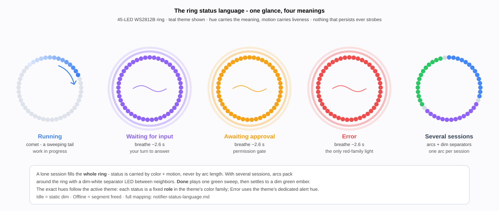
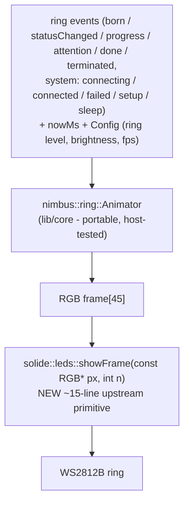

# The LED ring - motion & color language

The ring is not a status readout, it is an **ambient companion on your desk**.
Its job is to make the state of your work *felt* at a glance and in the corner
of your eye - calm when nothing needs you, alive when things happen,
unmistakable when you're needed.

Reading it takes one sentence: **color says what, motion says whether it is
live, brightness says how much it matters.** A sliding comet is work in
progress; a slow breathe is something waiting on you; a still, settled ring
means "handled, relax."

Three design principles behind everything below:

1. **Nothing pops.** Every appearance, change, and disappearance is a short,
   purposeful transition (150–400 ms), never an instant swap. Instant swaps
   read as glitches; motion reads as intention.
2. **Motion means work; stillness means rest.** Anything moving is *happening
   now*.
3. **Color is meaning, brightness is urgency, motion is life.**

The four states you will actually glance at, plus how several sessions share
the ring (teal theme shown - every hue follows the active theme):

## Reading the colors

| Meaning | Hue | Used for |
|---|---|---|
| Running / thinking | blue (170) | active jobs |
| Waiting for you (input) | purple (213) | your turn to answer |
| Waiting for you (approval) | amber (32) | permission gate |
| Done / success | green (85) | completion, connect success |
| Error | red (0) | failures, critical battery |
| Provider accents | Anthropic cyan · OpenAI green · Mistral amber · unknown white | segment tint |
| System / neutral | white | boot, connecting, "saved" blip |
| Setup needed | slow rainbow | unconfigured, invites setup |

Provider accent tints the segment; status drives the *animation*. The two
compose: a blue-comet "running" segment tinted cyan reads as "Anthropic is
thinking."

The exact hues follow your **theme**: each theme maps the status roles to its
own color family, and changing the theme recolors the ring live. The
status → role mapping and the theme rules (red reserved for errors, roles
hue-distinct) are in
[Modes & signals §5](./modes-and-signals.md) and the full specification,
[Notifier status language](./notifier-status-language.md).

## What you'll see - the job lifecycle

Every session on the ring is an arc, and every moment of its life gets motion:

| Moment | Motion | Why |
|---|---|---|
| **Birth** (new session) | arc **grows** from 1 LED to full width (~350 ms), starting as a bright shimmer, **settling** to the provider color | "a new thing began" - celebratory but brief |
| **Status change** | **crossfade** the segment old → new hue (~250 ms) | continuity, never a jarring recolor |
| **Progress** | fill **eases** to the new percentage, doesn't jump | smooth, legible |
| **Attention arrives** (input/approval/error) | one **emphasis flash** (bright, 120 ms), then the steady breathe | "hey - look here," then sustained |
| **Completion** (done) | a bright green **success ripple** sweeps the arc → fades to a dim ember | earned closure |
| **Termination** (offline) | arc **contracts** back to a point and winks out (~350 ms) | graceful closure, symmetric with birth |

And smaller, transient feedback:

| Moment | Motion |
|---|---|
| Knob turn (cursor) | soft **trailing comet** follows the cursor LED, decays after the dwell |
| Config saved (menu or web change persisted) | a single white **blip travels once around** the ring - "saved" |
| Voice: recording / processing / speaking | breathe (in) / comet (thinking) / solid (out), with smooth entry and exit |
| Low battery (first warning) | a slow **red breathe** overlaid under everything else |

## How the ring level changes the language

The [ring level](./modes-and-signals.md) (Dark / Calm / Full - each battery mode
binds one as its default) decides how much of this vocabulary plays:

- **Dark:** everything collapses to the *single attention LED* - system states
  and the top attention job play on that one LED (dim breathe / emphasis
  flash); the rest of the ring stays dark. Birth, death, and ripple are
  suppressed to a brief one-LED blip. Quiet by design.
- **Calm** (Balanced default): Dark, plus a soft activity glow - the
  Orchestrator's "working" heartbeat and sub-agent births/deaths - so an
  idle-looking ring still shows something is happening, without the full
  segment treatment.
- **Full:** the full motion language above. When **idle** (no jobs, no voice)
  the ring goes **fully dark** - an all-day desk ring shouldn't glow with
  nothing happening. A call for your attention or a single-click reveal still
  lights it, and a real job lights instantly at full brightness.
- The battery mode's **brightness cap** scales everything; in the Dark battery
  mode the whole language runs dimmer and slower (longer cycles, fewer FPS).

## How long a state lingers

The broker sends a frame on every change, not continuously, so a quiet ring is
normal between events. What lingers is deliberately split so a call for your
attention can't be lost while ambient noise still clears:

- **Ambient** states (running / done / idle) expire on a clock scaled to the
  ring level after the link goes quiet: **Full = 5 min** (a desk display stays
  lit), **Calm = 30 s**, **Dark = 5 s** (battery-frugal). A dead session
  shouldn't leave a stale ring, but a desk shouldn't blank every few seconds
  either.
- **Calls for your attention** (waiting for input / awaiting approval / error)
  are what you must not miss, so they hold well past the ambient cues - **1
  minute in Dark, 2 in Balanced, 5 in Full**, each tunable in Customize - and
  keep animating the whole time. A job waiting on *you* never vanishes just
  because the broker stopped re-sending.

## Wake the ring - the single click

A **single click** briefly wakes the ring: for ~4 s it promotes **any** ring
level to the full-brightness segment treatment, so you can glance live status
on demand - even from a fully dark idle ring. It then decays back to normal.
(Double-click still opens the menu in Orchestrator; long-press is the menu in
Notifier / hold-to-talk in Orchestrator.)

## Whole-ring system states - design targets, not yet wired

Some whole-ring moments are designed but **not implemented** - don't cite these
rows as current behavior:

| Moment | Motion | Status |
|---|---|---|
| **Boot / waking** | very dim white breathe, slow (~2.5 s cycle) | **live** (`main.cpp` boot-breathe window → driver `Pattern::Pulse`) |
| **Idle** | dark in every ring level; a needs-you cue or a single click still lights it | **live** (`ring_plan` compose - an empty Full plan renders black) |
| **Connecting** (Wi-Fi/Bluetooth) | dim white comet, brightness building as it retries | *design intent, not wired* |
| **Connected** | one quick bright green flash (150 ms) → fade to idle | *design intent, not wired* |
| **Connect failed / no credentials** | slow amber double-pulse, then rest | *design intent, not wired* |
| **Setup mode** (unconfigured) | slow rainbow drift, dim - pairs with the sign-in QR | *design intent, not wired* |
| **Entering deep sleep** (critical battery) | inward collapse to the top LED, then off | *design intent, not wired* |

Why the "not wired" rows exist

These were once a whole-ring `SysState` overlay in `ring_animator` that **no
production code ever drove** (`setSystem()` had zero callers) - it was removed
in the 2026-07 UX cleanup to stop it reading as implemented. The boot/connect
*audio* cues are live (SFX link sounds on the Wi-Fi had-IP and Bluetooth
connect edges); the LED equivalents are kept here as the design target if and
when they are wired.

---

## For developers - architecture and status

`solide::leds` today exposes only fixed **Patterns** and an **agent-segment**
API - no raw per-pixel access - so the transitions above cannot all be
expressed through it. The clean seam:

- **The Animator is portable and host-tested**: it holds per-segment animation
  state (phase, start time, from/to color, progress) and a system-state
  overlay, and on `frame(nowMs)` computes all 45 LEDs. Deterministic (the
  clock is passed in), so tests assert exact LED colors at chosen times during
  a birth grow-in, a death collapse, a crossfade midpoint, a success ripple -
  the golden-frame equivalent for the ring.
- **Device glue is thin**: feed it the same router/notifier events the ring
  already gets, call `frame()` at the profile FPS, push to `showFrame()`.
- **One upstream ask** (flagged to the solide worker):
  `solide::leds::showFrame(RGB[], n)` - a raw framebuffer path alongside the
  existing pattern/segment renderer. Until it lands, the current
  pattern/segment rendering stays and the Animator ships host-tested and
  dark-launched.

**Status:** this document is the design. It is implemented incrementally in
`lib/core` `ring::Animator` (see `test_ring_animator`) - transitions land
host-tested first, and device rendering switches on when `showFrame()` exists
upstream. The existing `ring_plan` (Dark single-LED vs Full segments) remains
the *steady-state* decision layer; the Animator is the *motion* layer that
renders those decisions with transitions between them.
