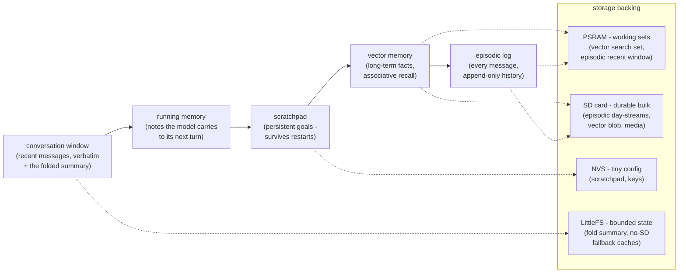
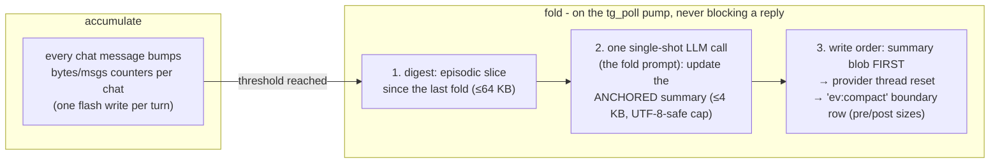

# Memory - the two RAM pools, the turn budget, and conversation compaction

How Nimbus fits a memory-hungry agent into a microcontroller: the two very
different RAM pools and which one is actually scarce, what a live turn costs
and how it stays bounded, and how long conversations fold into a compact
summary instead of growing forever.

This page merges three earlier documents (`memory-model.md`,
`heap-and-psram.md`, `compaction.md`) into one progressive read: start at the
hardware, end at the conversation.

Related: [orchestrator-storage.md](orchestrator-storage.md) (what lives on SD,
PSRAM, NVS, and flash), [turn-anatomy.md](turn-anatomy.md) (what the model
sees), [provider-wire.md](provider-wire.md) (the wire mechanics per provider).

The memory tiers at a glance - information flows left to right from the
shortest-lived tier to the most durable, and each tier is backed by the
storage that fits its lifetime (details: §1–§3 below and
[orchestrator-storage.md](orchestrator-storage.md)):

## 1. The two pools (read this before touching heap floors)

The Solide S3 board is an **ESP32-S3-DevKitC-1 N16R8**. It has **two very
different memory pools**, and conflating them has repeatedly caused work to be
throttled or deferred while most of the device's RAM sat idle. Know which pool
you mean.

| Pool | Size | Speed | DMA | What reports it | Character |
|---|---|---|---|---|---|
| **Internal SRAM** | ~266 KB heap (of 512 KB total; the rest is static/ROM) | Fast | Yes | `ESP.getFreeHeap()`, `heap_caps_*(…, MALLOC_CAP_INTERNAL)` | **SCARCE** - the real constraint |
| **PSRAM** (external, octal) | **8 MB** | ~2–4× slower | Limited | `ESP.getFreePsram()`, `heap_caps_*(…, MALLOC_CAP_SPIRAM)` | **ABUNDANT** - normally ~98% free |

**`ESP.getFreeHeap()` measures INTERNAL ONLY.** When it reads "16 KB free" the
device is NOT out of memory - it has ~8 MB of PSRAM free. It is out of the
*scarce* pool.

### What MUST live in internal SRAM (do not try to move these)

- **FreeRTOS task stacks** - every `xTaskCreate*` stack is internal. A task
  that does TLS (`tg_poll`'s deep mbedTLS handshake call chain), touches
  flash, or runs in an ISR cannot use a PSRAM stack.
- **DMA buffers** - Wi-Fi, I²S, SPI (display/SD), LED RMT. These request
  `MALLOC_CAP_DMA` explicitly and bypass the PSRAM spill entirely.
- **lwIP pbufs + the TLS record working set** - the ~24 KB "danger zone." A
  network call needs this much *contiguous-ish internal* to not fail; it is
  the real internal red line.

### What IS routed to PSRAM already (don't duplicate)

Installed in `main.cpp` at boot:

- **mbedTLS allocator → PSRAM** (`mbedtls_platform_set_calloc_free`): the big
  RX/TX content buffers (~16 KB each) + session/cert parse land in PSRAM. The
  ~40 K contiguous handshake that used to fail at ~50 K internal now lands in
  PSRAM.
- **General malloc/`new`/`String`/JSON churn ≥ the spill threshold → PSRAM**
  (`heap_caps_malloc_extmem_enable(N)`; currently **N = 128 B**). Allocations
  `< N` stay internal to keep hot paths fast; `≥ N` go to PSRAM. **Lowering N
  frees more internal** at a small PSRAM-speed cost - this alone took internal
  free from 16 KB → ~48 KB and made Telegram turns run (they had been
  deferring at the 34 KB floor).

Also PSRAM-backed by design: the vector-DB working set
(`setWorkingAllocators`), ArduinoJson node pools (`ps_json.h`) - including the
single-shot turn response docs - per-adapter request/response bodies
(serialized into one contiguous PSRAM-spilled string and written once), the
SFX manifest, the web audio test-tone buffers, minimp3's ~15 KB per-frame decode
scratch (via `mp3dec_decode_frame_ex`; it used to sit on the audio task stack,
forcing the sfx task to 20 KB and leaving the 8 KB music task one MP3 track short
of an overflow), and the Telegram poll body plus the poll task's staging buffers
(the inbound-drain slot and the shared API response scratch). The last two are
safe in PSRAM because `tg_poll` is their single consumer and its TLS work is
fully serialized, so a batch never needs two of either live at once - moving them
off internal freed ~6.7 KB of the scarce pool with no behavior change.

Moving the MP3 scratch to PSRAM let the sfx task stack drop from 20 KB to 12 KB,
returning ~8 KB to the contiguous internal block, and made the 8 KB music task
safe. `/api/state` surfaces the audio task high-water as `mem.sfxStackMin` and
`mem.musicStackMin` alongside `pollStackMin` / `asyncStackMin`.

### A deliberate exception: the episodic deep-history read stays internal

Not every transient belongs in PSRAM. The episodic **deep-history** search
(`memory.episodic` cold-scan, `GET /api/mem/episodic?cold=1`) reaches history
that sits on the SD card below the boot-scan index by walking the day-streams
backward, one small window at a time, on the **querying task** - the AsyncTCP
web task or the turn task, each of which runs on a tight internal stack. That
read window is a heap allocation on that task, so its size is a **crash
boundary, not a performance knob**: a large window (an early design used
128 KB) starves the task's contiguous internal SRAM and drops the device off
the LAN mid-query. It is kept small (≈8 KB, escalating only when a single
record is longer than the window). What bounds the work is the **per-call read
budget** (a few files, ~128 KB total) - not a big buffer - so deep history
*pages*: the store returns a resume cursor rather than allocating for the
whole scan. This is the counter-lesson to "route churn to PSRAM" - a small
bounded internal read on a stack-tight task is the correct shape. Full design:
[`orchestrator-storage.md`](orchestrator-storage.md) §3a.

### The heap floors are INTERNAL-only guards - not a whole-device budget

`agent_config.h` defines `ORCH_TURN_HARD_FLOOR` / `ORCH_AUTO_TURN_MIN_HEAP` /
`ORCH_DISPATCH_MIN_HEAP` / `ORCH_RECALL_MIN_HEAP` / `ORCH_LOOP_MIN_HEAP`, plus
`provider_verify`'s `VERIFY_MIN_MAX8` and the `/api/tools` async-stack guard.
They all gate on **internal** heap. Because the heavy allocations they used to
protect are now on PSRAM, a turn's true internal cost is small transients +
the lwIP/TLS stack, so the floors sit just above the ~24 KB danger zone
(≈28 KB), **not** at the pre-PSRAM 34–40 KB.

**Do NOT re-raise these floors to "survive with no PSRAM."** PSRAM is present
and carries the churn. If turns are deferring ("low on working memory") while
PSRAM is free, the fix is to move more internal churn to PSRAM (lower the
spill threshold), not to raise the floor. A turn that still OOMs fails soft
(error reply, no restart).

### Levers to free internal SRAM (biggest first, verify on-device)

1. **Route Wi-Fi/lwIP buffers to PSRAM** (`CONFIG_SPIRAM_TRY_ALLOCATE_WIFI_LWIP`,
   Wi-Fi static-buffer counts) - potentially the largest single win; needs an
   `sdkconfig.defaults`.
2. **Lower the malloc spill threshold** (`heap_caps_malloc_extmem_enable`,
   main.cpp).
3. **Right-size / statically-place buffers** (framebuffers, static arrays)
   into PSRAM.
4. **Re-anchor over-conservative internal floors** (above, done).

### How to measure (don't guess)

`ESP.getFreeHeap()` = internal free; `ESP.getFreePsram()` = PSRAM free.
`/api/state` reports both (`heap`/`heapMin` vs `psramFree`/`psramTotal`) and
`/api/health` lists PSRAM as its own row. For an internal-vs-PSRAM-vs-DMA
breakdown use
`heap_caps_get_free_size(MALLOC_CAP_INTERNAL | MALLOC_CAP_SPIRAM | MALLOC_CAP_DMA)`
and `heap_caps_get_largest_free_block(...)`.

## 2. Heap under a live turn - what's movable, what isn't

A live orchestrator turn runs with only **~47 K free *internal* SRAM** (TLS +
lwIP + the orchestrator all resident). PSRAM is nearly empty but is **not** in
the default malloc pool by default. What is already in PSRAM is listed above;
this section records what is stuck internal, and why (measured while chasing
the heavy-connector-write restart, 2026-07).

### What is STILL internal (and why)

- **lwIP RX pbufs** - inbound TLS/socket data queues as pbufs in
  `MALLOC_CAP_INTERNAL/DMA` by design; the extmem hook cannot move them. This
  was the dominant internal spike when the device buffered a whole large
  response. **Mitigation: streaming.** The transport stream-parses the
  response off the socket (`transport_tls.cpp` `execJson` →
  `deserializeJson(doc, BlockingClientReader, Filter)`), so pbufs drain
  continuously as the parser pulls bytes instead of piling up while a whole
  body is buffered. This is the real fix for the heavy-connector-write
  restart.
- **Small (< 128 B) allocations** - stay internal by the extmem threshold;
  cheap and not worth lowering the threshold (churn).
- **FreeRTOS task stacks** - e.g. `tg_poll` (16 K), which runs the whole
  turn. Internal by nature. The response parse is bounded to
  `NestingLimit(16)`, well within this stack.

### The size-transparency contract

The harness must handle any response / context / file size without crashing:

1. **Responses stream** off the socket; only filter-retained fields are stored
   (a 128 KB wire body → < 4 KB retained doc - `test_harness_streaming`).
2. **Tool results into the model are clamped** (4 KB/result, 24 KB total -
   `head_loop`), so context stays bounded.
3. **Heavy connector work is offloaded** to a sub-agent on the connector's
   provider (the orchestrator is guided to; routing in `jobs.cpp`), so the
   device only ever ingests a short result.
4. **Large payloads spill to SD** (the artifact store) rather than transiting
   RAM or the model's context.

### Do NOT

- Do not raise the turn heap floors to "fix" OOM - the fix is streaming +
  PSRAM routing, not gating turns out (the historical 34 K floor
  false-deferred healthy turns; the live floor is 28 K).
- Do not buffer a whole provider response then parse - stream it.
- Do not put connector write content through the model's context -
  offload/spill.

## 3. Conversation compaction - the fold

How the device keeps long conversations fast, cheap, and continuous: when a
chat accumulates enough history, the device summarizes it into a compact
per-chat memory (the **fold**), resets the provider-side thread, and keeps
going - nothing the owner said is lost, and every future turn carries the
summary instead of an ever-growing transcript. Shipped in v3.6.0 after a
reviewed design; E2E-proven on hardware.

### Owner's view

- **When it happens**: automatically, after roughly 48 KB of conversation on a
  chat since its last fold (knob: `compactKB`, 8–512, 0 turns auto-fold off) -
  or on demand with the **`/compact`** command (owner-only, also listed in
  /help).
- **What you see**: automatic compaction is silent - its record is the
  "Conversation compacted: … folded into a … summary" row in the chat history.
  A manual `/compact` acknowledges immediately and then confirms with
  "✓ Compacted." (or tells you it couldn't, with the next step). The web chat
  never gets notices (they would desync the reply pairing).
- **What changes**: nothing you'd notice in conversation quality - the last
  dozen messages stay verbatim in the model's context, the summary carries
  everything older, and long-term facts were already in vector memory. What
  improves: turns stop getting slower and more expensive as a chat ages.
- **If a provider is down**: the fold tries the device's other configured
  providers before counting a failure (the same order turns use), so one
  provider having trouble doesn't stall compaction - or message you about it.
- **If it keeps failing**: after 3 consecutive failures (or a fold that
  refills immediately), automatic compaction pauses for that chat and you get
  ONE alert; `/compact` always remains available and un-pauses it.

### How it works (the design, in one page)

The device cannot edit provider-side conversation threads (they're opaque
ids - and only OpenAI even has a cross-turn thread; Anthropic is stateless and
Mistral's tool-loop mode starts fresh every turn). So compaction is built on
the device's own episodic store, provider-uniformly:

- **Trigger** (`FoldStore::evaluateDue`): bytes-since-fold ≥ `compactKB` OR
  ≥200 messages - provider-independent by design. A reactive path also
  classifies real provider context-overflow errors (`isContextOverflowError`)
  and queues a fold; the turn itself recovers via the existing fresh-thread
  retry.
- **The fold call** (`TurnEngine::runFold`) is deliberately NOT a turn: no
  delivery, no recall, no tool loop, no conversation-map writes, no capture of
  the summary as chat history - the model's reply IS the summary and every
  other field of its output is structurally inert. Its spend is metered under
  the `compact` attribution (never a routine's budget). Gates (low heap, over
  budget, turn in flight) **defer** - only a real failed attempt counts
  against the breaker.
- **Anchored, not cumulative**: each fold UPDATES the previous summary with
  the new slice (opencode's pattern), so fold cost stays bounded forever. The
  summary re-enters every prompt as `## CONVERSATION SUMMARY` - explicitly
  framed as *information, not instructions*, and instructions found inside
  tool outputs are folded as data, never preserved as directives (prompt-
  injection posture).
- **Summary + verbatim tail**: the summary sits directly above the RECENT
  CONVERSATION window, the shape every surveyed harness (Claude Code, codex,
  opencode, aider) converged on. Under prompt-budget pressure the summary is
  sacrificed BEFORE the window (the tail is the fresher signal).
- **Durability & rollback**: all fold state (summary, counters, breaker) lives
  in one tolerant-load LittleFS blob (`/data/chatsum.txt`, LRU-16 chats). The
  NVS conversation map is untouched, so an OTA rollback to pre-v3.6 firmware
  simply ignores the file - rollback-safe by construction. Crash mid-fold:
  the write order (summary first, thread reset second) means the worst case is
  a fold that re-runs, never a lost summary with a reset thread.

### Verification

Host: `test_orch_compact` (trigger math, breaker, thrash guard, codec,
UTF-8-safe caps, fold-prompt contract), `test_harness_turn` (runFold's
no-side-effects contract incl. a hostile summary carrying device actions -
inert), `test_harness_compose` (§5a placement + budget-pressure drop).

Hardware (Board 2, both suites green): `tests/hil/test_l16_compaction.py` -
the full cycle with a marker planted OLDER than the verbatim window, proving
recall comes from the summary (`/api/lastturn` shows it) - and
`tests/hil/test_l15_memory_caps.py` - vector-store cap eviction (synthetic-only
damage), episodic retention past the PSRAM ring, and a fold completing from
the RAM ring under a simulated SD failure. Measured along the way: 512
episodic-ring rows with short texts pin ~30 K of internal SRAM (small strings
don't spill to PSRAM), which is why the ring deliberately stays at 512.

### Reference

| thing | where |
|---|---|
| knob | `compactKB` (NVS; default 48, clamp 8–512, 0 = auto off) |
| command | `/compact` (owner-only; async - runs on the next pump pass) |
| boundary record | episodic row, kind=log, tag `ev:compact`, in the chat's session |
| prompt section | `## CONVERSATION SUMMARY` (above the recent window) |
| state file | LittleFS `/data/chatsum.txt` (rollback-safe; LRU-16 chats, byte-bounded, written atomically) |
| fold prompt + trigger core | `lib/core/{include/nimbus/orch/compact.h, src/orch_compact.cpp}` |
| engine call | `TurnEngine::runFold` / `clearChatConv` (lib/harness) |
| device pump | `compactTick()` in `src/agent/orchestrator.cpp` |
| test seams (TEST builds) | `CTX?` / `COMPACT <chat>` / `MEMFILL` console + `/api/test/{ctx,compact,memfill}` |

⚠ **Assert on the `ev:compact` row, not on `CTX?`.** The diagnostic reads a
cross-task echo buffer, and until v3.7.0 that buffer was refreshed only at turn
end - so it reported the fold stamp as of the last TURN, never as of the last
FOLD, and a completed compaction stayed invisible until the next turn ended. A
test written against it passed only when the echo happened to be one fold stale,
observing the *previous* run's fold. The echo is now republished on every fold
outcome (success and failure alike), but the durable `ev:compact` episodic row
remains the right thing to assert on: it is written only on success, it carries
the byte/message counts, and it survives a restart.

### Derived context budgets (Context Fabric, 2026-08-05)

Every context allocation is **derived from the head model's context window**
rather than hardcoded: `nimbus::orch::deriveBudget(ctxTokens, overrides)`
(`lib/core/src/orch_budget.cpp`) turns the window into a system-prompt budget,
summary cap, verbatim-tail cap, per-tool-result clamp, cumulative tool budget,
sub-agent brief size and fold-slice size - each a ratio with a floor and a cap.
The window comes from the existing `modelCtxTokens()` table.

**Anchor invariant:** at a 200K window the derived values equal the previously
hardcoded constants exactly (32768 / 4096 / 3000 / 8192 / 65536 / 1200 / 65536),
so a device on defaults behaves identically. A smaller-window model degrades
gracefully; a larger one automatically gets a richer prompt.

**Owner overrides win.** `max_context_bytes` (memory config) and the two loop-cap
NVS keys now treat **0 / absent as "auto"**; any value you set is used verbatim
under the same clamps as before. `/api/orch` reports `loopRescapEff`,
`loopTotcapEff` and `ctxTokens` so the UI can show "auto (currently N)". Each
turn logs one line: `budget: ctx=200K sys=32768 res=8192 tot=65536 (auto|owner)`.

### Gradient trimming - never a dumb clip

The research principle (summary + verbatim tail) also applies **inside** a
turn and at every clip site:

- **In-turn replay (Anthropic only** - OpenAI/Mistral keep history server-side**)**:
  once the replayed conversation passes a quarter of the window, rounds older
  than the newest two collapse to one `[earlier round N] tool: gist… (N B)` line.
  Pairs fold whole, so every `tool_use` keeps its `tool_result`.
- **Tool results**: a clamped result keeps its full text in the recent-results
  ring and the marker says how to get it -
  `…[truncated 8192 of 51234 B - fetch the rest with results.get("r3")]`.
- **Sub-agent results**: past the 6-slot block cap, a result parks as a one-line
  stub with a `results.get("sub:<tag>")` pointer instead of being dropped; the
  episodic row on SD keeps the full text.
- **Context assembly**: the anchored summary **clips** (floor 1024 B) before it
  is dropped, and anything omitted is named in a bounded `## OMITTED (budget)`
  trailer so the model knows a category was withheld rather than empty.
