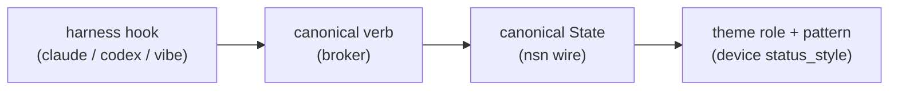

# Notifier status language

The Notifier ring speaks a **status language**: every AI-coding-session status maps
to a distinct **color _family_ role + animation pattern**, so a glance tells you
*what* is happening *and* on *which* session - without reading the e-ink. This doc is
the single cross-reference from a harness hook all the way to the LEDs, and it is
checked against the code that actually drives them (edit the code, then this doc - do
not let them drift).

The chain has four hops:

## 1. Harness hook → verb → State

Each harness adapter normalizes its hook events to a **canonical verb**; the broker
maps that verb to a **State** (`notify/broker/session.py` `_VERB_TO_STATE`). Unknown
verbs default to `Running`.

| Harness | Hook / event | verb | State |
|---|---|---|---|
| Claude | SessionStart | `start` | Idle |
| Claude | UserPromptSubmit / PreToolUse | `running` | Running |
| Claude | Notification `permission_prompt` | `notify:permission_prompt` | AwaitingApproval |
| Claude | Notification `elicitation_dialog` | `notify:elicitation_dialog` | WaitingInput |
| Claude | Notification `idle_prompt` (idle 60 s) | `notify:idle_prompt` | WaitingInput |
| Claude | Stop | `done` | Done |
| Claude | SessionEnd | `end` | Offline |
| Codex | SessionStart | `start` | Idle |
| Codex | UserPromptSubmit / PreToolUse | `running` | Running |
| Codex | PermissionRequest | `approval` | AwaitingApproval |
| Codex | Stop | `done` | Done |
| Codex | **Stop in _plan_ mode** | `plan_pending` | **WaitingInput** |
| Codex | SessionEnd | `end` | Offline |
| Vibe | before_tool | `before_tool` | Running |
| Vibe | after_tool success / failure | `after_tool:success` / `:failure` | Running / Error |
| Vibe | post_agent_turn | `post_agent_turn` | Done |
| Vibe | HITL timeout heuristic | `hitl_inferred` | AwaitingApproval |

**Codex plan-mode note** - Codex (≤ v0.124.0) has no dedicated "agent asked a plan
question" hook: in plan mode a turn ends by presenting a plan and waiting for you, but
that fires the same `Stop` hook as a finished turn - so the ring used to show **Done
(green)** when it was really **waiting on you** ("zilch / green while it waits",
owner-reported). The adapter (`notify/harness/codex.py`) reads `permission_mode` and
re-tags a plan-mode `Stop` as `plan_pending` → WaitingInput. Only `done` is
reinterpreted; running/approval/error keep their own meaning.

## 2. State → {theme role, pattern, brightness}

The device resolves each State to a **theme-family role index** + an **animation
pattern** in one place: `lib/core/src/status_style.cpp` (`statusStyle()`), host-tested
in `test/test_status_style`. The device no longer trusts the raw wire hue for
presentation - it computes ring behavior from `(State, active theme)`, so changing the
theme actually recolors the ring.

**Ambient grammar** (owner 2026-07-16 - the ring is all-day peripheral signage):
**nothing that persists may strobe.** Every needs-you state is the same smooth ~2.6 s
breathe; **hue alone carries the meaning** (cool = answer, amber = approve, reserved
alert red = error - red stays unmissable *because* nothing else is ever red). Fast
motion is allowed only as sub-second one-shot transition cues, and even those swell or
slide rather than flash. `Anim::Blink` maps to **no status** (a host test asserts the
ban; the enum survives for wire compat).

| State | Role (palette index) | Pattern | Bright | Meaning |
|---|---|---|---|---|
| Running | 0 - primary | **Comet** (sweeping tail) | 100% | model / tool working |
| WaitingInput | 1 - accent | **Breathe** (~2.6 s) | 100% | needs YOU (answer) |
| AwaitingApproval | 3 - detail (amber) | **Breathe** (~2.6 s) | 100% | decision / permission gate |
| Done | 2 - success | **Fade** (settle → 38% ember) | 85% | turn completed |
| Error | - alert hue | **Breathe** (~2.6 s, "breathing red") | 100% | tool / turn errored |
| Idle | 0 - primary | Static dim | 20% | session open, no active turn |
| Offline | - | Off | 0% | session ended (segment freed) |

One-shot transition cues (soft by rule): born = the arc grows fading in from dim in its
own hue (350 ms); dying = collapse fading out (350 ms); Done = one green sweep (500 ms);
web-action confirm = a soft pulse window (no Flash). In **Dark/Calm** the single-LED cue
honors this table's hue (whole-ring dim breathe - an Error breathes red there too).

`Role` is an index into the active theme's color **family**; `alert` uses the theme's
dedicated alert hue (below), so Error stays alarming yet in-family. History: Error was
originally Solid, then a 300 ms hard Blink ("errors deserve attention", 2026-07-14) -
live-use showed a 3.3 Hz red strobe held for minutes is an alarm, not signage; the
ambient grammar supersedes both.

## 3. Theme families

Themes are multi-hue **families**, not single colors (`lib/core/src/theme.cpp`,
`themePalette()`; served to the web UI at `GET /api/themes`). Role indices above pick a
color _within_ the active family, so the whole ring wears one coherent palette while
each status stays distinguishable by role + pattern.

Themes: `teal, ocean, ember, forest, openai, anthropic, mistral, rainbow, gemini, perplexity`.

**Alert hue per theme** (`themeAlertHue()`) - Error reads as danger without a jarring
pure-red clash on cool themes ("full red on ocean makes no sense"):

| Theme | Alert hue | | Theme | Alert hue |
|---|---|---|---|---|
| teal | 10 (coral) | | anthropic | 4 |
| ocean | 14 (warm amber) | | mistral | 2 |
| ember | 2 (red) | | rainbow | 0 (red) |
| forest | 6 | | gemini | 6 |
| openai | 4 | | perplexity | 12 (amber) |

## 4. Wire: nsn v2 carries harness + title

The nsn frame is **v2**: each segment carries the legacy `{state, hue, anim, progress}`
plus an optional **harness tag** (claude/codex/vibe) and a short **title** (session
task / cwd basename), appended as a backward-compatible TLV under the same magic - a v1
decoder ignores the trailing bytes (still CRC-covered). This is what lets the e-ink
SessionDetail show "**codex · deploy-plan · waiting**" instead of a meaningless "job 3".
Codec: `lib/core/src/nsn_proto.cpp` (byte-locked to `notify/broker/frame.py` in [nimbus-notify](https://github.com/ristllin/nimbus-notify)
via generated vectors). See [`hardware.md`](hardware.md) for the BLE transport.

The broker caps the v2 payload at the wire's 1-byte length field (≤255 bytes): with many
long-titled sessions it budgets titles greedily and degrades a segment to harness-only rather
than overflow (the device encoder guards the same limit). **Known limitation** - the broker
sets a harness tag for every real session, so any frame with ≥1 active session is now v2
(`LEN > 68`); a device still on **pre-v2 firmware** (whose decoder used the old 71-byte packet
buffer) rejects such frames. There is no protoVer negotiation yet - the fix for an old board is
to flash v2 firmware; a broker-side protoVer gate (device advertises, broker suppresses v2) is a
future item.

## 5. A single error ≠ a red ring

OWNER RULE (2026-07-13): a lone active session DOES fill all 45 LEDs - the full ring is
the aesthetic; status is carried by color + pattern (red = errors only), never by arc
length. (This inverts the earlier gap design - `ring_animator` layout `count==1 → L/4`
gap, which showed one errored session as a red **arc** rather than a whole red circle -
because the gap read as broken LEDs.) Stale segments are reaped posture-scaled so
a finished/errored job can't strand red over a healthy set (the ring-persistence
rules described above).
