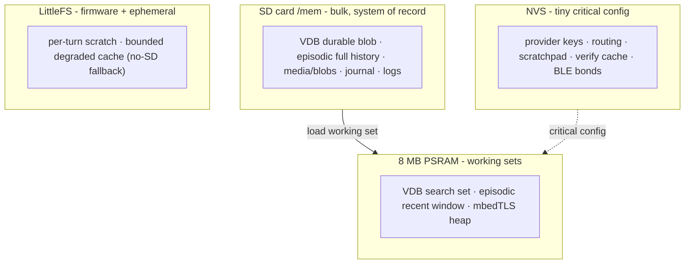

# Nimbus Tiered Storage Architecture (SD-primary)

Canonical record of **what data lives where** in the Orchestrator "World" memory
system, and why. Companion to [`orchestrator-world.md`](orchestrator-world.md)
(the cognitive tiers) and the
[orchestrator live turn](architecture/orchestrator-live-turn.md) (the live turn). Read this before touching `memory_subsystem`, `vector_memory`,
`episodic`, or the SD mount.

## 0. The directive and the reframe

Owner's directive: **store all bulk - VDB, episodic history, blobs/media, logs -
on the SD card; flash/RAM hold only tiny critical config + a degraded cache.**
Plus the constraint the hardware forces: **working sets belong in the 8 MB PSRAM,
not the ~300 KB internal SRAM**, and the device must **degrade gracefully with no
SD** (the bench board reads `cardType=0` today - the card is not detected on the
SPI bus at all, which is a seating/hardware issue, *not* a format issue; see the
F10 known-issue note).



The pre-redesign code violated the directive in three locatable ways:

1. **VDB working set in internal SRAM.** `g_vec` holds `std::vector<VecEntry>` on
   the default heap. At `maxVectors=2000` (256-dim int8) that is ~1.14 MB -
   guaranteed OOM on a device with tens of KB free internal heap.
2. **Episodic is a 500-message RAM ring** whose *whole* blob is rewritten on every
   `captureMessage` - O(history) write amplification and a hard 500-message
   ceiling, the opposite of "all history on SD."
3. **Persistence defaults to LittleFS** and only routes to SD if `setDataFs(SD)`
   runs. With no card, vectors grow **unbounded on the ~few-MB LittleFS partition
   with no overflow guard** - the one genuinely dangerous path (flash exhaustion).

## 1. The four tiers

Rule of thumb:
- **NVS** - tiny critical config that must survive a firmware wipe and is
  human-set (model-read-only). Card-independent.
- **LittleFS (internal flash)** - firmware + ephemeral per-turn scratch + a
  *bounded* degraded fallback cache when there is no SD.
- **PSRAM-working (8 MB)** - in-RAM working sets and indices (volatile,
  rebuildable from SD/flash): the VDB search set, the episodic recent window.
- **SD (durable)** - the system-of-record for everything bulk.

| Data type | Tier | Format / path | No-SD fallback |
|---|---|---|---|
| VDB vectors - working set | **PSRAM** | `entries_` in PSRAM heap | reduced-cap set still in PSRAM (or internal if no PSRAM) |
| VDB vectors - durable | **SD** | `/mem/vectors.bin` (existing `serialize` blob) | `/data/orchvec.bin` on LittleFS, **hard-capped** (≈400 vecs) + eviction |
| Episodic - full history | **SD** | `/mem/episodic/YYYY-MM-DD.jsonl` append-log + `index.bin` | in-RAM 500-ring + `/data/episodic.bin` whole-blob (as before) |
| Episodic - recent window | **PSRAM** | recent-N ring, hydrated from SD at boot | the ring *is* the whole history |
| Media / voice / artifacts | **SD** | `/mem/blobs/<hash>.<ext>` content-addressed | ephemeral only (`/voice.pcm`, `/reply.mp3`, `/audio/tgvoice.ogg`), deleted per-turn - **no durable media** |
| Scratchpad (goal tiers) | **NVS** | `orchmem`/`scratch` (~4 KB) | unchanged |
| Journal | NVS (6 slots `agjournal/j0..j5`) - the SD day-stream was PLANNED, never built | - | same NVS |
| Provider keys / routing / config | **NVS** | `solide::memory` keys | unchanged |
| Verify cache | **NVS** | `vfy_*` | unchanged |
| Logs / diagnostics | RAM ring (1280 B, `GET /api/log`) + serial - the SD log stream was PLANNED, never built. Device EVENTS are durable via the episodic `system` timeline (kind=log) | - | same ring |

Two things **do not move**: NVS config/keys/scratchpad/verify are already at the
right tier and are card-independent - the "critical info" the directive keeps off
SD. Everything bulk targets SD with a **bounded** LittleFS/RAM degraded mode.

## 2. VDB - working set in PSRAM, durable on SD

`VectorMemory` is portable/Arduino-free and allocator-agnostic, so its allocations
are routed **from the device seam**, not by editing the portable class.

- **Working set → PSRAM.** Place the engine and its hot storage in PSRAM via
  `heap_caps_malloc(MALLOC_CAP_SPIRAM)` (the pattern the PSRAM-mbedTLS allocator
  already proves - see the `nimbus-psram-tls` note). Gate on
  `esp_psram_is_initialized()` at boot; if PSRAM is absent, fall back to the
  reduced-cap internal path (§4). Capacity: 256-dim int8 ≈ 570 B/vector in RAM ⇒
  **~6000 vectors fit** in the PSRAM budget after TLS/JSON headroom (device cap
  set well below `kMaxVectorsMax`). Dims stay locked by the set-once embed gate.
- **Durable → SD.** Keep the byte-clean `serialize`/`deserialize` blob; change
  only the path (`/mem/vectors.bin`) and the **write discipline**: a **dirty flag**
  set by mutating ops only (not read-only recalls), debounced, written
  `.tmp`→rename for crash-atomicity. This kills the "rewrite the whole blob after
  every tools/call" amplification.
- **Migration** is already half-built: `loadBlob` reads SD-first, LittleFS-
  fallback, so the first SD-backed persist carries existing LittleFS memories onto
  the card.

## 3. Episodic - SD append-log + index, PSRAM recent window

**Decision: append-only JSONL day-streams + a compact binary offset index - not a
SQLite dependency.** Append is O(1) (seek-end, write one line); the index makes
date/session/kind queries cheap; a truncated last line is tolerable (same
philosophy as the tolerant vector deserialize); and it matches the documented
design intent (an append-only JSONL day-stream). SQLite stays deferrable behind
the same `EpisodicStore` interface. This
resolves the long-standing **F10 "SQLite-on-SD unbuilt"** item without the lib.

```
/mem/episodic/
  2026-07-04.jsonl   # append-only, one EpisodicMessage per line
  index.bin          # (tsHours, sessionId-hash, kind, day, byteOffset) fixed-width
  sessions.jsonl     # append-only EpisodicSession rows
```

- **Append path:** `captureMessage` writes one JSON line to today's file + one
  fixed-width index record. No whole-file rewrite → the 500-cap that protected the
  rewrite is lifted.
- **Recent window (PSRAM):** an `InMemoryEpisodicStore` recent-N ring, hydrated at
  boot by tailing the newest day-streams; serves context assembly + `memory.*`
  reads without SD I/O. It stops being the system-of-record and becomes a cache.
- **Query path:** the existing `MsgQuery` (session/kind/time-window/textContains/
  limit) is served index-first (skip day-files outside the window; reject on
  session/kind before opening the JSONL; textContains streams the survivors up to
  `limit`). A window fully inside the recent ring answers from RAM with zero SD I/O.
  Same semantics the in-memory store is host-tested against ⇒ tests transfer.

### 3a. Deep history - reaching below the boot index (v4.0.0)

The boot scan is deliberately **budget-bounded** (`kHydrateMaxRows` 4000 /
`kHydrateMaxBytes` 256 KB): an unbounded scan of a busy month's history took long
enough to trip the boot watchdog, leaving a device that could no longer start. The
cost of that bound is that after a restart the older rows are **on the card but not
in the index** - a plain query cannot see them, and for a while nothing said so.

Deep history closes that gap without moving the cliff (raising the budget just
delays it and costs RAM + boot time):

- **`epiTextMatch`** - the text filter is case-insensitive and matches every
  whitespace-separated term in any order, so "bilge pump" finds "the Bilge Pump
  serial". The old case-sensitive substring missed both.
- **Cold query** (`MsgQuery::coldScan`, opt-in) - when the indexed range comes up
  short, walk the day-streams *below each file's own index floor*, newest record
  first, reading backward in bounded windows. The unindexed region is **per file**:
  the boot scan reads each day-stream's tail, so the newest file can hold thousands
  of rows above the global floor day. Two budgets keep a single call safe on the
  querying task - at most a few files and ~128 KB per call - and the pass **pages**:
  it reports the exact cursor to resume from.
- **Cursor** (`MsgQuery::before`) - a row id for the indexed range, a
  `"<day>:<offset>"` byte cursor for the cold range. The store emits the next token;
  no caller (and no model) computes one. The indexed range is itself read-budgeted
  (each row is a real card read), so even a query that never leaves the index pages.
- **Honest floor** (`EpiQueryInfo`) - every answer carries how far back it looked,
  whether older history remains, and the resume token. "No results" from a bounded
  read is reported as exactly that, never as "it never happened".

Surfaces: `memory.episodic` cold-scans by default and takes `before`; its result
ends with a "searched back to `<date>`; older history exists … `before=<token>`"
line when there is more. `GET /api/mem/episodic` gains `cold` / `before` params and
returns `searchedTo` / `olderExists` / `nextBefore`; `GET /api/mem/stats` exposes
`epiTruncated` + `epiFloor`. The `[HOW YOU RUN]` prompt tells the model the log
reaches months back and to search it before claiming not to remember. Hot per-turn
windows never set `coldScan`, so they stay zero-read.

⚠ **The window is a heap allocation on the querying task.** The web task holds
~8 KB of stack next to ~60 KB of free internal SRAM, so the window size is a
crash boundary, not a performance knob - an early 128 KB window took the device
off the LAN mid-query. Kept small (8 KB, escalating only for an over-long record);
the budget is what bounds the work, not a big buffer.

## 4. Media / blobs - SD `/mem/blobs`, referenced by episodic `blobPath`

Content-addressed sidecars: on capture (Telegram voice note, TTS synth, mic
record, image/doc), hash the bytes → `/mem/blobs/<hash>.<ext>`, then
`captureMessage(kind=Audio/Image/File, blobPath=…)`. The episodic row is the index;
the file is the payload; identical bytes dedup for free. Ephemeral in-flight files
(`/voice.pcm`, `/reply.mp3`, `/audio/tgvoice.ogg`) stay transient LittleFS scratch
(privacy-deleted per turn); the **durable copy** is the SD sidecar (wipe the card
to purge). Retention: a maintenance pass archives/prunes day-streams + unreferenced
blobs older than 30 days (reference-count scan).

## 5. Migration + no-SD degraded mode (the "graceful" the directive demands)

**Boot/mount:** `solide::storage::begin()` → on success `setDataFs(SD)`,
`g_haveSd=true`. LittleFS always mounts (config + migration source + degraded
store). `esp_psram_is_initialized()` decides PSRAM vs reduced-cap internal.

**Migration** (one-time, on first successful SD mount): vectors migrate via the
existing SD-first/LittleFS-fallback `loadBlob`; episodic replays the old
`/data/episodic.bin` blob into day-stream appends, then drops a `.migrated` marker
(no double-migrate).

**Degraded mode** (`g_haveSd==false`) - the system still works, **bounded**:

| Subsystem | Degraded behavior |
|---|---|
| VDB | working set in PSRAM (or internal); durable to LittleFS **hard-capped ≈400 vecs** + score eviction. Closes the unbounded-flash bug. |
| Episodic | no-card-AT-BOOT: in-RAM 500-ring + LittleFS whole-blob. ⚠ a MID-RUN demote keeps the append-log (256-ring, nothing persists until promote) (as before). |
| Media | **refused**, not degraded (v3.7.0, owner's call): an inbound photo or document is declined with a message suggesting the sender describe it in words. Media on internal flash would compete with the firmware's own OTA slots for a 3.5 MB partition, and one phone photo can be a sixth of it. Voice notes still transcribe (the audio is transient); only the durable copy is skipped. |
| Files (artifact store) | **unavailable**: `artifact.save` fails with a legible reason and the listing reports `present:false`. |
| Tenants (roles + quotas) | fully functional - the table lives on **internal flash**, not the card, so losing a card never drops everyone's role. |
| Privacy boundaries | fully enforced - namespace and session filters live in the portable query layer, not the SD path, so degraded mode cannot open up what full mode keeps apart (asserted by `tests/hil/test_l20_degradation.py`). |
| Journal / logs | last-N RAM ring + small rotating LittleFS file. |
| Config / keys / scratchpad / verify | fully functional (NVS). |

**Verification signal (per AGENTS.md's bar):** a no-card boot emits a serial line
+ dashboard banner (`memory: no SD - degraded (vectors capped, no durable media)`),
a `STATUS`/`/api/state` field `sd=absent`, and a `RENDER?`-assertable indicator so
HIL can *prove* the degraded path. SD is re-probed live (`/api/sdprobe` / timer /
menu) so inserting a card upgrades the tier + runs migration without a reboot.

⚠ **The boot scan is BOUNDED, and must stay that way (F31).** `hydrate()` runs
inside `setup()`, before the device can serve anything, on a path the watchdog
watches. It used to read every day-stream whole and parse every row; a device
that had merely accumulated ~15 K rows could no longer start, and no amount of
power-cycling helped - retention prune runs *after* boot, so it could not
recover the device either. The scan now walks the newest day first and stops at
a row budget, a total-byte budget, and a per-FILE window read as the file's tail
(a single oversized file defeats a per-scan-only budget). Older rows stay on the
card and remain reachable by a dated query; they are simply not indexed at boot,
which `hydrateTruncated()` reports. **Any future work here keeps that property:
a device must be able to start regardless of how much it has written.**

**LittleFS overflow guard:** the degraded VDB persist checks free space
(`totalBytes-usedBytes`) before write; below a floor it stops accepting new vectors
and logs `vectors: flash full, embedding paused`. (The safety net the audit found
missing.)

## 5b. Implementation status (2026-07-04)

**Landed + verified** (native 343/343; on-device confirmed via `/api/log` + `/api/mem/stats`):
- PSRAM working set (§2): `psram_alloc` seam + device hook install; on-device
  `[psram] VDB working set -> PSRAM`, internal heap **148 KB free** (was ~45 KB).
- SD-primary paths (`/mem/*`) + LittleFS `/data` degraded fallback + SD-first/LittleFS
  migration read; atomic `.tmp`→rename writes.
- Degraded cap (400) + LittleFS overflow guard; dirty-flag persist (mutating tools only).
- Tier status: `memory::haveSd()/flashFull()`, `/api/mem/stats` fields + dashboard
  degraded banner, `STATUS sd=/psram=/minheap=/vec=`, live `/api/sdprobe` re-mount.
- Blob content-addressing utility (§4); a width-invariant bug was found, fixed, and
  regression-tested.

**Landed + ON-DEVICE VERIFIED 2026-07-04** (host-tested AND flashed to hardware while
the SD card was mounted - see the verification note at the end of this block; the card
is **intermittent** on this bench board, a cold-joint on the SD-slot GND, so it reads
`cardType=0` when the joint is open and `cardType=3` when it's making contact):
- Episodic **append-log day-streams + offset index** (§3): `AppendLogEpisodicStore`
  (`lib/core/.../episodic_log.h` + `orch_episodic_log.cpp`) behind the `EpisodicStore`
  interface - JSONL day-streams (`/mem/episodic/YYYY-MM-DD.jsonl`), an in-RAM offset
  index rebuilt at boot from the streams (one system-of-record; no separate index.bin
  to desync under power loss), a PSRAM recent-window fast path, and **uncapped history**
  (the 500-ring cap is lifted on SD). O(1) appends, index-first queries that never open
  an out-of-window day file, tolerant torn-line decode. Host-tested (`test_orch_episodic_log`,
  12 cases: O(1)-append proof via a write-counting fake FS, ring+index query parity vs the
  in-memory store, out-of-window skip, zero-read fast path, >500 history, hydrate/migration,
  torn-line tolerance, id-counter resume, retention prune, civil-date). Native **355/355**.
- **30-day retention prune** (§4): `AppendLogEpisodicStore::prune` drops old day-streams
  + reference-count-scans away unreferenced blob sidecars; wired to `memory::pruneRetention()`.
- **Durable media sidecars, WIRED + ON-DEVICE VERIFIED** (§4): `memory::captureMediaFile`
  STREAMS a LittleFS file → content-addressed `/mem/blobs/<hash>.<ext>` in a 512 B buffer
  (a streaming `BlobHasher`, so the ~480 KB mic PCM never loads whole into RAM), dedup +
  `.part`→rename atomic, then an episodic `Audio` row referencing it. Wired at all three
  capture sites: **TTS reply** (`/reply.mp3`), **inbound Telegram voice note**
  (`/audio/tgvoice.ogg`, persisted *before* the LittleFS privacy-delete), and the
  **on-device mic turn** (`/voice.wav`). SD-gated no-op with no card. Host-tested
  (streaming hash == whole) and **verified on the real card** via the `MEDIATEST` console
  self-test: `[mediatest] captured=1 episodic 37→38`, and `/api/mem/episodic` shows the new
  `{"kind":"audio","blob":"/mem/blobs/d3eb956d….bin"}` row. Adversarial review: 0 findings.
  ⚠ Privacy: this now retains raw inbound voice-note audio on the card (a change from the
  prior transcript-only delete) - durable-media by design; could be gated behind a setting.
- **Retention tick**: `main.cpp` loop calls `pruneRetention(30)` every ~6 h (no-op without
  an SD append-log or before the clock advances past the window).
- **Device seam**: `ArduinoEpiFs` (fs::FS backing for the portable `EpiFs`);
  `memory_subsystem::begin()` routes episodic through the append-log when `g_haveSd`,
  with one-time whole-blob→day-stream migration; the card-less path is byte-identical to
  before (append-log constructed only on SD). `esp32s3` + `test` builds link.

**On-device verification (2026-07-04, firmware `[env:test]` flashed, card mounted):**
- Boot with the new firmware: `[sd] mounted: 14911 MB`, `store=SD /mem, cap=2000`.
- **Migration proven:** boot log `memory: migrated 37 episodic rows -> SD append-log`
  (the legacy whole-blob's 37 rows replayed into the SD day-streams).
- **Query proven:** `GET /api/mem/episodic` returns all 37 rows, newest-first, content-
  identical - the append-log serves reads via `readRange` over the real card.
- **Persistence across reboot proven (F10 crux):** after a `REBOOT`, the second boot
  shows `[sd] mounted` + `memory: ready` with **NO "migrated" line** and `episodicMsgs=37`
  - `hydrate()` read the day-streams back (hydrate()>0 → migration skipped, no double-
  migrate), and a post-reboot query still returns all 37 rows. Durability confirmed.

**Remaining SD-gated steps** (final wiring; deferrable):
- A live *new* capture (post-boot incremental append) - the 37-row migration exercises
  the same `addMessage→append` path, so append-to-SD is proven, but a fresh turn-driven
  append wasn't triggered autonomously. Verify with one live Telegram/voice turn.
- Call the durable-media mechanism from the two media sites (TTS `/reply.mp3`, inbound
  Telegram voice `/audio/tgvoice.ogg`) - needs a streaming file-hash to avoid pulling
  media into the tight turn-path heap; not editing flashed turn code blind.
- Journal/logs → SD day-streams; periodic `pruneRetention()` scheduler tick + its
  on-device run (the delete path is real code; the logic is host-tested).

## 5c. SD quota + truth (CUM-7)

The artifact store must not be able to fill the card the bulk tiers also live on,
so it carries a quota, recomputed from the REAL card size at every mount:

- **Quota = card capacity - a 512 MB reserve** (`FileStore::quotaForCard`, pure +
  host-tested). The reserve is headroom the firmware, logs, media, and sound packs
  need. A 16 GB card gets a ~15.5 GB store quota; a 1 GB card gets 512 MB.
- **Cards below 1 GB are UNSUPPORTED** (`FileStore::sdCardSupported`): once the
  reserve is taken there is too little left to be a useful store, so the card
  mounts with a zero quota and an explicit `unsupported` state, and saves refuse
  legibly rather than the store silently offering a tiny space.
- **A flaky mount that reports `cardSizeMB()==0`** keeps the safe 512 MB default
  quota (never a zero quota from a transient read).

**The payload carries four distinct truths** so a client never reconciles two
payloads to tell the store quota from the raw card free space. `GET /api/files/list`:

```
present card:  {present:true, unsupported:false, count, bytes(=used),
                quota(=card-512MB), cardTotal, cardFree, freeBytes(=quota-used), files:[...]}
absent card:   {present:false, files:[]}
tiny card:     {present:false, unsupported:true, files:[]}
```

`/api/state.files` mirrors `present/unsupported/count/bytes/quota/cardFree`, and the
`files.list` tool returns `count/bytes/quota/cardFree/freeBytes` for the model.

## 6. Implementation phases (value × testability)

**Phase A - host-testable now, no hardware.** Append-log episodic store behind the
`EpisodicStore` interface (in-memory FS shim for tests; query parity with the
in-memory store); degraded VDB cap + LittleFS overflow guard; blob content-address
+ reference-count prune; dirty-flag/debounced persist. *All at 100% on `native`.*

**Phase B - device seams, no card required.** PSRAM routing for `g_vec` + episodic
recent window (boot PSRAM assert; `STATUS` reports `psram=ok`); `sd=absent` status
field + degraded banner + live SD re-probe. *Verifiable on the current cardless
board via `STATUS`/`RENDER?`.*

**Phase C - SD-dependent (gated on the card being detected).** `/mem/*` paths wired
through `setDataFs`; LittleFS→SD migration converter; durable media sidecars;
retention/archival maintenance.

## 7. E2E test plan

**Host (`pio test -e native`, kept at 100%)** - all portable logic:

- VDB: `serialize`↔`deserialize` bit-exact; truncated-blob tolerance; lowest-score
  eviction (permanent/creator exempt); top-k + threshold recall + access-boost;
  degraded cap when no SD; flash-overflow refusal.
- Episodic: append-log makes **O(1) appends** (write-counting fake FS, no whole-file
  rewrite); query parity with the in-memory store; index skips out-of-window days;
  recent-window fast path (zero FS reads); uncapped history (>500 queryable); id
  counter resumes past loaded history.
- Blobs: content-address dedup; reference-count prune.
- Migration: LittleFS blob → day-streams (+`.migrated`, no double-migrate);
  vectors SD-first/LittleFS-fallback.
- Tiering/config: scratchpad NVS round-trip; mem-config clamps.

**On-device HIL (`tests/hil`, `--allow-hardware`, gated markers)** - device
behavior; SD rows stay skipped until `cardType != 0`:

- *No card today (Phase B):* PSRAM backs the VDB (`heapMin` stays off the OOM
  floor as vectors grow); no-SD degraded banner + `sd=absent` + clamped cap;
  LittleFS-overflow pause; persist-across-reboot in degraded mode.
- *Gated on the card (Phase C):* SD mount + `/mem/*` created; migration on first
  mount; episodic full history on SD (cap lifted); durable media sidecar (voice
  note persists + episodic `Audio` row references it); recall into the live turn
  (must run off the main loop, not the watchdog-killed console `TURN`);
  persist-across-reboot from SD; SD hot-plug upgrade.

Collection stays clean with no device; state-mutating rows restore in `finally`;
manual media/hotplug rows fail LOUD if unconfirmed. A HIL row counts only when
green on hardware.
