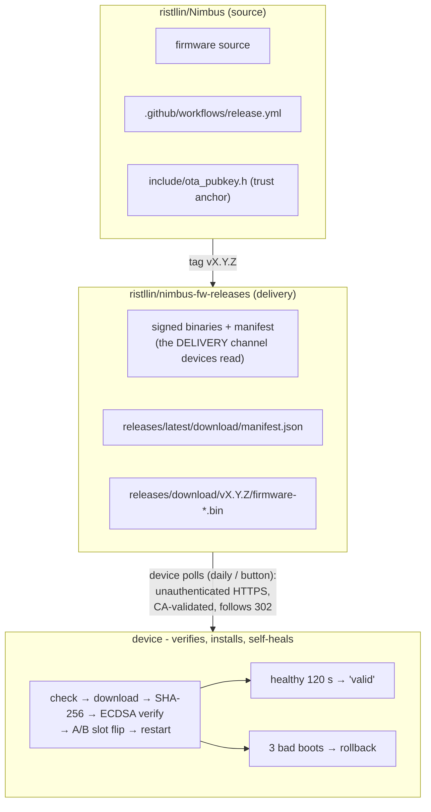

# Nimbus OTA - Operations & Maintenance Manual

Everything a developer/operator needs to run over-the-air firmware updates:
how it works end to end, how to cut a release for the fleet, and what to
maintain (tokens, keys) so it keeps working. For the *design* rationale and the
portable-core internals, see [`ota.md`](ota.md); this doc is the runbook.

---

## 1. The big picture

Two GitHub repos, one keypair, A/B flash slots:



**Why two repos.** The device downloads over plain unauthenticated HTTPS (you do
NOT bake repo credentials into firmware), so the signed firmware is published to
a dedicated, assets-only **public** repo that any device can fetch from - and the
delivery channel stays clean of source history. The signed binaries contain no
secrets. Same pattern as the SFX assets. A fork runs its own delivery repo - see
[`self-hosted-ota.md`](self-hosted-ota.md).

---

## 2. Trust & auth - what's secret, what's public, why

| Thing | Secret? | Where it lives | Purpose |
|---|---|---|---|
| **Signing private key** (ECDSA P-256) | SECRET | maintainer key storage (offline backup) · GitHub secret `OTA_SIGNING_KEY` | CI signs each release with it |
| **Signing public key** | public | `include/ota_pubkey.h` (compiled into firmware) · `nimbus_ota_pub.pem` | devices verify releases against it |
| **`RELEASE_PAT`** (fine-grained PAT) | SECRET | GitHub secret on `ristllin/Nimbus` | CI writes to the public releases repo |
| **`OTA_SIGNING_KEY`** | SECRET | GitHub secret on `ristllin/Nimbus` | the private key, for CI signing |
| **TLS CA bundle** | public | embedded in firmware (IDF cert bundle) | validates GitHub's TLS cert (when `tlsVerify` on, the default) |

**The signature is the real trust anchor.** Even though delivery is over TLS
(and even if TLS validation were off), a device installs firmware only if the
release's ECDSA signature verifies against a public key baked into the *currently
running* firmware. The signed payload binds version + variant + binary hash:
`nimbus-ota-v1\n<version>\n<variant>\n<sha256hex>\n`. So an attacker can't swap
variants, replay an old signature on a new binary, or serve unsigned firmware.

---

## 3. On-device mechanism (what the firmware does)

- **A/B slots.** Flash has two 6.5 MB app slots. The running slot downloads the
  new image into the **inactive** slot - the running firmware is never touched,
  so a failed/interrupted download is harmless.
- **Check** - ~2 min after boot, then daily, or on demand (web **Check for Updates** / `POST /api/ota/check`). Fetches `manifest.json` from the public repo,
  compares `version` to the running `NIMBUS_FW_VERSION`. A newer signed version →
  `available` (+ a one-time Telegram notice in Orchestrator mode). A 404 (no
  release yet) reads as `up-to-date`, not an error.
- **Install** - web button / `POST /api/ota/apply`. Streams the `.bin` into the
  inactive slot while computing SHA-256; checks the hash matches the manifest,
  then verifies the ECDSA signature; only then arms the NVS rollback guard and
  flips the boot slot; restarts. (`dry=1` verifies without flipping; `force=1`
  allows an explicit same/older install from the authenticated UI.)
- **Rollback (self-healing).** Before the flip it records `otaPending/otaPrev/
  otaBoots` in NVS. `bootGuard()` runs as the FIRST line of `setup()` (before any
  driver) and counts boot attempts; after **3** failed boots it flips back to the
  previous, untouched slot. A healthy boot (Wi-Fi up + ~120 s crash-free) clears
  the guard and marks the image **valid** (`lastOta="ok vX.Y.Z"`).
  > ⚠ Mark-valid takes ~120 s after the restart - `lastOta` sitting at
  > `"installing vX"` for a couple minutes post-update is normal, not a hang.
- **Surfaces.** Web **Settings → Software update** · `/api/state` fields
  (`ota`, `otaLatest`, `lastOta`, `otaSlot`, `autoUpd`) · console `OTA?`
  `OTACHECK` `OTAAPPLY` · Telegram notify.
- **Scope.** **Orchestrator mode only.** In Notifier mode NimBLE owns the
  internal SRAM (~23 KB free, below the 24 KB OTA task floor), so `/api/ota/*`
  refuse with 409 - Notifier devices update by USB. `autoUpd` (NVS, default OFF)
  enables unattended install in an idle window.

---

## 4. Cut a release for the whole fleet (developer runbook)

Everything after the tag is automatic.

```bash
# 1. bump the version (single source of truth; the CI tag-guard enforces tag == this)
#    edit include/version.h:  #define NIMBUS_FW_VERSION "v2.11.4"
git commit -am "release: v2.11.4 - <what changed>"
git push origin main

# 2. tag it - this is the ONLY action that ships an update
git tag v2.11.4
git push origin v2.11.4
```

CI (`.github/workflows/release.yml`) then, with no further input:
1. checks out `Nimbus` + `solide-drivers` (via `RELEASE_PAT`),
2. gates `tag == NIMBUS_FW_VERSION`,
3. builds both variants (`esp32s3` + `test`),
4. signs the manifest with `OTA_SIGNING_KEY`,
5. publishes `firmware-esp32s3.bin`, `firmware-test.bin`, `manifest.json` to
   **nimbus-fw-releases** (`RELEASE_PAT` write).

Watch it: `gh run watch -R ristllin/Nimbus $(gh run list -R ristllin/Nimbus -w release.yml -L1 --json databaseId -q '.[0].databaseId')`

**How the fleet gets it.** Every device already running OTA-capable firmware
(**v2.11.2+, Orchestrator mode**) sees the new tag on its next daily check and
installs it - or the owner hits **Check for Updates**. One tag → the whole
(OTA-capable) fleet converges. `-rcN` tags publish as pre-releases and do NOT
move `releases/latest`, so they don't reach devices via the daily check (test rc
builds with the `OTAURL` console override).

**Bootstrapping a device onto the OTA train** (one-time, per device): a device
running older/other firmware can't receive OTA tags until it's on v2.11.2+. Flash
it once over USB - `pio run -e test -t upload --upload-port <port>` (or `esp32s3`
for production) - after which every future tag reaches it with no cable. Confirm
the board first by MAC/WEBTOK, never the port suffix.

---

## 5. Maintenance - what expires, where, and how to renew

| Item | Expires? | Symptom when stale | Where / how to fix |
|---|---|---|---|
| **`RELEASE_PAT`** | Yes (you chose the date; fine-grained PATs ≤ 1 yr) | release CI goes **red** at the *solide-drivers checkout* or *publish* step (403 / "could not read repository") | Regenerate/create a fine-grained PAT (owner `ristllin`; repos `solide-drivers`=Contents:Read, `nimbus-fw-releases`=Contents:Read+Write) at github.com/settings/personal-access-tokens → `gh secret set RELEASE_PAT -R ristllin/Nimbus` |
| **`OTA_SIGNING_KEY`** | No (it's a key) | - | Doesn't expire. But **back it up** (offline, e.g. a password manager). If LOST, no future release can be signed → the whole fleet is orphaned (USB-only forever). |
| **TLS CA bundle** | rarely (GitHub CA rotation) | device `ota=error` on check with a TLS error in the log | Rare. Workaround: set `tlsVerify` off (encrypted-but-unvalidated; the signature still gates install). Real fix: ship a firmware release with an updated IDF cert bundle. |
| **GitHub Actions node deprecation** | n/a (cosmetic) | yellow "Node 20 deprecated" warning; run still green | Bump `actions/*` and `softprops/action-gh-release` versions in `release.yml` when convenient. |

**Set a calendar reminder ~1 week before `RELEASE_PAT` expires.** Check the
current expiry at github.com/settings/personal-access-tokens (or
`gh api /user 2>/dev/null` won't show it - use the web UI). A `git tag` release
with an expired PAT fails loudly in CI and ships nothing, so it can't silently
push a bad update - but it does block *all* releases until renewed.

**Key rotation (only if the private key is compromised):** append the new public
key to `kOtaPubKeys[]` in `include/ota_pubkey.h`; ship a release signed with the
**OLD** key so fielded devices learn the new anchor; then update `OTA_SIGNING_KEY`
to the new private key; drop the old public key one release later. Because the
firmware trusts a *list* of keys, rotation never orphans a device that's on a
build carrying both anchors.

---

## 6. Troubleshooting (symptom → cause)

| Symptom | Likely cause |
|---|---|
| Release CI red at *checkout solide-drivers* or *publish* | `RELEASE_PAT` expired or wrong scopes/repos |
| Release CI red at *sign* | `OTA_SIGNING_KEY` missing/malformed |
| Release CI red at *tag guard* | tag ≠ `NIMBUS_FW_VERSION` in `include/version.h` |
| Device `ota=up-to-date` but you published | device's baked `OTA_MANIFEST_URL` ≠ the public repo (old firmware), or the release isn't `latest` (it's a `-rc` prerelease) |
| Device `ota=error`, `otaErr=fetch` | can't reach GitHub (Wi-Fi/DNS), or a real 5xx |
| Device `lastOta=sig-fail` | release signed with a key **not** in the device's `kOtaPubKeys` (rotation gap / wrong key) |
| Device `lastOta=sha-fail` | corrupted/truncated download (retries next cycle) |
| Device `lastOta=rollback vX` | the new image crash-looped 3× → auto-reverted; investigate that build |
| `POST /api/ota/*` → 409 on a device | Notifier mode (heap-gated) - update it by USB, or it's already busy |
| `lastOta` stuck at `installing vX` for ~2 min | normal - the 120 s health window before mark-valid |

---

## 7. Quick reference

**Repos** - source `github.com/ristllin/Nimbus` · delivery
`github.com/ristllin/nimbus-fw-releases` (public, assets-only).
**Device manifest URL** - `https://github.com/ristllin/nimbus-fw-releases/releases/latest/download/manifest.json`.

**Key files** - `include/version.h` (version) · `include/ota_pubkey.h` (trust
anchors) · `tools/make_manifest.py` (sign+manifest; byte-locked to
`nimbus::ota::buildSigMessage`) · `.github/workflows/release.yml` (CI) ·
`src/sys/ota_update.cpp` (device glue) · `lib/core/src/ota_logic.cpp` (portable
core, host-tested).

**Common commands**
```bash
# cut a release
git commit -am "release: vX.Y.Z" && git push origin main && git tag vX.Y.Z && git push origin vX.Y.Z

# set / rotate secrets
gh secret set RELEASE_PAT     -R ristllin/Nimbus            # paste the PAT
gh secret set OTA_SIGNING_KEY -R ristllin/Nimbus < /path/to/your/ota_priv.pem
gh secret list -R ristllin/Nimbus

# check a device (HTTP, token-gated)
curl -sk "http://<ip>/api/state?t=<webtok>" | python3 -m json.tool   # ota / lastOta / otaSlot
curl -sk "http://<ip>/api/ota/check" -X POST -d "t=<webtok>"          # force a check

# manual/local release (if CI is down) - signs with the on-disk key
python3 tools/make_manifest.py --version vX.Y.Z --key /path/to/your/ota_priv.pem \
  --url-base https://github.com/ristllin/nimbus-fw-releases/releases/download/vX.Y.Z --out manifest.json \
  esp32s3=firmware-esp32s3.bin test=firmware-test.bin
gh release create vX.Y.Z -R ristllin/nimbus-fw-releases firmware-esp32s3.bin firmware-test.bin manifest.json
```
