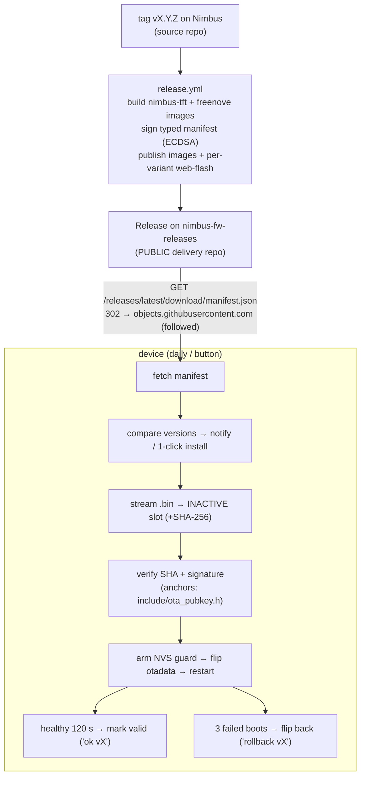

# OTA firmware updates

> **Operators:** for the runbook - how to cut a release, and which tokens
> expire where + how to renew them - see [`ota-operations.md`](ota-operations.md).
> This page is the design/reference.

Nimbus updates itself over Wi-Fi from GitHub Releases. The flash layout was
already A/B (stock `default_16MB.csv`: `otadata` + two 6.5 MB app slots), so OTA
needed no partition change: the running slot downloads the new image into the
**inactive** slot, verifies it, flips the boot flag, restarts - and **rolls back
by itself** if the new firmware can't boot.

⚠ **Delivery is from the dedicated releases repo [`ristllin/nimbus-fw-releases`](https://github.com/ristllin/nimbus-fw-releases), NOT the source repo.** The device
downloads over unauthenticated HTTPS (no repo credentials baked into firmware),
so release assets must live somewhere any device can fetch them - a dedicated,
assets-only public repo (the same pattern as the SFX assets). The signed
binaries carry no secrets, and the ECDSA signature is what devices trust.
Forking the project and shipping to your own devices? See
[`self-hosted-ota.md`](self-hosted-ota.md).



## Trust model

- **Signature** (the real gate): CI signs, per variant, the canonical message
  `nimbus-ota-v2\n<version>\n<type>\n<sha256-hex>\n` with ECDSA P-256
  (secret `OTA_SIGNING_KEY`). The device rebuilds that message from what it
  actually downloaded and verifies against the public keys baked into
  [`include/ota_pubkey.h`](../include/ota_pubkey.h) **before** the boot flag
  flips. Binding version+type kills mix-and-match and cross-version replay. (The
  transition release still signs the legacy `nimbus-ota-v1\n...\n<variant>\n...`
  message so existing fielded firmware can verify it - see Typed manifests.)
- **TLS**: downloads ride `tlsSetup()` (CA-bundle validation, `tlsVerify`
  default ON), so the transport is also authenticated on default settings.
- **Residual**: a MITM against a `tlsVerify=0` device can only replay an old
  *genuinely signed* release; auto-install moves strictly forward in version,
  so the worst case is pinning a device at its current version. Manual
  downgrade needs the authenticated web UI + `force`.
- The `test` variant additionally trusts a COMMITTED test key
  (`test/ota_test_key.pem`, `#ifdef NIMBUS_TEST` only) so the HIL suite can
  sign fixtures. Never flash `env:test` on a production unit.

## Typed manifests (v2)

The manifest is **typed**: `schema: 2`, and each entry in `variants` is keyed on
the device **type**, not the build tag. The four types are frozen:
`nimbus-tft` (the TFT + ring board), and `freenove-28` / `freenove-35` /
`freenove-40` (the all-in-one touchscreen, by panel size). A release publishes one
`manifest.json` holding every type that has an image; a device looks up only its
own type.

```
{ "schema": 2, "version": "v4.3.0", "notes": "...",
  "variants": {
    "nimbus-tft":  { "url": "...", "size": 3600000, "sha256": "...", "sig": "..." },
    "freenove-28": { "url": "...", "size": 3600000, "sha256": "...", "sig": "..." },
    "freenove-35": { ... }, "freenove-40": { ... } } }
```

- **Where the type comes from**: NVS key `otaType`, seeded by the flasher on a
  fresh install or written by the transition release on an existing device. If it
  is unset, the build falls back to its compile-time tag so dev/HIL builds
  (`test`/`test-cyd`) still resolve. A stored type from the wrong board family is
  refused (a Solide build only accepts `nimbus-tft`, a Freenove build only the
  `freenove-*` sizes), so a mis-seeded NVS can never pull a wrong-pinout image -
  the runtime twin of the compile-time board/variant bind in `ota_update.cpp`.
- **Untyped devices get no update**: a device whose type is empty (or absent from
  the manifest) matches no variant and reports "no update" - a settled state, not
  an error. **E-ink devices are frozen this way**: they carry no type, so after
  the transition release they never install again, and the final e-ink image reads
  "Updates have ended for this board."
- **The transition release** is a final **schema-1** manifest published under the
  tag existing firmware polls. Fielded firmware matches it by its build tag
  (`esp32s3`/`cyd`) and installs it; on first boot the new image derives its type
  from `scrModel` + board and persists `otaType`, then uses the schema-2 manifest
  thereafter. Generate it with `tools/make_manifest.py --schema 1`; the typed
  releases use the default `--schema 2`.

The repo-layout decision (reuse `nimbus-fw-releases`, one manifest per release) is
recorded in [`adr/0001-ota-releases-repo.md`](adr/0001-ota-releases-repo.md).

## CI secrets (two)

- **`OTA_SIGNING_KEY`** - the ECDSA private key (PEM) CI signs manifests with.
  Backed up in the owner's password manager; **if lost, fielded devices can never
  update again**. Rotation: append the new PEM to `kOtaPubKeys`, ship a release
  signed with the OLD key (fielded devices learn the new anchor), then re-key the
  secret; drop the old entry a release later.
- **`RELEASE_PAT`** - a fine-grained PAT the release workflow uses to (a) check
  out the [`solide-drivers`](https://github.com/ristllin/solide-drivers) sibling
  (`Contents: read`) and (b) publish the release to the `nimbus-fw-releases`
  repo (`Contents: read/write`). The default `GITHUB_TOKEN` is scoped to the
  source repo only, so it cannot publish to a second repository. Create it at
  github.com/settings/personal-access-tokens with those two repos + permissions,
  then `gh secret set RELEASE_PAT -R ristllin/Nimbus`.

## Release checklist

1. Bump `NIMBUS_FW_VERSION` in `include/version.h`; commit.
2. `git tag vX.Y.Z && git push origin main vX.Y.Z`.
3. Watch the `release` workflow: it gates tag==version.h, builds the `esp32s3`
   (nimbus-tft) and `esp32s3-cyd` (freenove) images, signs the typed manifest,
   and publishes `firmware-nimbus-tft.bin`, `firmware-freenove.bin`, and
   `manifest.json` (plus per-variant web-flash images on the `webflash` branch).
   `-rcN` tags publish as pre-releases - note `releases/latest` (what devices
   poll) only tracks FULL releases, so rc testing uses `OTAURL`/a draft URL, not
   the daily check.
   - **Transition release (one-time, for existing fielded devices):** also cut a
     schema-1 manifest so devices still on the old build tag can install it and
     cross into the typed scheme. Build the images, then
     `tools/make_manifest.py --schema 1 --version vX.Y.Z --key ... esp32s3=firmware-nimbus-tft.bin cyd=firmware-freenove.bin`
     and publish it under the tag those devices poll. New devices are seeded with
     their type by the flasher and never need this.
4. Devices see it on their daily check (or the **Check for Updates** button,
   Settings → Software update on the web page); Orchestrator-mode devices
   Telegram the owner once per version - the notice ends "Reply /update to
   install it now, or open Settings → Software update on the device's web
   page." (an already-current device answers `/update` with "Nimbus is up to
   date (vX).").

## Device behavior

- **Check**: ~2 min after boot, then daily; on demand from Settings → Software
  update on the web page, the device's Settings > Software update menu
  (Orchestrator mode only - "Check for updates" renders "(unavailable)" in
  Notifier mode), or `POST /api/ota/check`. State surfaces in `/api/state`
  (`ota`, `otaResult`, `otaLatest`, `otaNotes`, `otaPct`, `lastOta`, `autoUpd`)
  and `STATUS` (`ota=`, `lastOta=`).
- **A check always ends in a result.** `POST /api/ota/check` returns `202`
  (accepted) or `409` (busy or gated); the verdict then lands in `/api/state`
  as `otaResult`, which a poller can wait on without ever hanging on "checking".
  It settles to exactly one of: `up-to-date` (reached the feed, nothing newer),
  `new-version` (a newer release, with `otaLatest` + `otaNotes`), `unreachable`
  (the release feed could not be reached at all), or `failed` (reached the
  server but the manifest was rejected; `otaErr` carries the short reason).
  `pending` means a check is still running or none has run yet. The distinction
  between `unreachable` and `failed` is honest: a transport failure is never
  reported as "up to date". (`nimbus::ota::checkResult`, host-tested.)
- **Install**: the web page's **Install Update** button, the device menu's
  Settings > Software update > "Install vX" row (confirm: Cancel / Install and
  restart), Telegram `/update` (owner only), or `POST /api/ota/apply` (`dry=1`
  downloads + verifies without flipping, `force=1` allows same/older AND bypasses
  the battery gate below). During install the
  ring is a theme-color progress bar, the e-ink says "do not power off", and
  voice capture is refused. The download runs alongside the live Telegram poller
  (heap stays steady; an earlier "stop the poller to free heap" hook is gone - it
  deleted a live queue and crash-rebooted the device).
- **Battery / health gate** (both the manual and the auto path): an interrupted
  flash on a dying pack can leave a slot unbootable, so install is allowed only
  when the pack can finish the write. The rule: **level at or above 40 % AND
  estimated health at or above 60 %, OR the device is on external power, OR
  battery monitoring is disabled** (there is no pack to protect). Below that,
  the refusal names the next step: a low level asks to **Connect power** (`err`
  `need-power`), a low health estimate asks to **Recalibrate to 100 %** (`err`
  `need-recalibrate`, charge full then Calibrate). Because this board has no
  VBUS sense line to prove the charger for itself, every stop offers **Install
  anyway (I am charging)**, which re-submits with `force=1` and skips the gate.
  (`nimbus::ota::installGate`, host-tested.)
- **Auto-install** (`autoUpd`, default OFF): hourly idle-window evaluation -
  no turn/voice in flight, battery ≥50 % or external power, estimated health
  ≥60 % on battery, heap headroom (`nimbus::ota::autoInstallAllowed`,
  host-tested).

## ⚠ Notifier mode: OTA is heap-gated (Orchestrator-mode only, for now)

OTA check/install **refuse with 409 in Notifier mode** and never run there. In
Notifier mode NimBLE owns most of the ~266 KB internal SRAM, leaving ~23 KB free -
below the OTA task-spawn floor (24 KB free internal + 16 KB largest block). The
gate deliberately refuses rather than risk an OOM during the TLS download + flash
write. Consequence: a Notifier-mode device can't self-update over the air; update
it by **USB reflash** or by switching to **Orchestrator mode** (which rests at
~63 KB internal, well above the floor). OTA is fully verified in Orchestrator mode
(Boards 1 & 2). The eventual fix (deferred, owner decision 2026-07-18) is to have
OTA temporarily release BLE during the download in Notifier mode (frees ~40-70 KB
internal), then the post-install restart restores it.
- **Rollback**: before the flip the device arms `otaPend/otaBoots/otaPrev` in
  NVS; `otaupd::bootGuard()` (the FIRST line of `setup()`, raw-NVS so it beats
  every driver) counts boot attempts and flips back to the untouched previous
  slot after 3 failures. Healthy for 120 s (600 s if Wi-Fi never came up) →
  marked valid. Power loss mid-download touches only the inactive slot;
  between guard-arm and flip → disarmed as `aborted-preflip`.

## Testing

- Host: `pio test -e native -f test_ota_logic` (version/manifest/policy core +
  the signed-message golden, cross-checked against `tools/make_manifest.py
  --print-message`; the battery/health `installGate` branches; the definitive
  `checkResult` mapping incl. reachable-vs-unreachable).
- HIL: `python3 -m pytest tests/hil/test_ota.py -m net --allow-hardware` -
  local self-signed TLS server (flips `tlsVerify` off/on), test-key-signed
  manifest, real dry-run E2E, sha-fail + sig-fail negatives, 302 redirect hop.
- Rollback drill (console, `env:test`, both slots flashed): `OTASIM arm app0`
  (label from `OTA?` `slot=`) + `OTASIM crash` + `REBOOT` → three synthetic
  crash-boots → device returns on the previous slot with `lastOta=rollback`.
