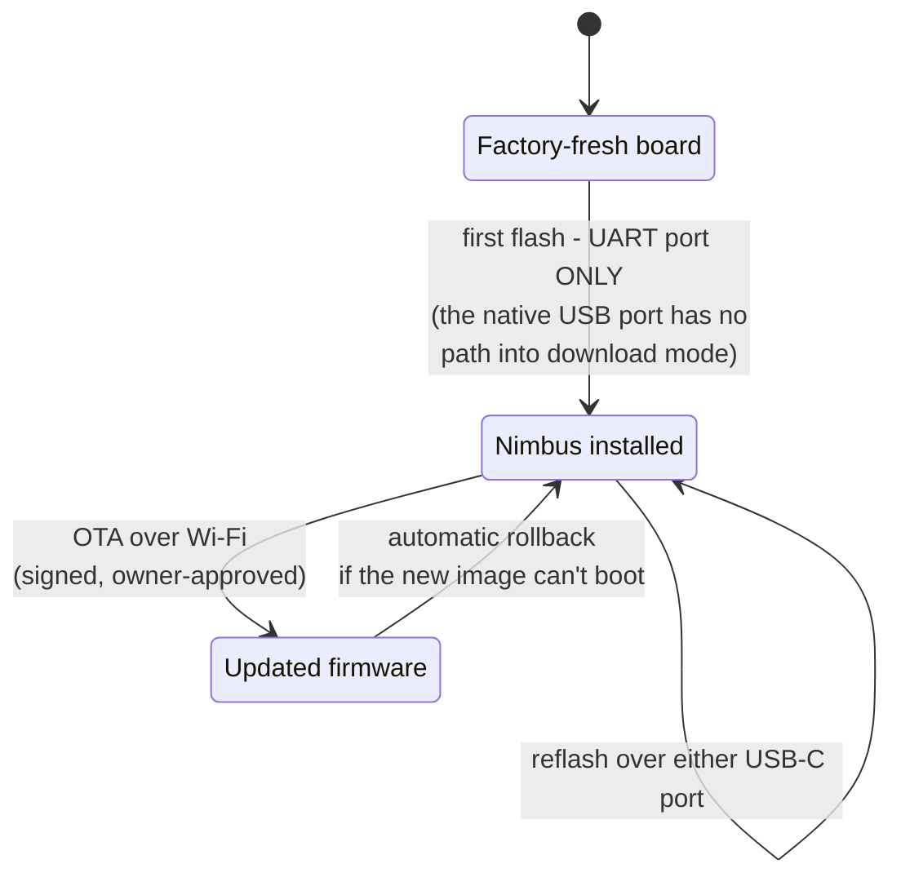
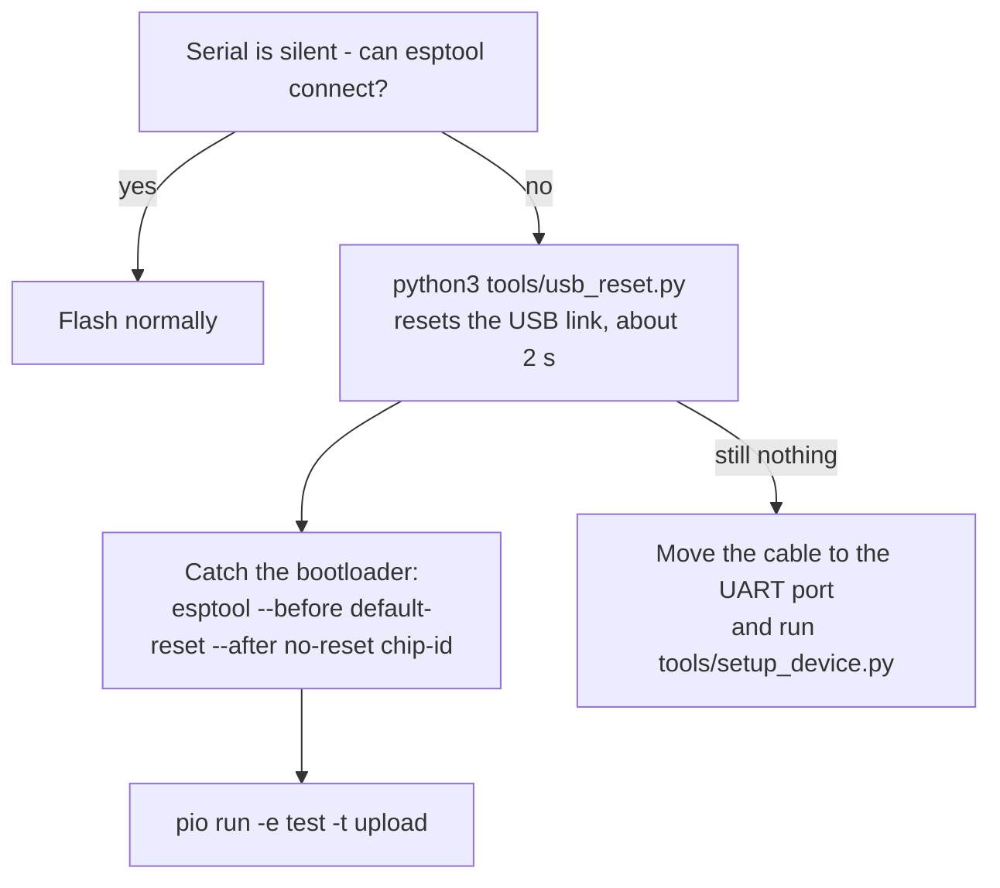

# Flash the firmware

Get the firmware onto the board. Two paths: the browser flasher (easiest), or
the guarded command-line installer.

:::caution Use the port labeled UART
The DevKitC-1 has **two USB-C ports and only one can flash a fresh board**.
Plug into the port silkscreened **`UART`**, not `USB`. On a factory-fresh
board the native `USB` port has **no path into download mode at all** - a
board that "won't flash" on that port is not broken, it is on the wrong port.
:::

## Path 1 - browser flasher (recommended)

Flash straight from a Chromium-based browser (Chrome or Edge), no toolchain
installed:

1. Connect the board's **UART** port to your computer with a **data-capable
   USB cable** (many cables are charge-only and never show a serial port).
2. Open the **[Nimbus web flasher](https://docs.cumulo-nimbus.ai/flash)** and
   **choose your board** from the list: **Nimbus board (TFT + ring)**, or the
   **Freenove CYD** at your panel size (2.8, 3.5, or 4.0 inch). This is the one
   choice you must get right (see "Picking the right image" below); the Install
   button stays disabled until you pick, so there is no wrong default to flash.
3. Click **Install Nimbus** and pick the serial port when prompted (a CP210x /
   `usbserial` entry). On a new board, choosing "Erase device" is fine; on a
   board already running Nimbus it wipes the saved settings.
4. **Ignore any Wi-Fi prompt the flasher shows afterwards** - Nimbus provisions
   through its own `Nimbus-setup` network, not through the flasher.

> **On trust:** like any first firmware install before secure boot, the
> browser-flashed image is written as-is - it is not cryptographically verified
> on the device the way [over-the-air updates](../ota.md) are (those are signed
> and checked before they apply). If you want to confirm the exact bytes first,
> the image's SHA-256 is published next to it at
> `raw.githubusercontent.com/ristllin/nimbus-fw-releases/webflash/latest/nimbus-webflash.bin.sha256`
> - compare it against the file the flasher downloads.

When it finishes, the board restarts into Nimbus: join the `Nimbus-setup`
Wi-Fi network and continue in the **[setup wizard](setup-wizard.md)**. The
image you picked already carries the display it belongs to, so **the screen
comes up right away on the correct panel**: there is no blank-screen step and
no display question in the wizard.

### Picking the right image (and what a wrong pick looks like)

The board variant is baked into the image at build time; the device does not
detect its own hardware. Each board and panel size has its **own** image, so the
one thing you must get right is the board you choose in step 2. The installer
lists exactly four:

| Choose | For | Update type it seeds |
|---|---|---|
| Nimbus board (TFT + ring) | the Solide S3 board with the 2.8" panel and LED ring | `nimbus-tft` |
| Freenove CYD - 2.8 inch | the Freenove all-in-one, 2.8" panel | `freenove-28` |
| Freenove CYD - 3.5 inch | the Freenove all-in-one, 3.5" panel | `freenove-35` |
| Freenove CYD - 4.0 inch | the Freenove all-in-one, 4.0" panel | `freenove-40` |

**What a wrong pick looks like:** an image built for the *other* board boots and
comes online normally over Wi-Fi, but its display driver talks to pins that are
not wired to this board's panel, so **the screen stays black even though the
device looks healthy**. A wrong Freenove *panel size* is subtler: the screen
lights up but the picture is sized for the wrong glass (clipped or shifted).
Either way the fix is the same, and it is safe: reflash from this page with the
**correct** board selected. Picking the right image is also what makes future
over-the-air updates safe, because that choice sets the update type the device
will only ever accept a matching image for.

## Path 2 - command-line installer

From a clone of the firmware repository, with Python 3 and
[PlatformIO](https://platformio.org/) installed:

```bash
python3 tools/setup_device.py
```

The installer identifies the board for you and confirms before it writes:

- It **discovers connected boards** by their USB descriptor and works out the
  **board family** (Nimbus board or Freenove CYD) from that plus the saved
  settings, so you rarely need to say which board you have.
- **One board** connected? It shows what it found and asks a single question:
  `Install to '<name>' (<board family>, <configured or blank>) on <port>? [Y/n]`.
  **Several boards?** It lists them and lets you pick by number, with an
  **Identify** action (`i2`) that blinks that board's ring or screen for about
  three seconds so you can tell which is which.
- It **never erases saved settings.** An already-configured Nimbus keeps its
  Wi-Fi, keys, pairings, and access token.
- On a new board it asks for the starting **operating mode** (Notifier or
  Orchestrator), and for a Freenove the **panel size** (2.8 / 3.5 / 4.0 inch).
  It seeds the display, orientation, mode, and the board's update type, verifies
  them, then installs the production firmware.

Useful flags: `--port` (skip discovery), `--board solide_s3|freenove_s3` (skip
autodetect), `--size 28|35|40` (Freenove panel), `--mode notifier|orchestrator`
(skip the mode prompt), `--yes` (skip the confirm prompt for CI; needs a single
connected board or an explicit `--port`, plus `--mode` for a blank board).

After it writes, the installer reads the board's serial to confirm the screen
came up, then exits. If the screen does not respond it stops with a non-zero
exit and says the wrong board variant was very likely flashed (for example a
Nimbus board image on a Freenove); the board still boots and joins the network,
so nothing else catches this. Check that the `--board` matches the hardware and
run the installer again. If a setup step fails part way, the installer restores
the production firmware first, so the board is never left on the temporary setup
image. Add `--skip-panel-check` only when you are flashing a board with no screen
attached on purpose.

### The Freenove CYD all-in-one

The [all-in-one board](../hardware/all-in-one-cyd.md) uses the **same**
installer and is auto-detected; no flag is required.

```bash
python3 tools/setup_device.py           # autodetects the Freenove on its USB-C port
python3 tools/setup_device.py --board freenove_s3 --size 35   # or be explicit
```

Two things are specific to this board:

- **One port, no UART bridge.** The CYD has a single USB-C port and rides the
  ESP32-S3's native USB the whole way, so there is no "wrong port" the way the
  DevKitC-1's two-port caution above describes. Just connect a data-capable
  USB-C cable.
- **The panel size sets the update type.** Each Freenove panel size is its own
  firmware image, compiled at that panel's resolution, and its own typed update
  (`freenove-28` / `freenove-35` / `freenove-40`); the size you pick is what the
  flasher seeds so the board is only ever offered a matching image. It is always
  the color touchscreen, so there is no display question. The 3.5" and 4.0" sizes
  are [host-verified only](../hardware/all-in-one-cyd.md#supported-panels) today.

Done? Continue to the **[setup wizard](setup-wizard.md)**. The rest of this
page is reference for reflashing and recovery.

---

## The board's flashing states

A board only ever passes through three states, and the UART-vs-USB trap
exists solely on the first arrow - once Nimbus is installed, any path works:



## The two USB-C ports, explained

| Port (silkscreen) | What it is | Starts a flash by itself? |
|---|---|---|
| **UART** | CP2102N bridge, with DTR/RTS wired to the chip's reset and boot pins | **Yes - electrical, regardless of what firmware is running** |
| **USB** | The ESP32-S3's own USB peripheral | Only while the chip's ROM (or Nimbus) owns it |

On the `UART` port, esptool enters download mode electrically - no buttons.
Fresh kits ship a demo that takes over the native USB peripheral, leaving no
software path to download mode on the `USB` port; the port then shows up as a
plain CDC-ACM device whose virtual DTR/RTS do nothing. On the `UART` port the
board appears as a CP210x serial device (`/dev/cu.usbserial-*` or
`/dev/cu.SLAB_USBtoUART`).

## Reflashing a board that already runs Nimbus

Once Nimbus is on the board, **either port works** for reflashing - Nimbus
keeps the native USB port reachable (its test build has a `REBOOT` console
command, and a task watchdog restarts a hung device on its own). A typical
bench reflash:

```bash
pio run -e test -t upload
```

With more than one board connected, always pass `--upload-port` explicitly,
and confirm which board a port belongs to before flashing - the
`usbmodemNNNN` suffix tracks the computer's USB port, not the board.

## Recovery



**A silent board is almost never bricked.** If serial goes quiet *and* esptool
cannot connect on the native USB port, the usual cause is stale host-side USB
state, not the board. Recover it in software - no need to unplug anything:

```bash
python3 tools/usb_reset.py    # resets the USB link (equivalent to a replug)
```

This resets the USB **link**, not the chip - it un-wedges a silent serial
device but cannot restart the firmware or enter download mode by itself. With
two boards attached, disambiguate with `--serial` or `--skip` (see the
script's help). Then, to flash, catch the board in its bootloader and hold it
there:

```bash
~/.platformio/penv/bin/python ~/.platformio/packages/tool-esptoolpy/esptool.py \
  --chip esp32s3 --port /dev/cu.usbmodem101 \
  --before default-reset --after no-reset chip-id
pio run -e test -t upload --upload-port /dev/cu.usbmodem101
```

If the native USB port still does not respond, the `UART` port always works:
move the cable there and run `python3 tools/setup_device.py`.

:::caution Never pulse the serial control lines
Do not open the port with tools that assert DTR/RTS by default, and never
strobe those lines hoping to reset the board - on this board that can wedge
the USB device silent. The installer and the commands above already handle
the port correctly.
:::

### Recovering the access token

If a damaged or blank display prevents scanning the sign-in QR, the web access
token can be read back over the physical UART, without erasing anything:

```bash
python3 tools/setup_device.py --show-token
```

This temporarily installs the UART diagnostic, prints the token, and restores
the production firmware. It refuses to run on a board without existing Nimbus
settings.

## Which build environment do I want?

| Environment | Install with | What it is |
|---|---|---|
| `esp32s3` | `python3 tools/setup_device.py` | **Production firmware.** Silent serial; what a finished device runs. The installer flashes this for you. |
| `test` | `pio run -e test -t upload` | Production firmware **plus a serial test console** (`STATUS`, `REBOOT`, `RENDER?`, …) for bench work and the HIL harness. Never the flash target for a finished device. |
| `provision` | `pio run -e provision -t upload --upload-port …` | A standalone serial **network diagnostic** - not the product firmware; it has no display UI, setup network, or web settings. `setup_device.py` uses a provisioning variant of it to seed a new board's settings, choosing the one that matches the board and the port (`provision` or `provision-uart` for a Nimbus board, `provision-cyd` for a Freenove) so its serial reply reaches the same cable. |
| `tftbringup` | `pio run -e tftbringup -t upload` | **Diagnostic only**: a bare TFT panel test (color bars, backlight fade, touch paint). It replaces the Nimbus firmware entirely - restore with `python3 tools/setup_device.py`. |

If any diagnostic environment was flashed by accident, running
`python3 tools/setup_device.py` puts the production firmware back; saved
settings are unaffected.

---

*How it works → [Hardware reference: first flash of a fresh board](../hardware.md#first-flash-of-a-fresh-board-use-the-uart-port)*
