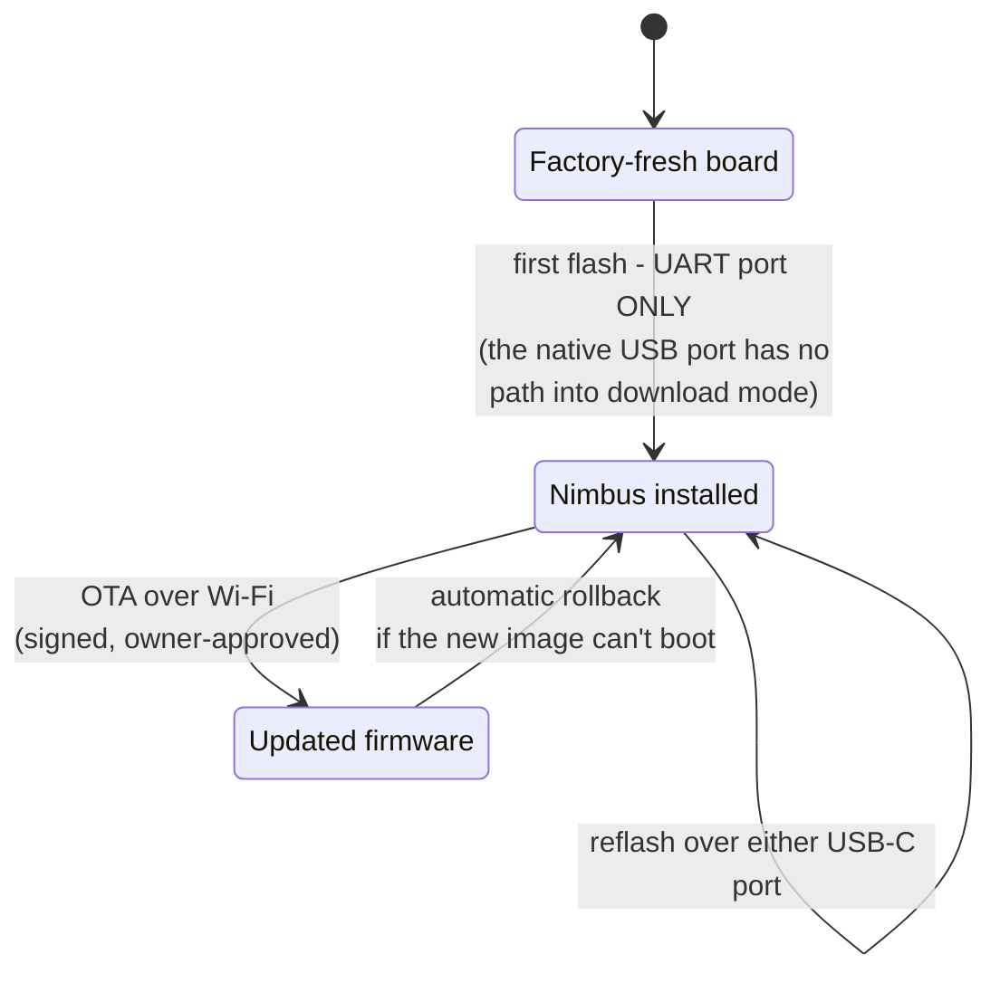
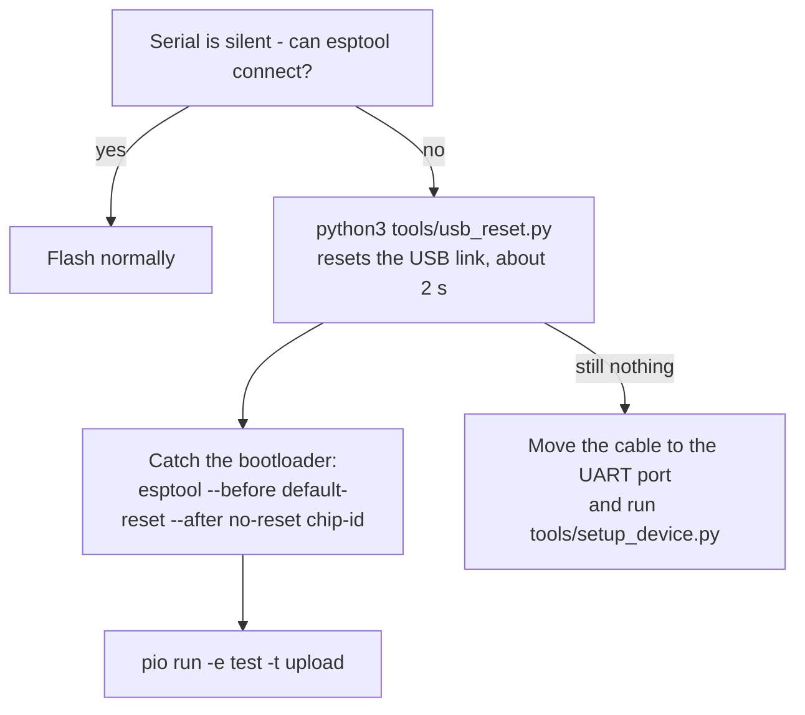

# Flash the firmware

Get the firmware onto the board. Two paths: the browser flasher (easiest), or
the guarded command-line installer.

:::caution Use the port labeled UART
The DevKitC-1 has **two USB-C ports and only one can flash a fresh board**.
Plug into the port silkscreened **`UART`**, not `USB`. On a factory-fresh
board the native `USB` port has **no path into download mode at all** - a
board that "won't flash" on that port is not broken, it is on the wrong port.
:::

## Path 1 - browser flasher (recommended)

Flash straight from a Chromium-based browser (Chrome or Edge), no toolchain
installed:

1. Connect the board's **UART** port to your computer with a **data-capable
   USB cable** (many cables are charge-only and never show a serial port).
2. Open the **[Nimbus web flasher](https://ristllin.github.io/Nimbus/flash)**
   and click **Install Nimbus**.
3. Pick the serial port when prompted (a CP210x / `usbserial` entry). On a new
   board, choosing "Erase device" is fine; on a board already running Nimbus
   it wipes the saved settings.
4. **Ignore any Wi-Fi prompt the flasher shows afterwards** - Nimbus provisions
   through its own `Nimbus-setup` network, not through the flasher.

> **On trust:** like any first firmware install before secure boot, the
> browser-flashed image is written as-is - it is not cryptographically verified
> on the device the way [over-the-air updates](../ota.md) are (those are signed
> and checked before they apply). If you want to confirm the exact bytes first,
> the image's SHA-256 is published next to it at
> `raw.githubusercontent.com/ristllin/nimbus-fw-releases/webflash/latest/nimbus-webflash.bin.sha256`
> - compare it against the file the flasher downloads.

When it finishes, the board restarts into Nimbus: join the `Nimbus-setup`
Wi-Fi network and continue in the **[setup wizard](setup-wizard.md)**. On a
touchscreen board the panel stays blank/white until the wizard's display step
is answered - expected, not a fault.

## Path 2 - command-line installer

From a clone of the firmware repository, with Python 3 and
[PlatformIO](https://platformio.org/) installed:

```bash
python3 tools/setup_device.py
```

The installer is deliberately hard to point at the wrong board:

- It lists **only UART bridges** (`/dev/cu.usbserial-*` and similar) and makes
  you pick one; it refuses native-USB ports and always passes the chosen port
  to PlatformIO explicitly.
- It reads the board's **immutable factory MAC** and its saved settings, then
  asks you to **type the MAC back** before anything is written - the guard
  that matters when more than one board is connected.
- It **never erases saved settings.** An already-configured Nimbus keeps its
  Wi-Fi, keys, pairings, and access token.
- On a new board it asks two setup questions - the fitted **display** (e-ink +
  knob, or the TFT touchscreen) and the starting **operating mode** (Notifier
  or Orchestrator) - verifies them, then installs the production firmware.

Useful flags: `--port` (skip the picker), `--display eink|tft` and
`--mode notifier|orchestrator` (skip the prompts), `--yes` (skip the typed-MAC
confirmation; allowed only with an explicit `--port`).

:::caution The TFT choice must be made at install time
A touchscreen board has no knob, and the firmware's raw default is e-ink - a
TFT board cannot correct a wrong display setting from its own controls.
Answer **TFT** when the installer asks.
:::

Done? Continue to the **[setup wizard](setup-wizard.md)**. The rest of this
page is reference for reflashing and recovery.

---

## The board's flashing states

A board only ever passes through three states, and the UART-vs-USB trap
exists solely on the first arrow - once Nimbus is installed, any path works:



## The two USB-C ports, explained

| Port (silkscreen) | What it is | Starts a flash by itself? |
|---|---|---|
| **UART** | CP2102N bridge, with DTR/RTS wired to the chip's reset and boot pins | **Yes - electrical, regardless of what firmware is running** |
| **USB** | The ESP32-S3's own USB peripheral | Only while the chip's ROM (or Nimbus) owns it |

On the `UART` port, esptool enters download mode electrically - no buttons.
Fresh kits ship a demo that takes over the native USB peripheral, leaving no
software path to download mode on the `USB` port; the port then shows up as a
plain CDC-ACM device whose virtual DTR/RTS do nothing. On the `UART` port the
board appears as a CP210x serial device (`/dev/cu.usbserial-*` or
`/dev/cu.SLAB_USBtoUART`).

## Reflashing a board that already runs Nimbus

Once Nimbus is on the board, **either port works** for reflashing - Nimbus
keeps the native USB port reachable (its test build has a `REBOOT` console
command, and a task watchdog restarts a hung device on its own). A typical
bench reflash:

```bash
pio run -e test -t upload
```

With more than one board connected, always pass `--upload-port` explicitly,
and confirm which board a port belongs to before flashing - the
`usbmodemNNNN` suffix tracks the computer's USB port, not the board.

## Recovery



**A silent board is almost never bricked.** If serial goes quiet *and* esptool
cannot connect on the native USB port, the usual cause is stale host-side USB
state, not the board. Recover it in software - no need to unplug anything:

```bash
python3 tools/usb_reset.py    # resets the USB link (equivalent to a replug)
```

This resets the USB **link**, not the chip - it un-wedges a silent serial
device but cannot restart the firmware or enter download mode by itself. With
two boards attached, disambiguate with `--serial` or `--skip` (see the
script's help). Then, to flash, catch the board in its bootloader and hold it
there:

```bash
~/.platformio/penv/bin/python ~/.platformio/packages/tool-esptoolpy/esptool.py \
  --chip esp32s3 --port /dev/cu.usbmodem101 \
  --before default-reset --after no-reset chip-id
pio run -e test -t upload --upload-port /dev/cu.usbmodem101
```

If the native USB port still does not respond, the `UART` port always works:
move the cable there and run `python3 tools/setup_device.py`.

:::caution Never pulse the serial control lines
Do not open the port with tools that assert DTR/RTS by default, and never
strobe those lines hoping to reset the board - on this board that can wedge
the USB device silent. The installer and the commands above already handle
the port correctly.
:::

### Recovering the access token

If a damaged or blank display prevents scanning the sign-in QR, the web access
token can be read back over the physical UART, without erasing anything:

```bash
python3 tools/setup_device.py --show-token
```

This temporarily installs the UART diagnostic, prints the token, and restores
the production firmware. It refuses to run on a board without existing Nimbus
settings.

## Which build environment do I want?

| Environment | Install with | What it is |
|---|---|---|
| `esp32s3` | `python3 tools/setup_device.py` | **Production firmware.** Silent serial; what a finished device runs. The installer flashes this for you. |
| `test` | `pio run -e test -t upload` | Production firmware **plus a serial test console** (`STATUS`, `REBOOT`, `RENDER?`, …) for bench work and the HIL harness. Never the flash target for a finished device. |
| `provision` | `pio run -e provision -t upload --upload-port …` | A standalone serial **network diagnostic** - not the product firmware; it has no display UI, setup network, or web settings. Its `provision-uart` variant is what `setup_device.py` uses internally to seed a new board's settings. |
| `tftbringup` | `pio run -e tftbringup -t upload` | **Diagnostic only**: a bare TFT panel test (color bars, backlight fade, touch paint). It replaces the Nimbus firmware entirely - restore with `python3 tools/setup_device.py`. |

If any diagnostic environment was flashed by accident, running
`python3 tools/setup_device.py` puts the production firmware back; saved
settings are unaffected.

---

*How it works → [Hardware reference: first flash of a fresh board](../hardware.md#first-flash-of-a-fresh-board--use-the-uart-port)*
