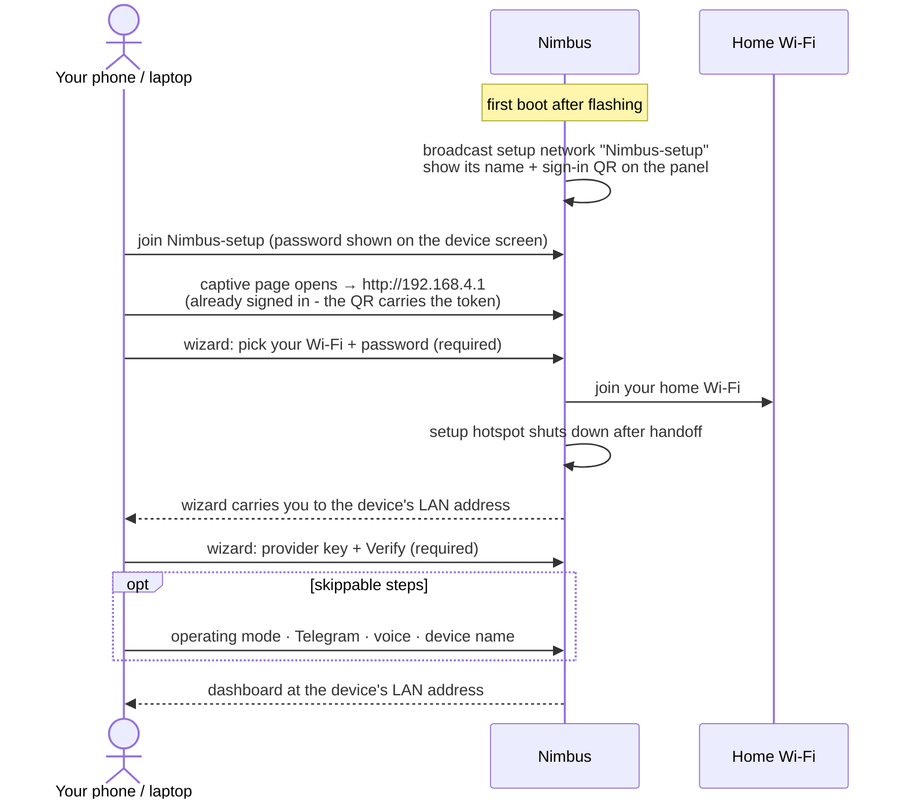

# Set up the device

From first power-on to a configured device: join the setup network, walk the
onboarding wizard, land on the dashboard. About ten minutes; no serial console.

The whole flow at a glance - every step is detailed in the sections below.
On a touchscreen board the device shuts its setup hotspot down once it is on
your Wi-Fi and the wizard follows it to the new address automatically:

## 1. Power on

Power the board over USB-C. What you see depends on the mode chosen during
flashing:

- **Orchestrator** shows its own **setup Wi-Fi network name** and a sign-in
  QR on the display. Continue below.
- **Notifier** shows Bluetooth pairing guidance instead - there is no Wi-Fi
  or web UI in that mode. Jump to the
  **[Notifier quick start](notifier-quick-start.md)**.

## 2. Join the setup network

Two steps, in order - the same two the device screen shows:

1. **Join the setup network** shown on the panel:
   - **Network:** `Nimbus-setup` (a second device numbers itself
     `Nimbus-2-setup`, and so on)
   - **Password:** shown on the device screen (unique to your device) - or just
     scan the QR to join automatically
2. **Open `http://192.168.4.1`.** A setup page usually opens on its own once you
   join. **If nothing opens, visit `http://192.168.4.1`** in your browser.

Don't use `nimbus.local` for this first hop - it is a LAN name and can resolve to
a different Nimbus. The setup page opens the wizard **already signed in**; there is
no token to copy.

## 3. Walk the wizard

The wizard asks for two required things and lets you skip the rest:

| Step | Required? | Notes |
|---|---|---|
| **Connect to Wi-Fi** | Yes | Scan, pick your home network, type its password. 2.4 GHz only; SSIDs are case-sensitive. |
| **Provider key** | Yes - one verified key | Paste an API key and click **Verify**. **[Mistral](https://console.mistral.ai/) is the recommended starting point** - free tier, and the voice default; OpenAI and Anthropic work too. Have the key ready before you start (see [Get your provider key](provider-keys.md)); you cannot fetch one now, on the device's own Wi-Fi. Keys are write-only: shown as "set", never displayed again. |
| Operating mode | Skippable | Defaults to what the installer chose; changeable later (a change restarts the device). |
| Telegram | Skippable | Add a bot token later under Assistant → Connectors → Telegram. |
| Voice | Skippable | Dictation and spoken replies default to Mistral. |
| Device name | Skippable | One name drives the setup network SSID, the LAN address, the Bluetooth name, and what the assistant calls itself. |

On a **touchscreen board**, keep the wizard open while the device joins your
Wi-Fi: the setup network shuts down after handoff (to protect the panel from
its own radio), and the wizard carries you to the device's new LAN address
automatically. "Home Wi-Fi connected + setup hotspot off" is the healthy end
state, not a failure.

:::danger Using only a Mistral key? Set embeddings BEFORE first use
The long-term memory's **embedding provider defaults to OpenAI**, and it is a
**set-once** choice: changing it later **erases the vector memory** (every
stored embedding becomes unreadable to the new model). If Mistral is your only
key, open **Memory & Files → Memory settings** and switch the embedding
provider to **Mistral before your first conversation** - while the memory is
still empty and there is nothing to lose.
:::

## What works with which provider

Any one verified provider runs the assistant. A few features are tied to a
specific provider or key - honestly, today:

| Feature | Mistral | OpenAI | Anthropic |
|---|---|---|---|
| Conversation, tools, sub-agents, routines | ✓ | ✓ | ✓ |
| Dictation (speech-to-text) | ✓ *(default)* | ✓ | - |
| Spoken replies over Telegram | ✓ *(default)* | ✓ | - |
| Spoken replies on the device speaker | - | ✓ | - |
| Image generation (`image.generate`) | - | ✓ | - |
| Long-term memory embeddings | ✓ *(switch before first use)* | ✓ *(default)* | - |
| Web search | needs a separate **Tavily** key (Assistant → Tools → Web search) | same | same |

## 4. The dashboard

The wizard ends on the device's **dashboard** at its LAN address - health,
battery, memory, and sessions at a glance, with **Home**, **Chat**, **Memory**,
the **Assistant** page (one flat subtab row: Models, Connectors, Tools, Skills,
Routines, Usage, and Safety), and **Device** settings. You sign in once per
browser; the sign-in QR on the device screen gets any new browser in.

Full tab-by-tab detail: the
[web UI reference](https://docs.cumulo-nimbus.ai/getting-started/webui-reference).

Next: **[Your first conversation](first-conversation.md)**.

---

*How it works → [Orchestrator World](../orchestrator-world.md)*
