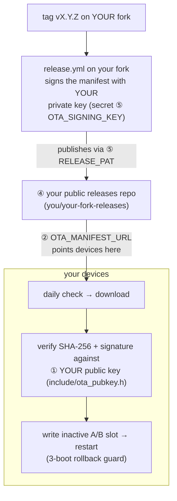

# Self-hosted OTA - running your own update channel

A fork that ships firmware to its own devices needs its own update channel:
its own signing keypair, its own releases repository, and two constants
changed in the source. Without these, your devices would poll the upstream
project's releases - signed with a key your fork does not hold - and your CI
could not publish anywhere.

Read [how OTA works](ota.md) first; this page is only the delta a fork must
apply.

The chain is the upstream one with your names substituted at every hop - the
numbers in the diagram are the rows of the table below:



## What a fork must change

| # | Thing | Where | Why |
|---|---|---|---|
| 1 | **Signing keypair** | `include/ota_pubkey.h` (public key, compiled into firmware) + the private key as a CI secret | Devices install only what verifies against the keys baked into the running firmware. Your devices must trust *your* key. |
| 2 | **Manifest URL** | `OTA_MANIFEST_URL` in `src/agent/agent_config.h` | Where devices poll for updates. Point it at your own releases repository. |
| 3 | **Sound-pack base URL** | `SFX_SYNC_BASE` in `src/agent/agent_config.h` | Where devices sync the optional voice-pack WAVs from. Point at your own asset repository, or leave the upstream one (the assets are public). |
| 4 | **A public releases repository** | e.g. `you/your-fork-releases` | Devices download unauthenticated - release assets must be on a public repository (a private repository's assets 404 without auth). Keep it assets-only. |
| 5 | **Workflow secrets** | `OTA_SIGNING_KEY` + `RELEASE_PAT` on your source repository | CI signs with your private key and publishes to your releases repository. |

## Step by step

### 1. Generate a keypair

```bash
openssl ecparam -name prime256v1 -genkey -noout -out ota_priv.pem
openssl ec -in ota_priv.pem -pubout -out ota_pub.pem
```

Put the **public** key into `include/ota_pubkey.h` (`kOtaPubKeys[]` - the
firmware trusts a *list*, which is what makes later rotation possible).
**Back up the private key offline.** If it is ever lost, no future release can
be signed and every fielded device is orphaned onto USB-only updates forever.

### 2. Create the releases repository

Create a **public**, assets-only repository (the upstream pattern:
`nimbus-fw-releases`). Devices fetch
`releases/latest/download/manifest.json` from it and follow the redirect to
the binaries.

### 3. Point the firmware at it

In `src/agent/agent_config.h`, set:

```c
#define OTA_MANIFEST_URL "https://github.com/<you>/<your-releases-repo>/releases/latest/download/manifest.json"
```

and, if you host your own sound pack, `SFX_SYNC_BASE` likewise.

### 4. Configure CI

The release workflow (`.github/workflows/release.yml`) needs two secrets on
your source repository:

- **`OTA_SIGNING_KEY`** - the private key PEM from step 1.
- **`RELEASE_PAT`** - a fine-grained personal access token with `Contents:
  read` on your board-support checkout (if you pin a specific
  [solide-drivers](https://github.com/ristllin/solide-drivers) ref that needs
  it) and `Contents: read/write` on your releases repository. The default
  `GITHUB_TOKEN` cannot write to a second repository.

```bash
gh secret set OTA_SIGNING_KEY -R <you>/<fork> < ota_priv.pem
gh secret set RELEASE_PAT     -R <you>/<fork>
```

### 5. Cut a release

```bash
# bump include/version.h NIMBUS_FW_VERSION to vX.Y.Z, commit, then:
git tag vX.Y.Z && git push origin main vX.Y.Z
```

CI gates tag == version, builds `esp32s3` + `test`, signs the manifest, and
publishes. Devices already running your firmware see it on their next daily
check. Your fork's ongoing release chores - rc tags, token renewal, key
rotation, and troubleshooting - mirror the upstream process, with your own
repositories in place of the upstream names.

## What you inherit for free

The device side needs no changes: A/B slots, SHA-256 + ECDSA verification
before the boot-flag flip, the three-boot rollback guard, the daily check, the
web/Telegram/console install surfaces, and the version-forward auto-install
policy all key off the two constants and the key list above.

## Signed-message discipline

`tools/make_manifest.py` and the device's `nimbus::ota::buildSigMessage()`
must produce byte-identical canonical messages
(`nimbus-ota-v1\n<version>\n<variant>\n<sha256-hex>\n`) - the pairing is
golden-tested. Change both together or never.

---

*How it works → [OTA firmware updates](ota.md)*
